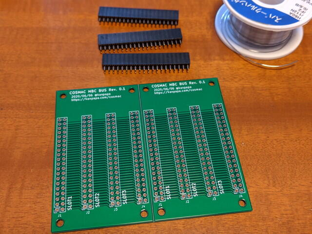
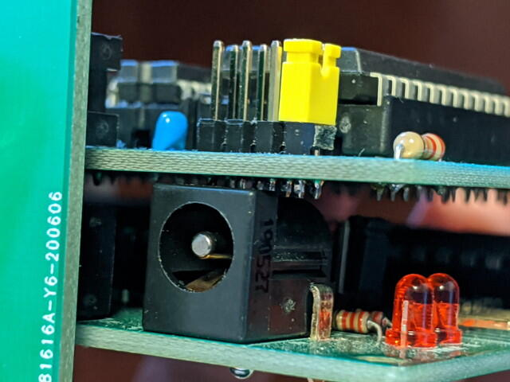
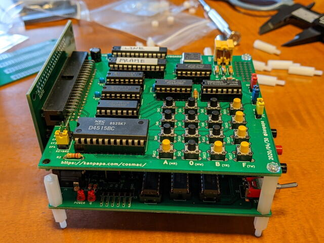

先日発注していた[COSMAC MBC BUSボード Rev. 0.1](https://kanpapa.com/cosmac/blog/2020/06/cosmac-mbc-busboard.html "COSMAC MBCでバス基板を使ってみました")が届きました。

<!--more-->

早速基板接続用のコネクタを実装しました。

BUS基板にCPUボードとVIDEOボードを実装したところ、基板とパーツがぶつかり、基板が曲がっています。微妙に基板の間隔が狭いようです。

おかしいなと思い実装状態を計測したところ、想定していた基板間隔の12.7mmより狭くなっています。基板の間隔を[秋月電子の12.7mmスペーサー](http://akizukidenshi.com/catalog/g/gP-07567/ "スペーサー　Ｍ３　１２．７ｍｍ　ＴＰ－１２")に合うようにコネクタの位置を決めたつもりだったのですが、図面を書いてみたところ気が付きました。基板の厚さ1.6mmを考慮していなかったので12.7mmではなく11.1mmになっていたのです。

仕方ないので１つコネクタを飛ばして、スペーサーをつなぎ合わせ何とか実装できました。

簡単だと思いこみ図面を書かないとこうなってしまうという良い勉強ができました。
