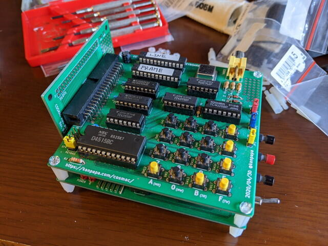

前回基板の厚さを考えないで発注して[失敗したCOSMAC MBC BUSボード](https://kanpapa.com/cosmac/blog/2020/06/cosmac-mbc-bus-rev-01-assembly.html "COSMAC MBC BUSボード Rev. 0.1が届きましたが・・・")ですが、[修正したRev.0.2](https://kanpapa.com/cosmac/blog/2020/06/cosmac-mbc-bus-rev-02-order.html "COSMAC MBC BUSボード Rev. 0.2を発注しました。")が到着しました。

<!--more-->

前回のRev.0.1と比較すると基板の厚さだけ間隔が広くなっていることがわかります。

基板接続用の[ピンソケット2x20(40P)](http://akizukidenshi.com/catalog/g/gC-00085/ "ピンソケット（メス）2x20 (40P)")をはんだ付けして、CPU基板とSTG1862/キーボード基板の間に[12.7mmのスペーサー](http://akizukidenshi.com/catalog/g/gP-07567/ "スペーサー M3 12.7mm TP-12")を挟み、BUS基板を取り付けてみたところ・・・

今回は無事実装できました。横から見ても問題なさそうです。

これでフラットケーブルを使わずに基板間の接続ができるようになりました。Maker Faire Tokyo 2020にむけて、もう２～３枚BUS基板を作成しておきたいので、追加のピンソケット(20x2 40P)を秋月電子にオーダーしておこうと思います。
