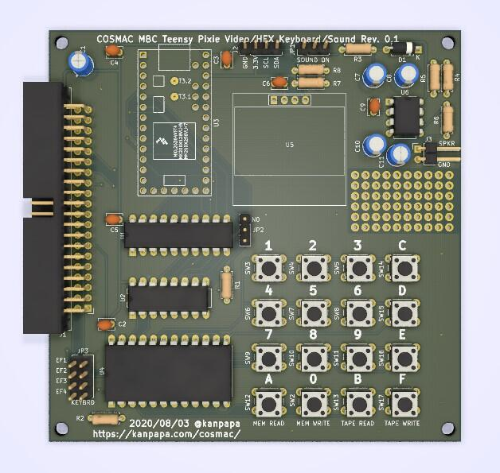

前回[ブレッドボードで動作確認したTeensy 3.2 Pixie Simulator](https://kanpapa.com/cosmac/blog/2020/08/teensy32-cdp1861-pixie-simulator.html "Teensy 3.2でのCDP1861 Pixie Simulatorを試してみました")をCOSMAC MBC用に基板化してみました。これまで使用していたSTG1861と置き換える形の設計とし、HEX Keyboardはそのままで、空きエリアにCOSMAC VIPのSound回路を追加しました。

基板レイアウトの3Dイメージは以下のようになります。

これまで必要だった外付けビデオモニタが不要になるのでコンパクトに使うことができます。その反面、表示画面が小さくなってしまいますが、OLEDなので大丈夫かなと思います。また、I2Cのインターフェースが今後使えそうに思うので、コネクタから引き出せるようにしておきました。

到着が楽しみです。
