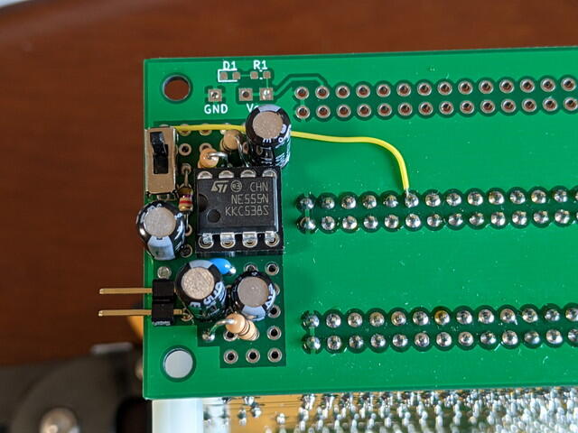

先日製作した[Teensy Pixie Video/HEX Keyboard/Soundボード Rev. 0.1](https://kanpapa.com/cosmac/blog/2020/08/teensy-pixie-hexkey-sound-rev01-assembly.html.html "Teensy Pixie Video/HEX Keyboard/Soundボード Rev. 0.1")にはサウンド回路を組み込みましたが、[STG1861 DISPLAY/HEX KEYBOARD Rev. 0.2](https://kanpapa.com/cosmac/blog/2020/05/cosmac-stg1861-hexkey-rev02-final.html "STG1861 DISPLAY/HEX KEYBOARD Rev. 0.2")にはサウンド回路が組み込まれていません。基板を再設計すれば組み込むことはできると思いますが、もっと簡単に実装できないかと [COSMAC MBC BUS基板](https://kanpapa.com/cosmac/blog/2020/07/cosmac-mbc-bus-rev-02-assembly.html "COSMAC MBC BUSボード Rev. 0.2を製作しました")のユニバーサルエリアに組み込んでみることにしました。電源も取れますし、サウンドのON/OFFを行うQ出力にもバスから接続できます。

ユニバーサルエリアに実装した状態です。

ギリギリ組み込むことができました。黄色いワイヤーがバスにつながっていますが、これがQ出力です。音を止めることができるようにスライドスイッチも付けました。

<!--more-->

裏面の実装です。

完成したサウンド回路付きバス基板でCOSMAC MBC CPUボードとSTG1861ボードを接続します。

これで問題なくサウンド出力ができるようになりました。
