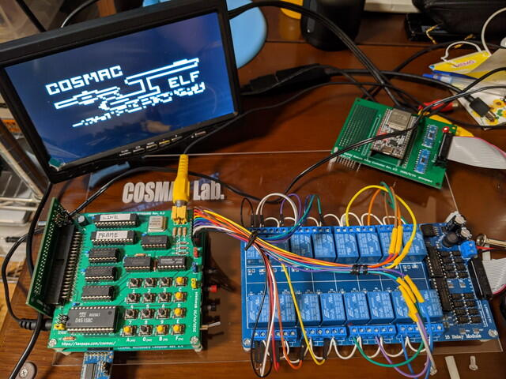

[COSMAC VIPスマートフォン操作システム](https://kanpapa.com/cosmac/blog/2020/09/cosmac-vip-os-ESP32-remote-keypad-acrylic1.html "COSMAC VIPスマートフォン操作システムをアクリル板にまとめました")を製作しましたが、本来は人間がスマホ画面にタッチしてCOSMAC VIPのHEX Keypadを操作するのが目的です。でも使い方によってはあらかじめ用意したデータを読み込んで、そのままHEX Keypadに送ることもできるわけです。そこで、ESP32のプログラムを変更して自動キー入力ができるようにしてみました。

自動キー入力でCOSMAC VIP OSの機能を使って指定したメモリアドレスからデータを書き込みます。実行できるプログラムを書き込むこともできるのですが、書き込んだ結果がすぐわかるようにVRAMのメモリアドレスである0F00番地からデータを書き込みました。VRAMに書き込んだデータはそのままドットで画面に表示されます。

実際の動きをYouTubeにアップしておきました。

https://youtu.be/Avk82hSGX6A

最終的にはCOSMACでよく見かける画面を表示することができました。

これを使えばMaker Faire Tokyo 2020の会場でデモンストレーションができるなと思い、スマホの操作画面に「DEMO」ボタンを追加して、スマホからVRAM書き込みのデモンストレーションを行えるようにしました。

ついでに、会場で来場者のかたに入力していただこうと思っているサンプルゲームプログラムも自動入力できるように「AUTO」ボタンを追加しておきました。

さて当日うまく動くかお楽しみに。
