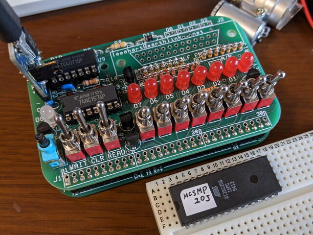

1802 Membership Cardは動作していますが、[EEPROMでモニタが動かなかった](https://kanpapa.com/cosmac/blog/2020/10/1802-membership-card-part2.html "1802 Membership Cardを作ってみました（モニタ動作編）")のが気になります。なぜ動かないのかを調べてみました。



<!--more-->

まず、モニタが起動しなかったEEPROMを取り外し、ROMライタで読み出したファイルを元のMCSMP20Jモニタプログラムをハッシュで比較してみました。

公式サイトのMCSMP20Jモニタプログラム

```
$ sha1sum MCSMP20J.bina983d294f9451e36126e8c17c178a3a98eed3015  MCSMP20J.bin
```

EEPROMから読み出したデータ

```
$ sha1sum testj.bin8113b7fdb0b09cf029643bcde3f957f4854ecccb  testj.bin
```

明らかに内容が異なります。

どこが書き変わっているのか差分を確認します。

```
$ cmp -l MCSMP20J.bin testj.bin13568 325   032768 377   0
```

cmpコマンドではオフセットの値は10進数、データの値は8進数で表示されているので、16進数のアドレスとデータにしてみると以下のようになります。

```
$34FF  D5 -> 00$7FFF  FF -> 00
```

この２バイトの差分がみつかりました。念のためダンプして確認してみます。

公式サイトのMCSMP20Jモニタプログラム

```
000034f0  3b e3 ff 1a 33 e3 f8 01  d5 4b fb 0d 3a f9 2b d5  |;...3....K..:.+.|00003500  d4 a5 73 01 98 73 4b fb  d6 3a 00 4b fb d7 3a 00  |..s..sK..:.K..:.|　　：000049a0  ff ff ff ff ff ff ff ff  ff ff ff ff ff ff ff ff  |................|*　（この間すべてffであることを示します）00008000
```

EEPROMから読み出したデータ

```
000034f0  3b e3 ff 1a 33 e3 f8 01  d5 4b fb 0d 3a f9 2b 00  |;...3....K..:.+.|00003500  d4 a5 73 01 98 73 4b fb  d6 3a 00 4b fb d7 3a 00  |..s..sK..:.K..:.|　　：00007ff0  ff ff ff ff ff ff ff ff  ff ff ff ff ff ff ff 00  |................|
```

確かにこの2バイトが書き変わっています。

しかし、ほとんどの部分は元のモニタプログラムと一致しています。これぐらいの差であればある程度モニタが動いても良いように思えます。

また気になるのは$7FFF、つまり実際のアドレスだと$FFFFというメモリエリアの終端のバイトが書き変わっていることです。

ここからは推測ですが、モニタが起動する際にメモリマップがどのようになっているかを確認するために$FFFFにデータを書きこんで調べているのではないかと。

$FFFFに正常に書き込めたので$8000-$FFFFをRAMと誤判断し、初期化処理をしている可能性もあります。

そこでEEPROMに書き込めないようにEEPROMの/WEがVDDに接続されるようにジャンパーピンを設定してみました。

回路図のTABLE 1に記載されている標準のジャンパーピン設定

```
P2 1-2, 4-5P3 1-3, 2-428C256     MCard18021(A14)  -- A1423(A11) -- A1126(A13) -- A1327(/WE) -- /WE
```

今回試したジャンパーピン設定

```
P2 1-2, 4-5 P3 1-3, 4-528C256     MCard18021(A14)  -- A1423(A11) -- A1126(A13) -- A1327(/WE) -- VDD
```

もう一度MCSMP20JモニタプログラムをEEPROMに書き込んでフロントパネルから起動したところ、無事モニタが立ち上がりました。

あとで[COSMAC ELF Group](https://groups.io/g/cosmacelf "COSMAC ELF Group")でコメントをいただいたのですが、同様な問題に遭遇して同じようなジャンパーにされたかたがいました。この問題は報告済みだとのことです。

これでEEPROMが安心して使えるようになりました。
