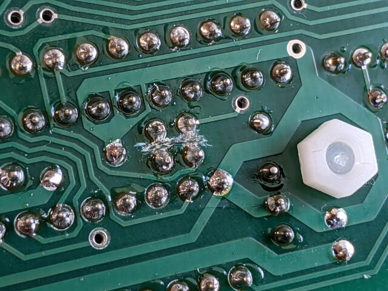
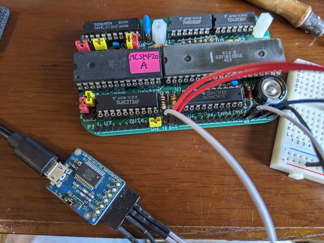
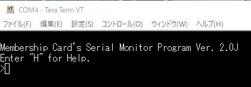
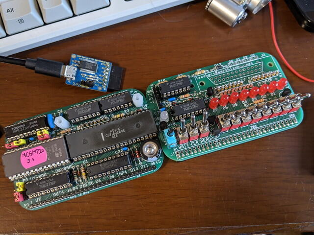

[RAMだけを実装した1802 Membership Cardは問題なく動きました](https://kanpapa.com/cosmac/blog/2020/10/1802-membership-card-part1.html "1802 Membership Cardを作ってみました（トグルスイッチ編）")が、さすがにトグルスイッチだけではプログラム入力が大変です。そこで[Membership Card用のモニタプログラム](http://www.sunrise-ev.com/MembershipCard/Readme.txt "Membership Card用のモニタプログラム")をROMに書いて実装します。このモニタプログラムはCOSMAC MBCでも使用しているものです。

公式ページに掲載されているモニタプログラムをメモリ配置に合わせて書き込みますが、２つの選択肢があります。

1. パワーオンと同時にモニタプログラムが起動するように$0000にROMを配置する。

3. ELFのスタイルでトグルスイッチでモニタプログラムへジャンプするように$0000のRAMに書き込んで、$8000のモニタプログラムを起動する。

私の場合は、トグルスイッチが好きなので、ELFのスタイルをとりました。この場合はアドレス設定のため、パターンを一部カットし、ジャンパーする必要があります。

私のFront panelはRev. Jなので、Rev. J用のMCSMP20J.binを28C256 EEPROMに書き込みました。28C256用にジャンパーピンをセットし、Membership Cardに取り付けて電源をいれ、トグルスイッチでC0 80 00を書き込み、リセットしました。正常であればEnterキーを入力すると通信スピードを自動認識し、モニタのスタートメッセージが表示されるのですが、何もターミナルに表示されません。

動かない原因が見えないので、切り分けていきます。

まず、シリアル入力はEF3に接続されていますので、EF3にミニオシロスコープをつないで、シリアル信号が来ていることを確認しました。また、2色LEDがキー入力に合わせて緑色に点灯するのも確認できます。シリアル出力はQに接続されているので、Qにパルスを送信するプログラムを動かし、PCのターミナルに連続した文字が表示されることも確認しました。シリアル入出力信号はCPUと問題なく接続されているようです。

次はROMが$8000に配置されているかの確認です。簡単な[メモリダンププログラム](https://github.com/kanpapa/MCard1802/blob/main/memdump.lst "メモリダンププログラム")をトグルスイッチで入力しました。これを動かすと$8000からの内容がLEDに表示されます。

LEDの点滅状態からモニタプログラムが$8000に配置されていることを確認できました。

ここまで動いていればハードウェアは問題なさそうです。そこでFront Panelを取り外して、Membership Cardのみでモニタを動かしてみます。フロントパネルが無いのでモニタは$0000に配置して電源を投入するとモニタが動作するようにMCSMP20A.binをEEPROM 28C256に書き込み、アドレス設定のジャンパーも切り替えておきます。このあたりは公式ページにある["Special" 1802 CPU Card Quickstart Manual](http://www.sunrise-ev.com/MembershipCard/1802cpuK3.pdf)にも書かれています。30ピンヘッダーに電源とUSBシリアルをつなぎます。

電源を投入してEnterキーを入力したところ、正常にモニタのスタートメッセージが表示されました。

もちろんモニタコマンドも正常に動きます。ここでMembership Card本体にも問題がないことが確認できました。

ではなぜMembership CardとFront panelの組み合わせで動かないのか。原因が見えないのでダメ元で28C256 EEPROMから27C256 EPROMに変更して、27C256用にジャンパーピンをセットし、電源を投入し、トグルスイッチでC0 80 00を書き込み、リセットしたところ、

問題なくモニタプログラムが動きました。

なぜ28C256で動かなかったのが原因がよくわかりませんが、27C256で問題が解消されたのでこのまま使うことにします。

Membership Cardは様々なコンフィグレーションが試せ、Membership Card単体でも立派なマイコンボードとして動作します。公式ページには時計やネームタグなど応用例がいくつもありますし、[COSMAC ELF Group](https://groups.io/g/cosmacelf "COSMAC ELF Group")では様々な試みが飛び交っています。

すっかり気に入ってしまったので、実験用にもう一枚Membership Cardの基板とユニバーサル基板をオーダーしてしまいました。
