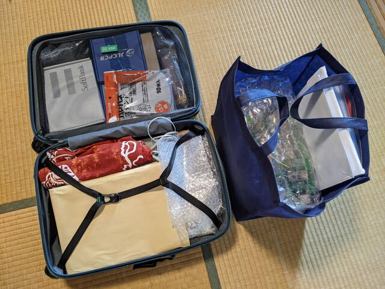
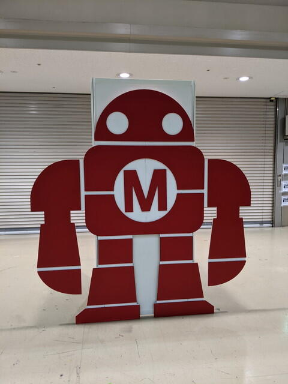
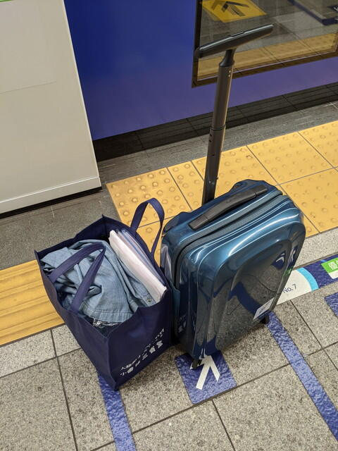
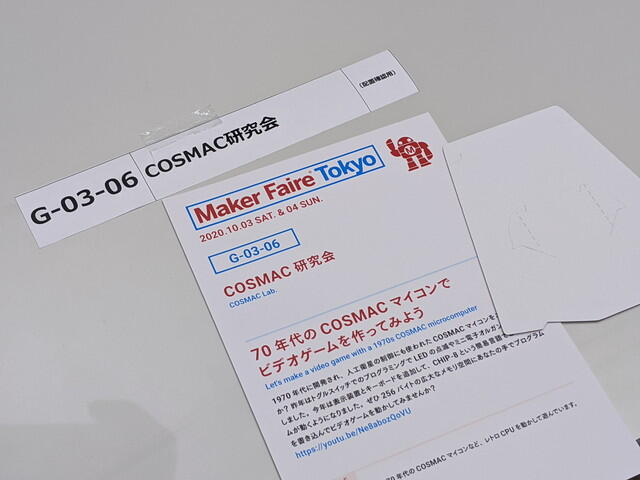

今年も前日に搬入を行いました。宅急便での輸送も考えたのですが、やはり直前まで調整を行ったので今年も手持ちです。機材をなるべく小さめの段ボール箱にいれた上で、スーツケースに詰め込みます。振動が伝わっても大丈夫なもので、重めのものを入れました。

もう一つは手提げ袋。こちらは壊れやすいものをプチプチにくるんでいれています。可能な限り段ボールにいれてはありますが、今回の目玉のスマホコントロールCOSMAC VIPはそのままプチプチにくるんでそっと運びます。手作りの説明パネルも力が入ると割れてしまうかもしれないので、こちらに入れています。

荷造りが完了した状態はこちらです。なんとか納まりました。

<!--more-->

あとは電車で移動です。

ビックサイトが見えてきました。

いつもの看板が設置されています。

搬入前の会場です。かなり机の間隔が広いです。通路も広々としています。

自分が使う机の上には紹介パネルが置いてありました。

早速持ってきたものを並べてみたのですが、思ったより机が狭くすべてを置くことができず、すこし絞って設置を行いました。電源も投入し動作確認まで行いました。

展示準備もできたので布をかけて、撤収です。

明日はよろしくお願いします。

[１日目のレポート](https://kanpapa.com/cosmac/blog/2020/10/cosmac-maker-faire-tokyo-2020-day1.html "COSMAC研究会でMaker Faire Tokyo 2020に出展しました（1日目）")に続きます。
