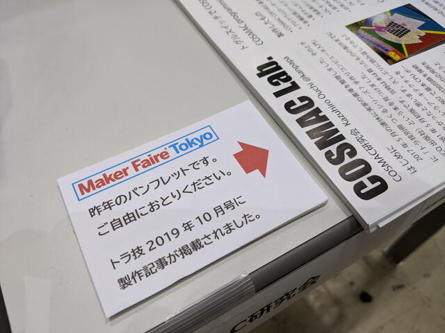
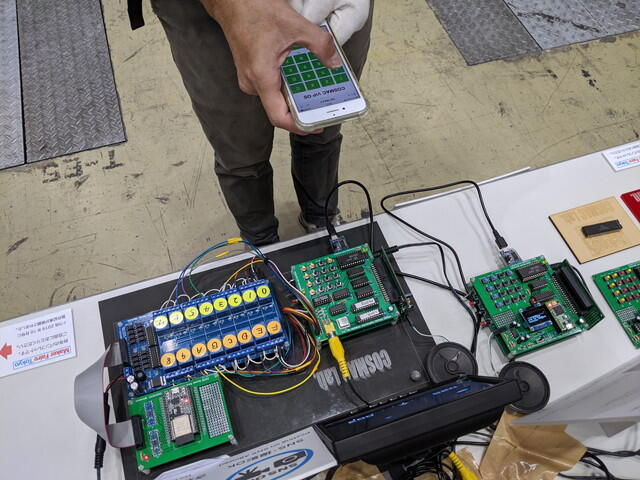
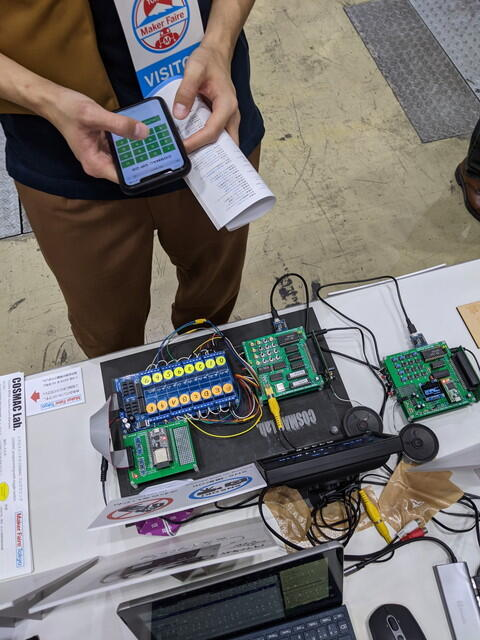
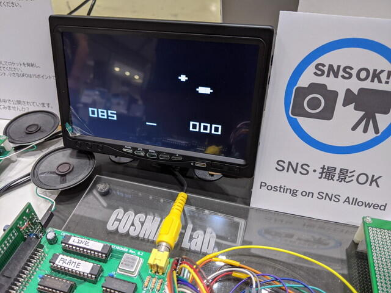
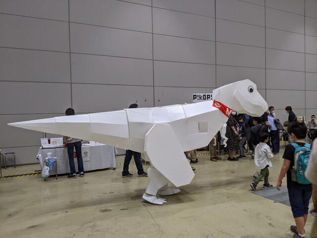
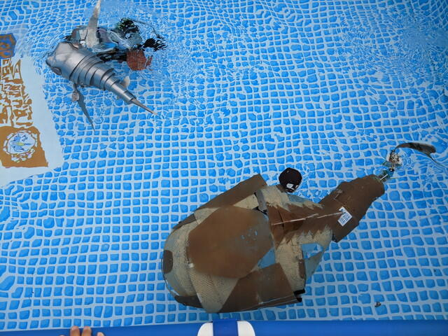

[Maker Faire Tokyo 2020](https://makezine.jp/event/mft2020/ "Maker Faire Tokyo 2020")の２日目です。この日は10時から開始です。会場準備は9時からなので準備時間は1時間しかありませんが、大きなトラブルもなかったので昨日と同じ配置で準備です。

<!--more-->

ここで気が付いたのですが、トグルスイッチコンピュータの電池を昨日抜き忘れていて、Lチカがそのまま動いていました。昨日からずっと動作していたことになります。

あと、昨日はフライヤーをお取りくださいと手書きの付箋紙で案内していたところを、小さいパネルを作って置き換えました。

入場待機列が長くなっているのことで、10時より少し前に開場し、来場者が次々と訪れます。昨日と同じような質問が続きましたが、突然「これゲームですか？」というかたが。ゲーム好きなのでぜひ試してみたいとのことで、スマホでCOSMAC VIPを操作して1970年代のUFOゲームにチャレンジいただきました。

ゆっくりしたゲームに戸惑いつつも、楽しんでいただけたようです。スコアは４０点でした。

そうこうしているうちに、２人目のチャレンジャーです。専用のWiFiアクセスポイントに接続して、ゲームにチャレンジです。

こちらのかたは８５点のハイスコア。やはりタイミングが難しいとのことでした。

このあともう一人チャレンジされて、スコアは２５点でした。

COVID-19対策で、展示物に触れない対策として準備しましたが、わざわざスマホをWiFiに接続して試していただきありがたかったです。

ここでCOSMACを見られるとは思わなかったという感想や、CHIP-8をご存知のかたもいらっしゃいました。やはり層が厚い。SBC-Z80をこの前作ったというかたがいらっしゃいましたので、ではぜひCOSMACもということで基板を1セットお渡ししました。

さて他の展示も回ってみましょう。

会場ではシロさんがたまに歩いておりました。子供が一緒について回っているという光景がほほえましかったです。

また、R2D2さんも複数で歩き回っていました。たまに鉢合わせして奇声(?)を上げていましたが、挨拶だったのかな。

いったん会場をでて、屋上展示場にも行ってみました。

プールの中でロボットの魚が泳いでいます。手前の大きい魚は自律制御で泳いでいるそうです。

他にも興味あるものがたくさんありましたが、長くなってしまうので、また別の記事で書こうと思います。

16時に展示が終了し、ブースの荷造りを行い撤収しました。もちろん、Maker Faire Tシャツも買いました。今年はCOVID-19の課題もありつつ、Maker Faire Tokyoが無事開催できてよかったです。関係者のみなさまありがとうございました。

