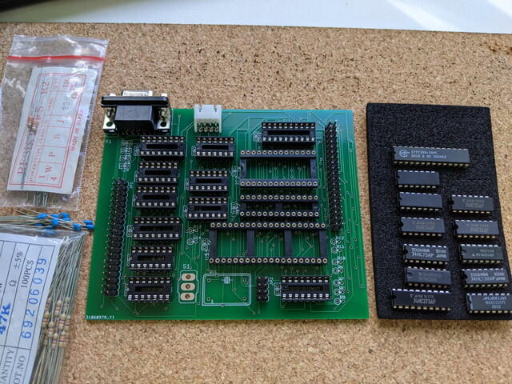
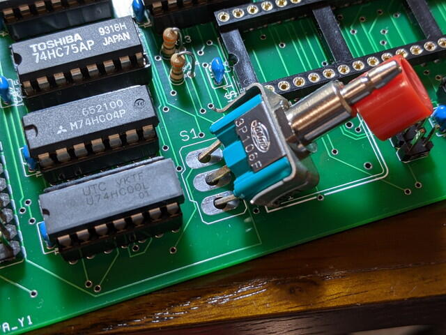
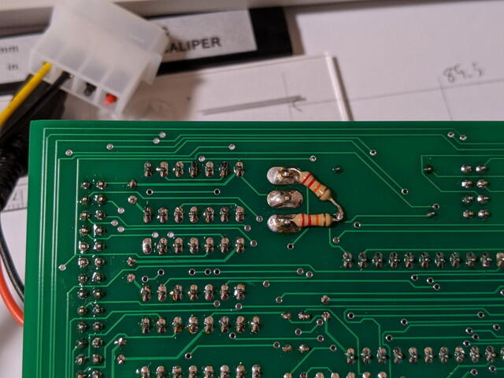
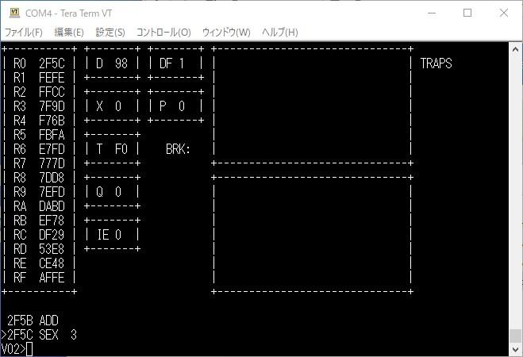

COSMAC ELFフォーラムの記事でMike Rileyさんが開発されたPico/Elf V2という基板の配布の話題がありました。100枚作ったので実費で配布しますとのこと。調べてみたところCOSMAC CPUとROM/RAM、IDEインターフェイスがあり、CFカードをファイルシステムとして使い、[Elf/OS](http://www.elf-emulation.com/elfos.html "Elf/OS")が動作する基板とのことです。COSMACでOSを動かしたことはありませんでしたので早速私も配布を申し込みました。（すでに初回分の配布は終了しています。）

Pico/Elf V2のサイトはこちらです。

- [http://elf-emulation.com/picoelf.html](https://t.co/6gr1jXliB9?amp=1 "http://www.elf-emulation.com/picoelf.html")

到着したPico/Elf V2基板です。見た目は一般的なSBCに見えますが、IDEインターフェイスがあるのが特徴です。

パーツが揃ったので組み立て開始です。

パーツの入手で苦労したのは4MHzのOSCとリセット用のプッシュスイッチです。なかなか4HMzのOSCが置いていないので、[マルツさんでDigikeyパーツの発注](https://www.marutsu.co.jp/pc/i/33771284/ "XTAL OSC XO 4.0000MHZ HCMOS TTL")をしました。プッシュスイッチはピン間隔で合致するものが見当たらず、[秋月電子さんの特価品](https://akizukidenshi.com/catalog/g/gP-11761/ "押しボタンスイッチ　ＳＧＭ製　赤")を使用しました。若干サイズが合わないのですが、無理やり実装です。

完成したPico/Elf V2基板です。

この時点ではIDE-CF変換基板が手元になかったため、まずは[Diskless ROM](http://www.elf-emulation.com/software.html "Pico/Elf V2 software")でPico/Elf V2を動かしてみました。私の場合はUSB-シリアル変換基板を使っているので、外部バス端子の/EF2とQをUSBシリアルに接続しました。

電源を投入したところ、少し動きがおかしいです。リセットスイッチを押しても何も変化がありません。リセット信号を確認したところ、スイッチを押してもLowのパルスがみえません。[回路図](http://www.elf-emulation.com/hardware/picoelf2.png "回路図")を確認したところ、スイッチ入力にプルアップ抵抗が必要ではないかと思われました。そこで急遽手持ちの22KΩの抵抗をはんだ付けしました。

この修正を行ったことでリセット信号が正常になりました。

オリジナルのBOMではすべて74LSシリーズで構成されているのですが、私の場合はすべて74HCシリーズで実装したためのようです。開発者のMikeさんにもこのことは伝えておきましたので、次回の基板ではプルアップ抵抗が実装できるようになるのではと思います。

この状態で再度動かしてみたところ、無事メニューが表示されました。

BASIC、FORTH、LISP、アセンブラ、モニタ、デバッカと一通りの開発環境が揃っているようです。

あまり聞いたことがないVisual/02を動かしてみました。

これはデバッカのようです。見やすい画面になっています。

Dump Memory/Load MemoryではXMODEMを使ってメモリ上のデータの入出力ができます。

このようにかなり強力な環境です。

また、メモリマップやハードウェアは一般的な構成なので、私の[COSMAC MBC](https://kanpapa.com/tag/cosmac-mbc)ボードでもこのDiskless ROMを動かすことができました。次にCOSMAC MBCを改版することがあれば、シリアル入力にEF2を選択できるようにしてPico/Elf V2 Diskless ROMも動くようにしたいと思います。

IDE-CF変換基板が到着したらいよいよ[Elf/OSを動かしてみます](https://kanpapa.com/cosmac/blog/2020/11/cosmac-elfos-picoelfv2-part2.html "COSMACでElf/OSを動かしてみました（Elf/OS起動編）")。
