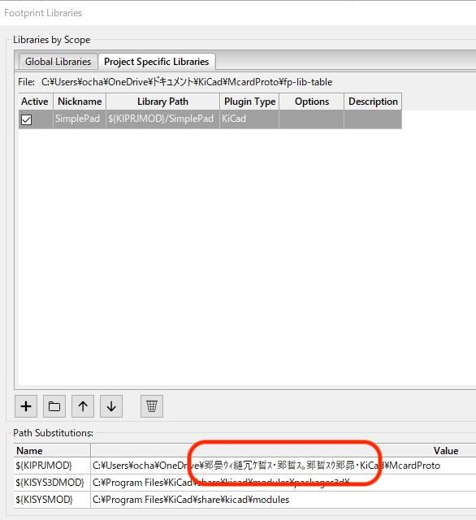
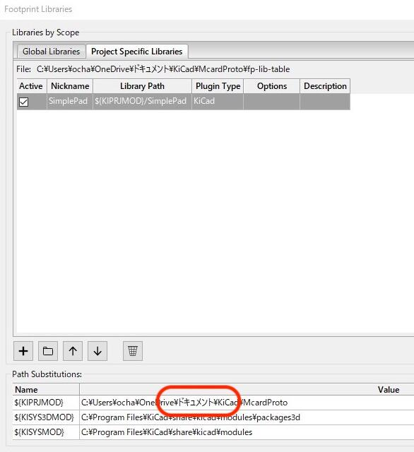

[新しいバージョンのKiCad 5.1.8](https://kicad.org/blog/2020/11/KiCad-5.1.8-Release/ "KiCad 5.1.8 Release")の配布が始まったということで、早速Windows PCにインストールしてみました。過去作成したプロジェクトを読み込ませて、問題ないかなと確認したところ、次のようなエラーがでてしまいました。

日本語のパスが文字化けしてしまっています。私の場合はプロジェクトファイルをOneDriveに置いているのですが、「ドキュメント」という部分が文字化けしています。

<!--more-->

フットプリントのパス設定画面を確認したところ、KIPRJMODのパスが文字化けしてしまっています。

KiCad 5.1.6を使っていたときはこのような問題はなかったので、5.1.6をインストールして確認しました。

やはり問題ありません。

他のバージョンではどうなのかと、KiCad 5.1.7をインストールしてみたところ、文字化け問題が発生してしまいました。ということで、KiCad 5.1.7以降に発生したバグのようです。

英語のフォルダにプロジェクトを移動して回避する方法もあるのですが、やはり不便なのでバグ報告をしてみることにしました。

KiCadの問題報告は以下から行うようです。私も初めての報告です。

- [Report an Issue](https://kicad.org/help/report-an-issue/ "Report an Issue")

今回報告したIssueです。

- [The path including Japanese is garbled and cannot be used. (regression in KiCad 5.1.7)](https://gitlab.com/kicad/code/kicad/-/issues/6387 "The path including Japanese is garbled and cannot be used. (regression in KiCad 5.1.7)")

英語ができないので翻訳サイトを活用して作成しました。おかしな表現もあると思いますが、伝われば良しということで。

日本語の文字化けという英語圏のかたには伝わりにくい問題のため、なるべくスクリーンショットをたくさんいれて伝わるようにしました。

その日のうちにPriority: High、i18nというコメントがつきましたので、この問題は認識いただけたようです。修正作業はこれからのようですが、次期バージョンの5.1.9では修正されていることを期待します。

【追記】2020.12.15 パスが文字化けする問題の修正報告をいただきました。動作確認を行い、問題ないことをお伝えしましたので、次の5.1.9の正式リリースで反映されると思います。
