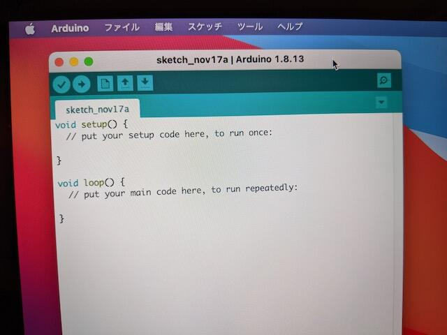

ARMが乗ったMacが発売されるということで早速注文してしまいました。最近は新品のPCを買った事がなかったのですが、新しいM1プロセッサが載っているということで興味津々です。これまで68K→PowerPC→IntelのCPU移行をみてきたこともあり、今回も楽しみです。

## MacBook Airが到着

スペックはメモリ8GB、SSD 256GBという一番低いものです。移動しての利用を想定しているので、そんなに重い処理を行うつもりはありません。ファンレスでどこでも使えるという物を選びました。


電源を投入すると懐かしい「ジャーン！」が鳴り響きました。

起動画面を見ると普通のmacです。標準搭載されているアプリを起動すると何やらすぐアプリケーションの画面が出ます。新しいCPUなので速いと噂には聞いていましたが、本当にサクサク速いです。Dockのアイコンをクリックして一瞬でアプリの画面が開きます。

## 既存のアプリケーションの動作は？

ここで他社製のブラウザをインストールしてみます。既存のアプリケーションはどの程度のスピードで動くのでしょうか。

ダウンロードしたIntel x86版のChromeを開くと次のような画面が表示されました。（11/19現在Apple M1用のChromeの配布が始まっています。）


Rosettaが自動的にインストールされ、Chromeのx86\_64のバイナリをM1プロセッサ用に翻訳してくれます。起動後にChromeのバージョン情報を確認するとアーキテクチャのところに「（x86\_64 翻訳）」と表示されています。

ChromeでWebサイトをみてみましたが、スピードも問題なく普通に動きます。なかなかよくできていると思います。


## 電子工作でも問題なく使えるのか？

私の場合はややハードウェアよりの使い方が中心なので、手始めにArduino IDEを動かしてみます。

まずは通常のMac版をダウンロードしてインストールしましたが、特に問題なく起動できました。



MacBook AirのUSB-CコネクタにHUBを接続し、Arduinoに接続します。


この状態でblinkのスケッチを書き込むことができました。Lチカも問題ありません。

Arduino IDEはM1 MacBook Airでも問題なく使えることがわかりました。

## Arduino-esp32は少し手ごわい

次は最近よく使っているArduino-esp32です。ESP32DEV-Cへの書き込みはできるのでしょうか。

いつも通りに環境設定で追加のボードマネージャーのURLを指定して、ESP32 Arduinoを使えるようにしました。

テストのため空のスケッチを検証してみたところ、うまく動きません。途中でエラーになってしまいます。


このエラーメッセージを調べたところ、以下の記事を見つけました。まさにこの状態です。

- [arduino-esp32 projects fail on macOS 11 "Big Sur" #4408](https://github.com/espressif/arduino-esp32/issues/4408 "arduino-esp32 projects fail on macOS 11 ")

こちらに書かれているように環境設定を行いました。

**【注意】これ以降の手順はコマンドラインについての知識があることを前提に記載しています。何をやっているのかわからない場合は絶対に行わないようにしてください。**

1. Arduino IDEの環境設定から、/Users/...../preferences.txt のリンクをクリックして、フォルダを開く。

3. packages/esp32/hardware/esp32/1.x.x フォルダの中にある plathome.txtを開き、7行目にある tools.esptool\_py.cmd=esptool となっている部分を tools.esptool\_py.cmd=esptool.py と書き換えて保存する。

5. packages/esp32/hardware/esp32/1.x.x/tools フォルダにある esptool.py を packages/esp32/tools/esptool\_py/2.x.x/ フォルダにコピーする。

7. 以下のコマンドで、コピーした esptool.py に実行権限をつける。  
    chmod +x packages/esp32/tools/esptool\_py/2.x.x/esptool.py

スクリーンキャプチャが記事にありますのでそれを確認しながら行うことをお勧めします。

これでArduino IDEを再起動すれば、ESP32のスケッチがコンパイルできるはずですが、私の場合はpythonライブラリのpyserialが無いというエラーが出ましたので、次のようにコマンドを入力してpyserialをインストールしました。

```
% sudo easy_install pip
% pip install pyserial
```

以上の操作を行い、無事ESP32のスケッチがコンパイルできるようになりました。


ESP32DEV-Cへの書き込みも行えました。


このように現在はESP32用のArduino IDEの環境設定は面倒ですが、これはM1プロセッサが原因ではなく、macOS Big Surへの対応がまだ完全ではないためと思われます。いずれ対応されると思いますので、それまで待つのも手だと思います。

※なお、この記事はM1 MacBook Airで書いてみました。全く問題ないですね。
