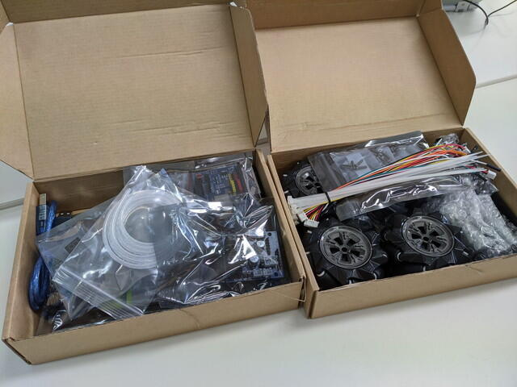
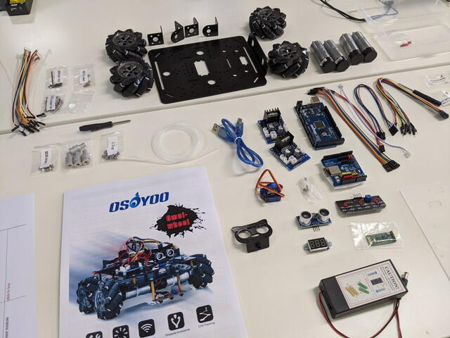
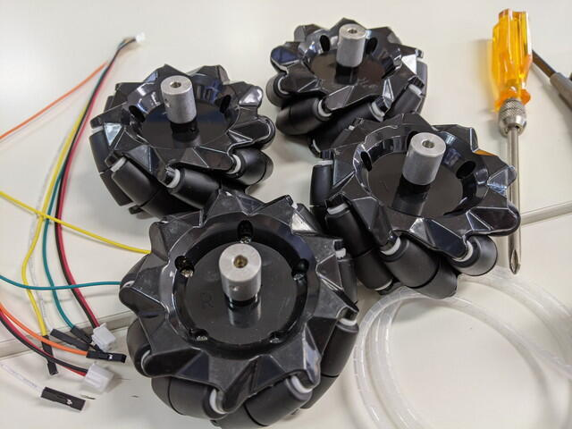
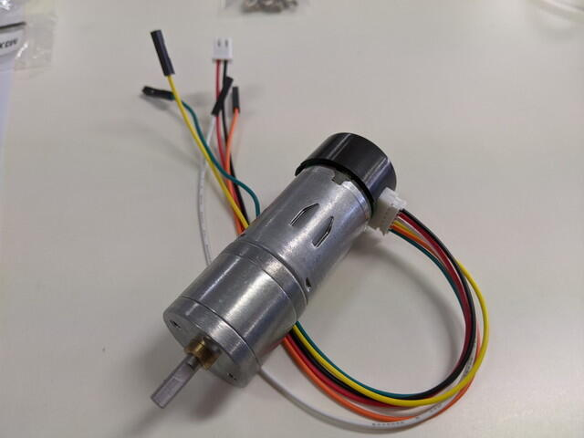
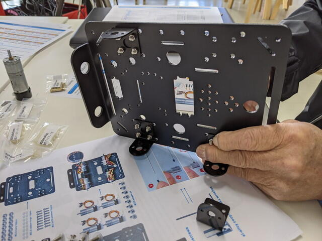
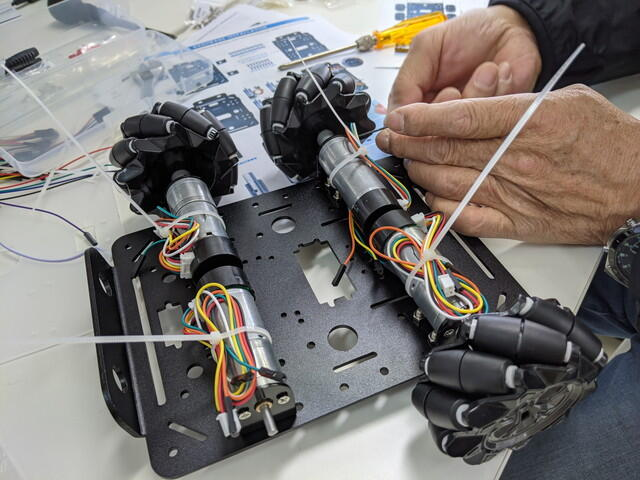
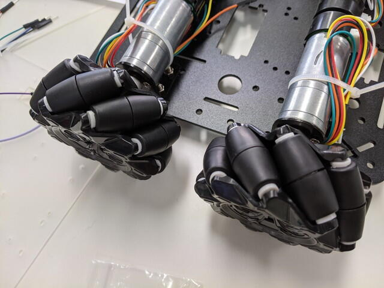

[おおたFab](https://ot-fb.com/ "おおたFab")さんで、「[素人でもロボットを作りたい](https://ot-fb.com/event/%e7%ac%ac34%e5%9b%9e%e3%80%80%e7%b4%a0%e4%ba%ba%e3%81%a7%e3%82%82%e3%83%ad%e3%83%9c%e3%83%83%e3%83%88%e4%bd%9c%e3%82%8a%e3%81%9f%e3%81%84%ef%bc%81%e3%80%80/ "第34回　素人でもロボット作りたい！")」というセミナーが行われています。

今回、新しい素材として[OSOYOO](https://osoyoo.com/ "OSOYOO")さんのメカナムロボットをいじってみることになりました。

- [Metal Chassis Mecanum Wheel Robotic (for Arduino Mega2560)](https://osoyoo.com/2019/11/08/omni-direction-mecanum-wheel-robotic-kit-v1/ "Metal Chassis Mecanum Wheel Robotic (for Arduino Mega2560) ")

このロボットの特徴はメカナムホイールといわれる車輪です。車輪の表面に斜め45度の小さい樽のようなローラーが取り付けられています。４つのメカナムホイールには４つのモーターが取り付けられていて、４つのモーターの駆動力をうまく調整することで、様々な方向に動かすことができます。通常の車ですと直接車輪の向きを変更することで方向を変えていますが、このメカナムホイールは車輪の向きは変えずにヌルヌルと動くようなイメージです。

もちろんこのような制御をおこなうためにはマイコンが必要になります。このキットにはArduino Megaやモータードライバ、センサーなどが同梱されているので、Arduinoをプログラミングしてロボットの動きを制御することになります。

商品のパッケージは２つの段ボールに分かれていました。

部品がぎっしりです。制御用のArduino Megaやセンサーなども入っていますが、今回は基本シャーシまで組み立てます。

<!--more-->

まずはパーツの確認です。テーブルにすべてのパーツを広げ、マニュアルと比較します。

一通りのパーツはそろっているようです。ネジなどは少し多めに入っていました。スペアパーツでしょう。

まずはメカナムホイールに車軸を付けます。このときネジにバリが残っているようでなかなかねじ締めができません。この部分のネジの精度は今一つでした。

車軸を取り付けたメカナムホイールが４つできました。

次はモーターにケーブルを取り付けます。ここは特に問題ありません。重みのあるモーターでしっかりしている印象がありました。

次はシャーシにモーターを固定する金具を取り付けていきます。

シャーシにモーターを取り付けます。このあとの作業で配線が邪魔にならないようにバインド線で固定しておきます。

モーターの軸にメカナムホイールを取り付けます。

この時メカナムホイールの樽の向きに注意する必要があります。樽の軸が内側に向くようにホイールを並べます。

これでシャーシ部分は完成です。かなりがっしりした作りに見えます。モーターのパワーがどのくらいなのか、動くのが楽しみです。

