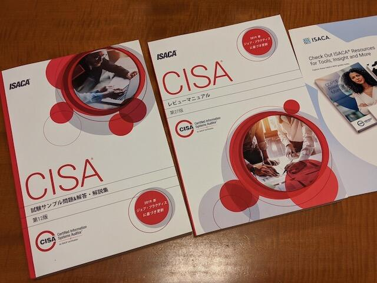

[CISSPに合格](https://kanpapa.com/2019/12/cissp-exam-pass.html "CISSPの試験に合格するまで")してからしばらく資格取得はお休みしていましたが、そろそろ次の資格にチャレンジしてみようと思います。次は[CISA (Certified Information Systems Auditor)](https://www.isaca.gr.jp/cisa/index.html "CISA (Certified Information Systems Auditor)")という資格で、情報システムの監査および、セキュリティ、コントロールに関する高度な知識、技能と経験を有するプロフェッショナルとして[ISACA](https://www.isaca.org "ISACA")が認定する国際資格で、日本語では「公認情報システム監査人」となるそうです。

国際資格ではありますが、CISSPと同様に日本語での試験ができることと、日本語のテキストや問題集が揃っているので少し安心です。でも、CISSP同様に長時間の試験で150問ということで難易度は高いです。

## まずはテキストを入手

テキストと問題集を入手しようとしたのですが、[ISACA国際本部のBOOK STORE](https://www.isaca.org/credentialing/cisa/prepare-for-the-cisa-exam "https://www.isaca.org/credentialing/cisa/prepare-for-the-cisa-exam")でしか売られていないので、国際貨物（私の場合はUPS）で送られてきます。テキストも問題集も送料の価格もやや高めですが、これしかないので買うしかありません。あらかじめISACA会員になっておくと少しディスカウントされるのですが、ISACA会員になるのは合格してからということにしました。

今回購入したのは以下の２冊です。

- [CISA Review Manual, 27th Edition](https://www.isaca.org/bookstore/cisa-exam-resources/crm27ed "CISA Review Manual, 27th Edition") (Japanese)
- [CISA Review Questions, Answers & Explanations Manual, 12th Edition](https://www.isaca.org/bookstore/cisa-exam-resources/qae12ed "CISA Review Questions, Answers & Explanations Manual, 12th Edition") (Japanese)

UPSで送られてきたテキストです。5日ぐらいで到着しました。なかなかの厚みです。

## CISAの自己評価

レビューマニュアルを読み始めたところ、CISA試験の準備を効率的に行うために自己評価をしてみましょうと書いてあったので、ホームページにあった[Free CISA Self-Assessment Exam](https://www.isaca.org/-/media/info/cisa-practice-quiz/index.html "Free CISA Self-Assessment Exam")を行ってみました。これは無料で10問の問題が出題されて、スキルと知識のレベルをすばやく測定できるそうです。当然英語なので、問題をGoogle翻訳で翻訳しながら進めました。

結果は10問中7問正解でした。

わからない用語がでてきたところはことごとく間違っていましたが、即答できる問題もあり、CISSPの知識がある程度助けてくれそうです。

## さあ、試験勉強だ！

これで準備はできたので、CISSPのときと同様に、まずはレビューマニュアルをざっと読んでから、問題集に取り組んでみます。いつを受験日にするかはまだ決めていませんが、半年以内には資格を取得したいところです。

- [CISAの試験を受験しました](https://kanpapa.com/2021/03/cisa-exam-pass.html "CISAの試験を受験しました")
