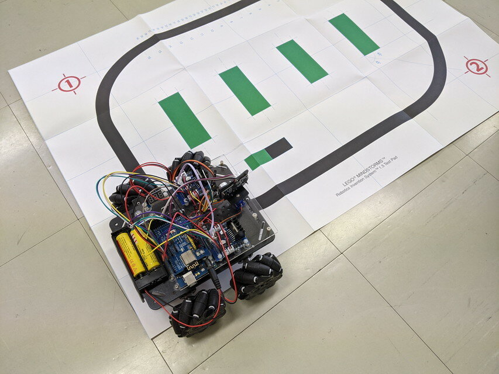
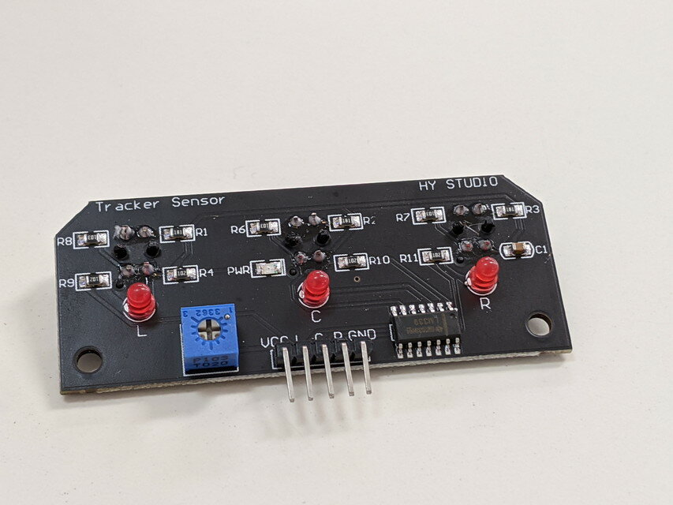
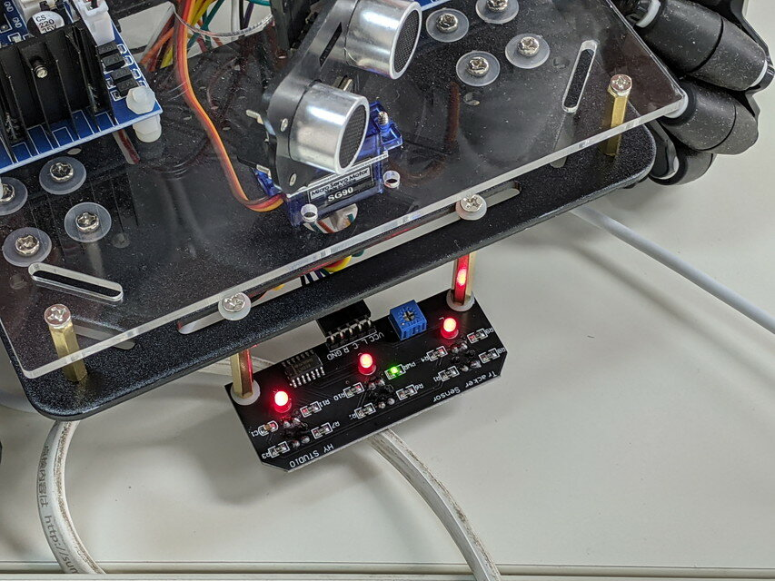
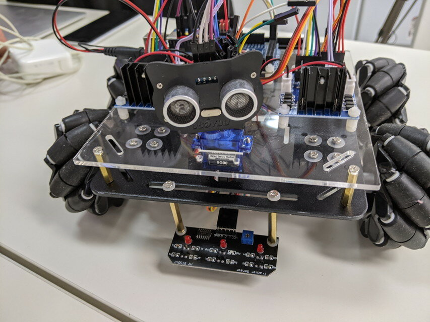

[おおたfab](https://ot-fb.com/ "おおたfab")さんのセミナー「素人でもロボットをつくりたい」では、[OSOYOOさんのメカナムロボット](https://osoyoo.com/2019/11/08/omni-direction-mecanum-wheel-robotic-kit-v1/ "Metal Chassis Mecanum Wheel Robotic (for Arduino Mega2560) ")を素材にして実験をしています。

 [前回(第37回)のセミナー](https://kanpapa.com/2021/02/mecanum-wheel-robot-lesson2-fixed.html "メカナムロボットに超音波センサーを取り付けました（おおたFab 第35回 素人でもロボットをつくりたい）")で障害物をよけて動くロボットができました。今回はセンサーを追加してライントレーサーをつくります。

<!--more-->

### センサーの取り付け

まずはセンサー基板の取り付けです。LEDとフォトトランジスタを組み合わせることで地面の明暗を判別するセンサーが３つ並んでいます。（次の写真ではセンサーは裏側なのでみえません。今度撮り直します。）

このセンサーをロボットに取り付けます。

センサーのケーブルをArduinoマイコンに接続します。

センサーのLEDも点灯しているので接続はできていると思われます。

### 動作確認

この状態でテストプログラムをアップロードして動かしてみたところ、うまく前にすすみません。センサーのLEDの点灯状態からみるとセンサーでラインは認識できているようです。

Arduinoプログラムをreverseではないものに入れ替えましたが、状況は変わりませんでした。ハードウェアに問題がないかと配線を確認したところ、一か所入れ替わっているのを発見したので修正しました。

再び動かしてみたところ今度は正常に動作しました。しっかりラインを認識して動いているようです。

### モータのエンコーダーの実験

この実験のあと、少し時間があったのでモータのエンコーダーの実験をしてみました。

OSOYOOさんのサイトの以下の記事です。エンコーダーのパルス出力をArduinoで読み取って値を出力するものです。

- [Arduinoを使ってモーターエンコーダをテストする方法](https://osoyoo.com/ja/2019/11/08/how-to-test-motor-encoder-with-arduino/ "Arduinoを使ってモーターエンコーダをテストする方法")

しかし、思うような結果が得られません。エンコーダから出力されるはずのパルス信号を観測しようとおおたfabさんのオシロスコープをお借りして接続してみましたが、常にHIGH(+5V)が出ている状態で期待していたパルス信号が見えませんでした。

これを解決するにはエンコーダーのカバーを外して内部構造を見てみたいところですが、こちらは別の機会にということになりました。

### 次回のセミナー

次回はBluetoothで無線制御を行ってみます。

