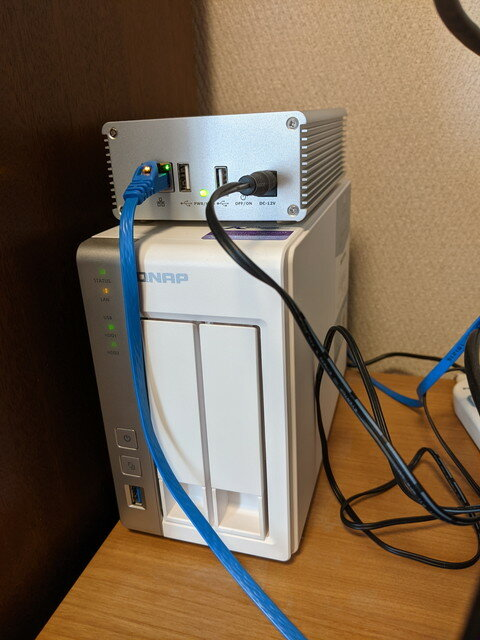
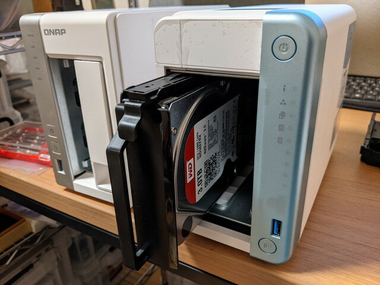
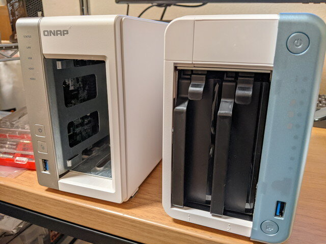
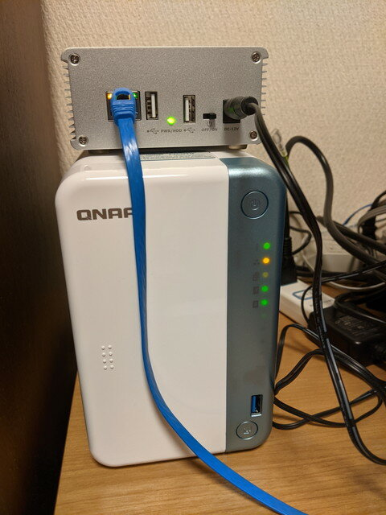

### ファイルの自動整理をやってみたら・・

これまで自宅ネットワークではQNAP [TS-231P](https://www.qnap.com/ja-jp/product/ts-231p "TS-231P")を使ってきました。

写真データがかなり溜まってきたので、ファイルの自動整理をおこなおうかと[Qfilling](https://www.qnap.com/ja-jp/software/qfiling "Qfilling")を使ってみたところ、メタデータを使った整理は全文検索エンジンの[Qsirch](https://www.qnap.com/ja-jp/software/qsirch "Qsirch")を動かすために、メモリが2GB以上（4GB推奨）必要で、今使っているTS-231P（メモリ1GB、増設不可）では動かないことがわかりました。

<!--more-->

### NASのアップグレードを検討

TS-231Pを購入してから時間もたっているので、もう少しパワーのあるNASに買い替える時期かなと最近のモデルを調べ始めました。データの移行も気になりますがQNAPでは機種間の互換があり、ハードディスクを同じ順番で差し替えることでそのまま使えるようです。これはデータの移行が楽ちんですね。メモリもSODIMMなので簡単に増設できそうです。

メモリ4GB搭載でスペックの高い[TS-253D](https://www.qnap.com/ja-jp/product/ts-253d "TS-253D")もあるのですが、そこまでは必要なさそうなので、コストパフォーマンスの良い[TS-251D](https://www.qnap.com/ja-jp/product/ts-251d "TS-251D")を購入してメモリ増設を行うことにしました。

### 新しいNASが到着

到着したTS-251Dです。メモリは4GBを2枚買いました。16GBでもよかったのですが、私の使い方であれば、8GBで十分でしょう。

### さっそくセットアップ

まずは、TS-251Dに4GBメモリを2枚取り付けます。前面のHDDのカバーを外すと、メモリスロットが目に入ります。外側のカバーを外して取り付ける方法もあるようですが、私はそのままスロットに取り付けました。

次はデータの移行です。今使っているTS-231Pからハードディスクを取り外します。

順番を間違えないように１台ずつ行います。

これまでの白いトレイからハードディスクを取り外し新しいトレイに取り付けます。新しいトレイではネジが不要な構造でパチンと止めるだけでびっくりです。（2.5インチはネジ止めが必要です。）

トレイに取り付けたハードディスクを新しい本体にセットします。

もう１台のハードディスクも同様に取り付け、２台のハードディスクがベイに収まりました。

これでカバーを取り付ければ作業終了です。

### 動作確認

元の位置に設置しネットワークを接続します。

電源をいれると何事もなかったようにNASとして動き出しました。CPUがARMからCeleronに変わったので、コンテナは設定しなおしでしたが、他は問題ありません。心なしかスピードが速くなっているように感じます。

メモリも8GBになりましたので、いろんなアプリケーションも試せそうです。
