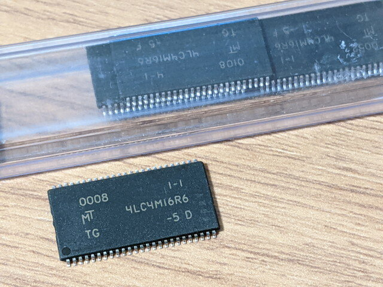

[MC68EZ328 DragonOne SBC](https://kanpapa.com/2021/03/mc68ez328-dragonone-sbc-kicad.html)の主要パーツはAliexpressで発注しました。一番安い発送方法を選択したため到着までに時間は少しかかりますが、ディスコンのパーツを手に入れることができます。

今回は再現性を重視し、回路図通りのパーツを使用しています。CPUは以前購入して保管していたものですが、それ以外のパーツは今回新規に購入しました。

#### CPU MC68EZ328PU16V

#### Flash memory AM29LV033C-90EC 4Mx8bit

#### DRAM MT4LC4M16R6TG-5 4Mx16bit EDO

#### RTC DS1306 CLK/CALENDAR SPI

他にロジックICが必要ですが、こちらは秋月電子で購入できるものを使用することにしました。

- [74LCX245FT](https://akizukidenshi.com/catalog/g/g114111/)
- [74LCX00FT](https://akizukidenshi.com/catalog/g/g114106/)

あとは[基板](https://kanpapa.com/2021/04/mc68ez328-dragonone-sbc-pcb-ordered.html "MC68EZ328 DragonOne SBCの基板を発注しました")の到着を待つのみです。
