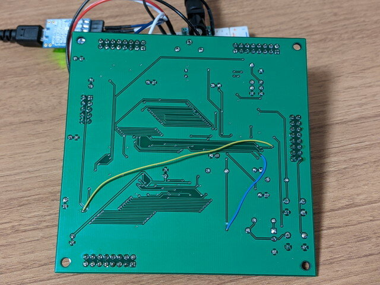
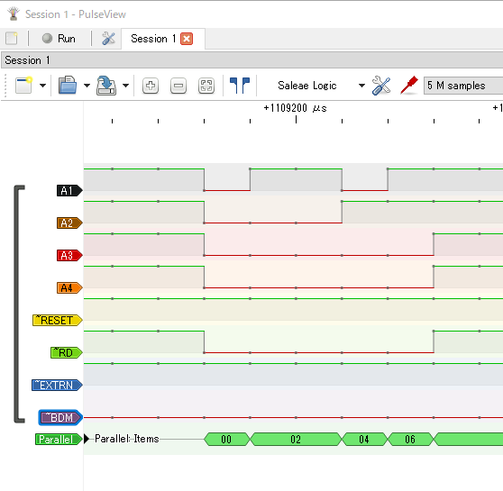
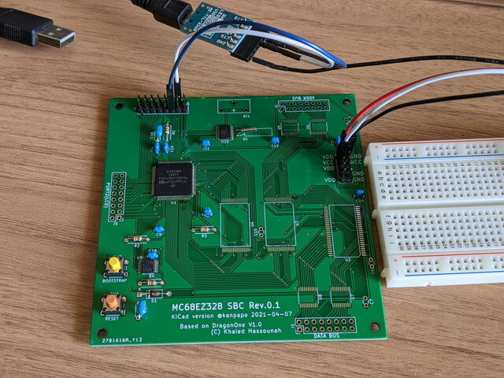
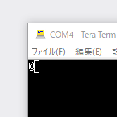
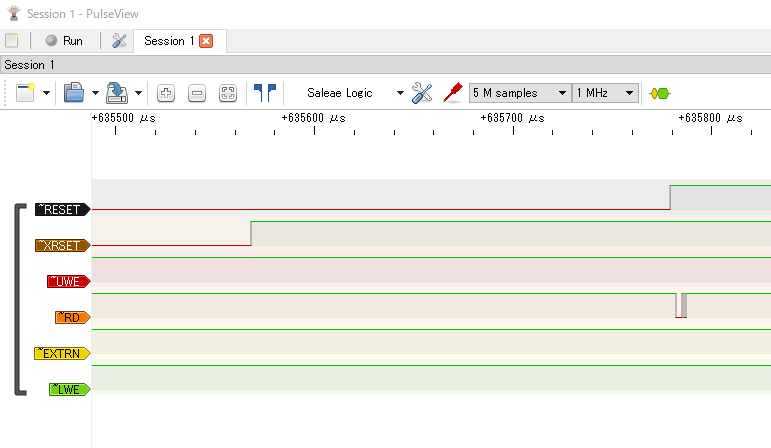

先日到着した[MC68EZ328 DragonOne SBC基板](https://kanpapa.com/2021/04/mc68ez328-dragonone-sbc-pcb-rev01.html "MC68EZ328 DragonOne SBCの基板が到着しました")の実装を行いました。これだけしっかりしたSMDパーツの基板実装は初めてです。（[クソマゾLEDマトリクス](https://kanpapa.com/2018/12/16x16led-matrix-kit.html "クソマゾLEDマトリックス バッヂ を作ってみた")よりはかなり簡単ですが。）

### DragonOne SBC基板の実装

慎重にCPU、メモリなどを実装しました。まだRTCのバッテリーは取り付けていません。


恐る恐る電源を入れて、シリアルポートにPCを接続します。MC68EZ328にはユニークなブートローダーモードがあって、EMUBRK信号をLOWにしたまま、RESETをすることで、CPU単体でブートローダーが動きます。ターミナルから何か１文字を入力すると、それを認識して「@」が返ってくるのですが、試したところ何も反応がありませんでした。

 <!--more-->

### トラブルシューティング

そう簡単には動かないと思っていましたので、回路図を見直したところ２か所間違いを見つけました。何とかパターンカットとジャンパー線で修正できたので、再度電源を投入しましたが、状況は変わりませんでした。



ロジアナを接続したところ、リセット後にアドレス信号は正常に出ていました。CPU自体は動いているように見えますが、古いものですからなんとも言えません。



### シンプルな回路で動作を比較してみる

やむなく比較用にCPUのみを実装した基板を製作しました。CPUのみなので確実に動作するはずです。



こちらの基板でブートローダーを起動したところ、「@」の表示が出ることを確認しました。CPU周りの回路は問題ないことが確認できました。



ブートローダーが動作しているときにロジアナでみてみると、RD(OE)信号がアクティブに動いているのがわかります。


### ブートローダーが動かなかった理由

メモリを実装した基板でEMUBRKスイッチをLOWにし、リセットをしても通常のリセット時と同じような動きにみえました。



これはブートローダーモードにするための、EMUBRK信号がLOWにできておらずブートローダーモードに入っていないと推測できたので、もう一度念入りにはんだ付けをしました。

再度電源を投入したところ、ブートローダーの「@」が表示されました。結局原因ははんだ付けの不良だったのです。時間がかかりましたが解決できてよかったです。


### ブートローダーで簡単なプログラムを動かしてみる

ブートローダーからプログラムを動かしてみたいところですが、まだ外部メモリが正常に使えるかわからないので、確実に利用できるCPU内部にあるIBUFFと呼ばれる８バイトの命令実行用メモリを使います。

ここではメモリの内容を表示してみます。ブートローダーにbレコードというフォーマットでIBUFFへのコード書き込みとIBUFFにあるコードの実行ができます。

今回は以下のbレコードを書き込みました。00000000番地の内容をシリアルポートに出力します。$FFFFF907はUART Transmitter Registerのアドレスです。

```
FFFFFFAA082C7C000000004E71     ;movea.l #$00000000, A6 ; nop
FFFFFFAA00                     ;ibuffのアドレスから実行
FFFFFFAA082A7CFFFFF9074E71     ;movea.l #$FFFFF907, A5 ; nop
FFFFFFAA00                     ;ibuffのアドレスから実行
FFFFFFAA081A964E714E714E71     ;move.b  (A6), (A5) ; nop ; nop ; nop
FFFFFFAA00                     ;ibuffのアドレスから実行
```

これを読み込ませたところ、最後に１バイトの文字化けが表示されました。


これが$00000000のメモリの内容になります。ターミナルでは確認できないので、ターミナルのログをバイナリエディタでみてみると。


どうやら$00000000番地からは$FFが読み込めたようです。

CPUの内部レジスタはまだ未設定なので、リセット後にデフォルトで有効となるCSA0(Chip Select Group A)をフラッシュメモリのCE(Chip Enable)に接続しているため、00000000番地はフラッシュメモリになっているはずです。しかし、この時点ではフラッシュメモリの内容が正常に読めているのかはまだわかりません。

もう少し広い範囲のメモリを確認するためには、読み出すアドレスを指定したコードをIBUFFに設定しながら何回も実行することで、メモリダンプのプログラムができるはずです。

本来はBBUG.EXEという公式のユーティリティがあるのですが、現在は入手できないため、同様なプログラムをコツコツ作って、メモリが設計通りに配置されて読み書きできるか、メモリチェックプログラムを動かすなど、ハードウェアの基本的な確認を進めてみます。
