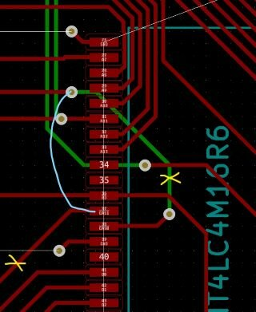
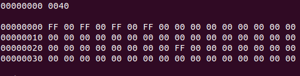

[ロジアナを使っていろいろためしてみましたが](https://kanpapa.com/2021/04/mc68ez328-dragonone-sbc-dram-ibuff.html "MC68EZ328 DragonOne SBCで8バイトのプログラムを動かしてみる")、DRAMの仕様書にある通りの信号がでていました。タイミング的にも余裕があります。謎は深まるばかりです。

### CASが逆になっている？

偶数アドレスにアクセスしたときは、CASHがLとなり、奇数アドレスにアクセスすると、CASLがLとなります。これでデータバスの上位8ビットを読み取るか、下位8ビットを読み取るかが決まるわけです。ここで、ふと思いました。CASHとCASLが逆になっているのではないかと。

CPUが上位バイトを読み取ろうとしているときに、DRAMが下位バイトの情報をバスに出しているとしたら、目的のデータは読み取れません。

回路図を確認したところ、プリント基板のレイアウトを優先しているためにデータバスの上位バイトと下位バイトが逆に接続されていました。ということは、CASLとCASHを入れ替える必要があるのではということで、パターンカットとジャンパー線で修正してみることにしました。

### 回路を修正

修正後の回路図はこうなります。通常はCASLをCAS0に、CALHをCAS1に接続するのですが、この回路ではメモリのD0-D7がバスの上位ビット、メモリのD8-D15がバスの下位ビットに接続されているのでCASを逆に接続することで正しくなります。

プリント基板は以下のようにパターンカットを行いました。

パターンカットとジャンパ線で修正した基板です。

### 無事DRAMにアクセスできました

修正後にメモリダンプをしたところ、何やらランダムな値が入るようになりました。どうやらDRAMの内容が見えているようです。

ブートローダーから$00を書いたり、$FFを書いたりしましたが、メモリの先頭の一部を除いて正常に書き込み、読み出しが行えることが確認できました。

メモリの先頭付近で、$00を書き込んだにもかかわらず一部値が異なっているところがあります。

メモリ不良の疑いもありましたが、製作した２枚の基板の両方で同じ値になっているので、メモリ不良ではなくブートローダーがなんらかの形で書き換えている可能性があると考えています。

いったんこのエリアは避けて、他の部分でメモリチェックのプログラムを書いてみようと思います。

(追記）MC68EZ328のマニュアルに以下の記述がありました。これは正しい動作でした。

「注：ブートストラップモードでは、リセットベクター(0x0～0x7)とAライン例外ベクター(0x28～0x2b)の空間は、モトローラのみが使用できるように予約されています。これらの場所にメモリを読み出した場合、正しくないデータが返されます。」

まずはDRAMが使えるようになってひと安心です。
