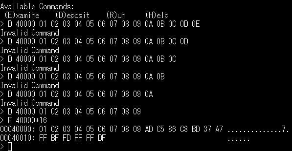
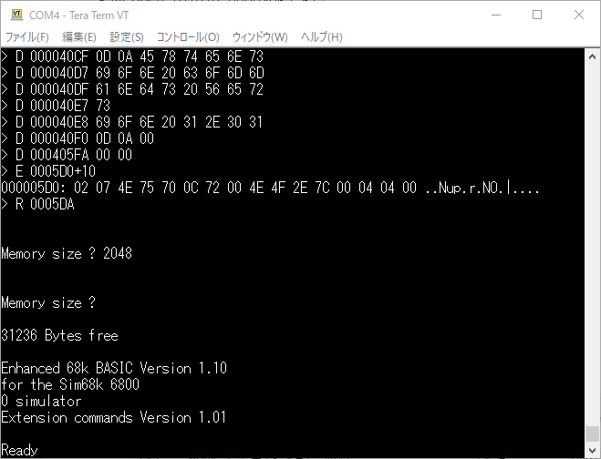

[モニタが簡単に起動するようになった](https://kanpapa.com/2021/05/mc68ez328-dragonone-sbc-flash-monitor.html "MC68EZ328 DragonOne SBCのフラッシュメモリからモニタを起動できました")ので、アプリケーションを動かしてみることにしました。

やはりまずはBASICでしょう。68000プロセッサで動作するBASICを探したところ、以下のものがありました。

- [Enhanced 68k BASIC by Lee Davison](https://philpem.me.uk/leeedavison/68k/simbasic/index.html "Enhanced 68k BASIC by Lee Davison")

かなり強力そうなBASICです。EASy68Kのシミュレータでも動くようでグラフィック機能も実装されています。今回はSBCですのでコンソール機能しか使いませんが、それでも有益なステートメントが装備されているようです。

### モニタで大量にメモリに書き込みたい

ブートローダーでメモリにロードする場合はBレコードを準備すればよいのですが、モニタのコマンドにはSレコードやBレコードの読み込み機能はなく、アドレスとデータを指定してメモリに書き込む機能「（D)eposit」しかありません。今回はこの機能を使って手入力と同じになるようなファイルを作成して、アップロードすることでメモリにデータを書き込むことにしました。具体的には以下のようなデータになります。

D ADDRESS DATA DATA DATA DATA.....

(例）D 00003020 E5 D4 67 32 B0 3C 00 2C

何バイトまで書き込みができるのかを確認してみました。



一度に9バイトまで書き込みができるようなので、1回の書き込みは8バイトとして、Pythonで[stod.py](https://github.com/kanpapa/MC68EZ328/blob/main/bbug/stod.py "stod.py")というスクリプトを作成し、Sレコードからメモリ書き込みデータ（ここではDレコードと呼ぶことにします）を作成するようにしました。

モニタを起動した状態で、Sレコードから変換したDレコードをアップロードすると、次々とメモリに書き込むことができます。

<!--more-->

### Enhanced 68K BASICをMC68EZ328用に修正

EhBASICはEASy68Kで動作するようになっているので、入出力ルーチンをMC68EZ328で動作するように以下のルーチンに入れ替えました。LOAD/SAVEは今は使えないためダミーにしています。

```
* output character to the console from register d0VEC_OUT     MOVE.L  D0,-(sp)   * save d0     MOVE.B  D0,$fffff907.LoutChar1:     MOVE.B  $fffff906.L,D0     AND.B   #$20,D0     BEQ     outChar1     MOVE.L  (SP)+,D0   * else restore d1     RTS* input a character from the console into register d0* else return Cb=0 if there's no character availableVEC_IN    MOVE.B  $FFFFF904.L,D0    AND.B   #$20,D0    BNE     RETCHR    TST.B   D0          * set z flag*   ANDI.B  #$FE,CCR    * clear carry, flag we not got byte (done by ORI.b)    RTSRETCHR    MOVE.B  $fffff905.L,D0    TST.B   D0       * set z flag on received byte    ORI.B   #1,CCR   * set carry, flag we got a byte    RTS* LOAD routine (dummy)VEC_LD    RTS* SAVE routine (dummy)VEC_SV    RTS
```

今回の修正はコンソールで動作するための最低限の修正なので、EASy68Kに依存した機能を使うとハングアップするかもです。そのうちSBCに特化した機能のみにしてコンパクト版を作ってみようかと思います。

### Enhanced 68K BASICが動きました

EhBASICのソースをアセンブルして生成されたSレコードをDレコードに変換してモニタにアップロードします。アップロードがおわったところで、モニタのRコマンドで実行すると、無事EhBASICが動作しました。



最初は動きがおかしかったのですが、VEC\_OUTでD0レジスタを破壊しないように修正したところ正常に動くようになりました。

ここまで動けばASCIIARTベンチマークの実行です。ただし、オリジナルのソースをつかうと"NEXT without FOR Error"となってしまいました。EhBASICではFOR NEXTループを脱出できない仕様のようで、一番内側のFOR NEXTループをIFループにすることで実行できました。


無事動きました。かかった時間は2分11秒でした。

追記：電脳伝説さんのSBC1802データパックに入っているASCIIART.BASであれば修正不要で実行できました。

EhBASICはサイズが大きいので、これもフラッシュメモリに書き込んで、すぐ起動できるようにしようと考えています。
