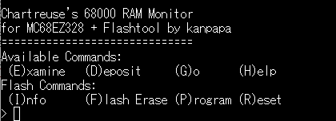
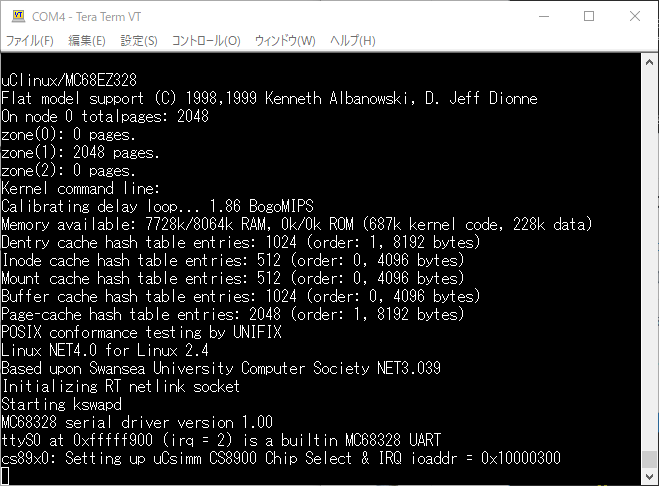

以前、[uClinuxのビルド環境までは構築](https://kanpapa.com/2021/03/uclinux-build-ubuntu20-04-wsl.html "68000用のuClinuxをUbuntu 20.04 LTS (WSL環境) でビルドしてみました")しましたが、実際にMC68EZ328の実機上で動かしてみます。DragonOneと同様にシンプルなArcturus社のuCsimmボードのコンフィグレーションを基本として、今回のDragonOne SBC用に修正していきます。

### uClinuxのイメージファイルの作成

まずは、uCsimmボード用のイメージファイルを作ります。Linuxカーネルは2.4系を使います。

DragonOneとuCsimmはメモリマップに違いがあるので、uClinux-dist/linux-2.4.x/arch/m68knommu/platform/68EZ328/ucsimm/rom.ldのメモリアドレス定義を変更します。uCsimmはFlash 2MB, DRAM 8MBなので、Flashの部分をDragonOne SBC用に修正しました。また、uCsimmは専用のブートローダがあり、そこで68EZ328 CPUの制御レジスタを設定しているようなのですが、DragonOneは直接起動するため、リセット直後に68EZ328 CPUの初期設定をおこなう必要があります。そのため、ucsimm/crt0\_fixed.Sにboot.bで行っているものと同様のレジスタ設定を加えました。

変更パッチは後程Github.comに登録しておきます。

### モニタにフラッシュ書き込み機能を追加

ビルドして生成されるimage.binはフラッシュメモリに書き込むためのバイナリデータですので、Bレコードに変換して、ブートローダーに読み込ませ、その後フラッシュ書き込みツールで書き込みます。

この作業を行いやすくするために、モニタプログラムにフラッシュ書き込み機能を統合しました。これで書き込むバイナリの内容確認やちょっとしたパッチもそのまま行えます。

### uClinuxの起動

ビルドで生成したimage.bをフラッシュメモリに書き込み、リセットをしたところ何も反応がありません。

まあ、そう簡単に動くわけはないと思っていましたが、ダメ元でモニタをロードし、リセット後に実行されるはずのアドレスから実行したところ、以下のような表示が現れました。

これは、シリアル通信の速度が一致していない場合によく見る文字化けです。何行か続いて表示されているようにみえます。すぐ出力が終わってしまうので通信速度は合わせられませんでした。

リセット時も同じアドレスからの実行なので、これと同じ状態になるべきですが、モニタからの実行とリセット直後の違いを考えてみると、モニタはブートローダーから起動しているので、ブートローダーが動いている時点ですでに終わっているUARTの初期設定が必要なことに気が付きました。

レジスタの設定を行っているucsimm/crt0\_fixed.SにUART設定も追記して、image.bをビルドして再びFlashに書き込み、リセットをしたところ今度は起動メッセージが表示されました。

このあと順調に進むかと思いましたが、途中で止まってしまいました。

CS8900はuCsimmに搭載されているLANコントローラです。当然DragonOneにはCS8900はありませんので、待ちになってしまったようです。ネットワーク機能を外して再びビルドです。

これで動くかなと期待したのですが、また止まってしまいました。（続く）
