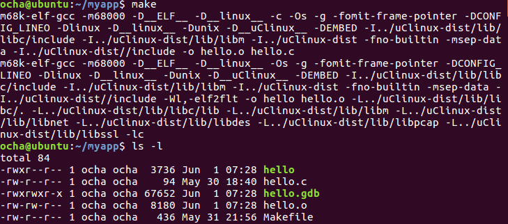
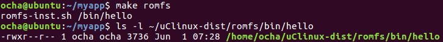
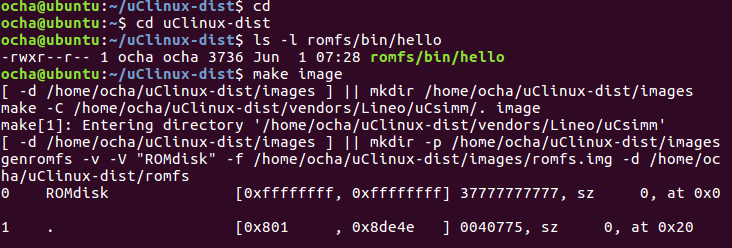
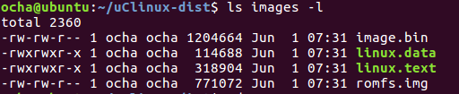

[uClinuxが動くようになりました](https://kanpapa.com/2021/05/mc68ez328-dragonone-sbc-uclinux-part9.html "MC68EZ328 DragonOne SBCでuClinuxを動かす(9) ～2002年のビルド環境を再現～")が、自分で作ったアプリケーションを動かすにはどうすればいいのでしょう。Google検索で見つけた[uClinux-dist開発者ガイド（アットマークテクノ SUZAKUサイト）](https://suzaku.atmark-techno.com/files/downloads/suzaku/manual/uclinux-dist_developers_guide_ja-1.4.5.pdf "uClinux-dist開発者ガイド")を参考にしてアプリケーションを動かしてみました。

### 作業ディレクトリの作成

ホームディレクトリにuClinux-distがあるとして、ホームディレクトリにmyappという作業用のディレクトリを作成しました。

```
$ cd
$ mkdir myapp
```

### Makefileの作成

以下のようなMakefileを準備します。

```
ROOTDIR=../uClinux-dist
ROMFSDIR = $(ROOTDIR)/romfs
ROMFSINST = romfs-inst.sh
PATH := $(PATH):$(ROOTDIR)/tools
UCLINUX_BUILD_USER = 1
include $(ROOTDIR)/.config
LIBCDIR=$(CONFIG_LIBCDIR)
include $(ROOTDIR)/config.arch
EXEC = hello
OBJS = hello.o
all: $(EXEC)
$(EXEC): $(OBJS)
$(CC) $(LDFLAGS) -o $@ $(OBJS) $(LDLIBS)
clean:
-rm -f $(EXEC) *.elf *.gdb *.o
romfs:
$(ROMFSINST) /bin/$(EXEC)
%.o: %.c
$(CC) -c $(CFLAGS) -o $@
```

### アプリケーションプログラムのソースコードの準備

hello.cを用意しました。

```
#include 

int main(void) {
    printf("hello, uClinux-m68k DragonOne\n");
    return 0;
}
```

### makeの実行

makeをして実行ファイルを作成します。



### romfsへの組み込み

make romfsでhelloの実行ファイルをromfsのディレクトリにコピーします。



### イメージファイルの作成

make imageでhelloが追加されたimage.binを作成します。



make中のメッセージでhelloが組み込まれていることがわかります。


これでhelloが組み込まれたimage.binができました。



### フラッシュメモリへの書き込み

image.binをimage.bに変換して、フラッシュメモリに書き込みます。

### uClinuxでアプリケーションを実行

フラッシュメモリに書き込んだあとリセットしてuClinuxを起動します。アプリケーションhelloは動くのでしょうか？


無事helloが動きました！ これでいろんなアプリケーションを組み込むことができそうです。
