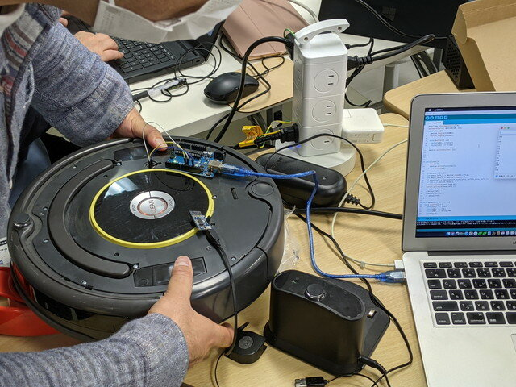

[第41回（4月3日)](https://kanpapa.com/2021/04/Roomba-robot-1.html "ルンバをArduinoで制御してみました。（おおたfab 第41回 素人でもロボットをつくりたい）")ではArduinoからルンバに対してコマンドを送ってモーターを動かしました。第42回（4月17日）はルンバのセンサーデータをArduinoで読み取ることを試してみます。

### ルンバから読み取れるデータ

ルンバにはいろいろなセンサーが取り付けられています。障害物に接触したことを検知するバンパーやモーターの回転数を読み取るエンコーダー、各種スイッチが押されたかを読み取るなどが考えられます。

今回はモーターの回転数をエンコーダーという仕組みで読み取ります。モーターに電流を流すとモーターが回転します。しかし、本当に回転しているのかはモーター側ではわかりません。もし何かに引っかかってモーターが回らない状態になっているにも関わらず、モーターに電流を流し続けるとモーターが焼けてしまうかもしれません。このため想定通りにモーターが動いているかを検知する仕組みが必要になるのです。

<!--more-->

### エンコーダーの仕様を確認

仕様を確認しようと、仕様書を探したところ、500系のルンバ用のマニュアルと、600系のマニュアルがありました。今回入手したルンバは600系なので600系の仕様書を使うことにします。細かくは確認していませんが、若干異なる部分がありそうです。

- [iRobot® Roomba 500Open Interface (OI) Specification](https://www.irobot.lv/uploaded_files/File/iRobot_Roomba_500_Open_Interface_Spec.pdf "iRobot® Roomba 500Open Interface (OI) Specification ")
- [iRobot® Create® 2 Open Interface (OI)Specification based on the iRobot® Roomba® 600](https://www.irobotweb.com/-/media/MainSite/PDFs/About/STEM/Create/iRobot_Roomba_600_Open_Interface_Spec.pdf?la=en "iRobot® Create®  2 Open Interface (OI)Specification based on the iRobot® Roomba® 600")

エンコーダを読み取るための仕様がみつかりました。

ルンバから情報を取得する場合は、以下のコマンドを送るようです。

- Sensors Opcode: 142　Data Bytes: 1

このコマンドのあとに取得するデータの種類をPacket IDで指定します。

- Serial sequence: \[142\] \[Packet ID\]

Packet IDの仕様によると、左側と右側で別々に値がとれるようです。

|   | Packet ID | 取得できるData |
| --- | --- | --- |
| Left　Encoder Counts | 43 | 符号付2バイト |
| Right Encoder Counts | 44 | 符号付2バイト |

コマンドとPacket IDを送信すると、2バイトの符号付データが受信できるはずです。

さらに調べたところ参考となるWebサイトも見つかりました。

- [ArduinoからRoombaをSoftware Serialで動かす](https://qiita.com/legokichi/items/36a13e68722c51c72927 "ArduinoからRoombaをSoftware Serialで動かす")
- [iRobot create2 (Arduino-Roomba) create 2を動かす方法とエンコーダーの値を取得する方法についてまとめる](https://www.media.lab.uec.ac.jp/?page_id=697 "iRobot create2 (Arduino-Roomba) create 2を動かす方法とエンコーダーの値を取得する方法についてまとめる")

### Arduinoのプログラム

ルンバ600の仕様書やWebサイトの情報からArduinoのプログラムをつくりました。ソースはGitHub.comに置きました。

- [docofab/RoombaControlls/Sample/Roomba0417/Roomba0417.ino](https://github.com/docofab/RoombaControlls/blob/main/Sample/Roomba0417/Roomba0417.ino "Roomba0417.ino")

### エンコーダーの値を読み取ってみる

ルンバに接続したArduinoでプログラムを動かして、モーターの軸を手で回転させてみます。

少し持ち上げて車輪を回すと数値が読み取れました。この値でどの程度回転したかを知ることができます。

今回はエンコーダーのデータだけ読み取ってみましたが、同様な手順で他のセンサーデータも読み取れるものと思われます。

次回はセンサーのデータを入力として、モーターを制御するようなことを試してみます。
