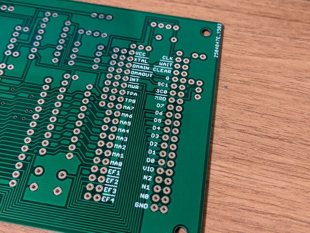
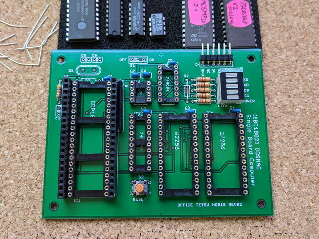
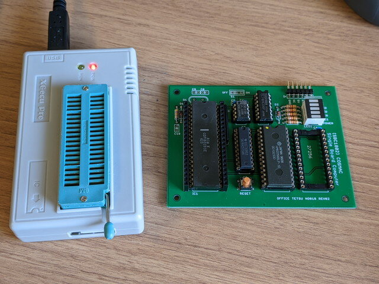
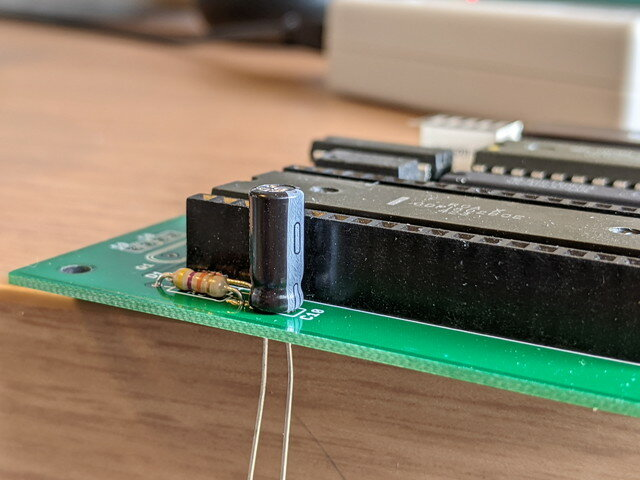
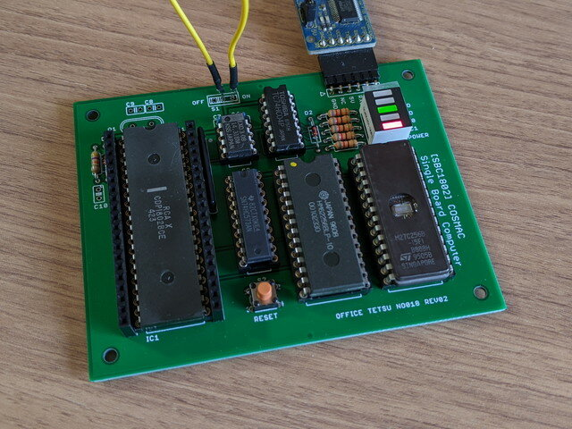
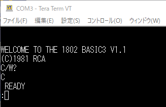
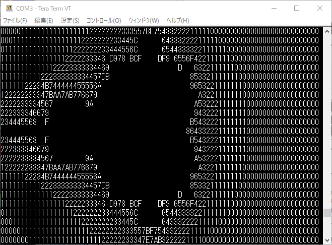

SBC1802は電脳伝説(@vintagechips)さんが設計したシンプルなシングルボードコンピュータで、CDP1802 COSMAC CPUでRCA BASIC3が動作します。この専用基板の品薄が続いていましたが、ようやく入手できましたので早速組み立ててみました。この専用基板は[オレンジピコショップ](https://store.shopping.yahoo.co.jp/orangepicoshop/pico-a-041.html "SBC1802専用プリント基板")さん、[スイッチサイエンス](https://www.switch-science.com/catalog/7107/ "SBC1802ルーズキット")さんで取り扱っています。（5/4現在、品切れのようです。）

### SBC1802の基板をチェック

今回購入したSBC1802基板です。他の基板と一緒に購入しました。

<!--more-->

基板の裏側を確認したところ、CPUのピン配置が書いてありました。拡張コネクタを使った実験をするときに便利そうです。

### 組み立て作業開始

組み立てに必要なパーツはほぼ手元にありましたが、EXO3とLEDだけは秋月で購入しました。

はんだ付けがほぼ完了したSBC1802基板です。小型スライドスイッチと10μFのケミコンだけ見つからなかったのであとで探してみます。

手持ちのICをとりつけて、ROMライタでRCA BASIC3をROM 27C256に焼きます。

小型スイッチは見つからなかったのでまた今度購入することにします。10μFのケミコンは見つかったのではんだ付けしようと思ったのですが、部品の背が高いため、CPUの周りにある拡張用のコネクタから頭がはみ出てしまいます。

拡張基板を製作したときに邪魔になりそうなので、背の低いタンタルコンデンサを入手したあとに取り付けることにしました。

### いよいよ電源を投入

USBシリアルを接続し、電源を投入する前に電源スイッチの代わりのジャンパー線で仮止めです。ケミコンがないのでRESETスイッチを押すことでパワーオンリセットの代わりです。

シリアルターミナルからEnterキーを押すと、無事RCA BASIC3が起動しました。

デモプログラムをアップロードして動かしてみます。お約束のASCIIARTです。

足りないパーツを入手して仕上げたいところですが、他のパーツと一緒に手配する予定なので、しばらくはこのまま動かすことになりそうです。
