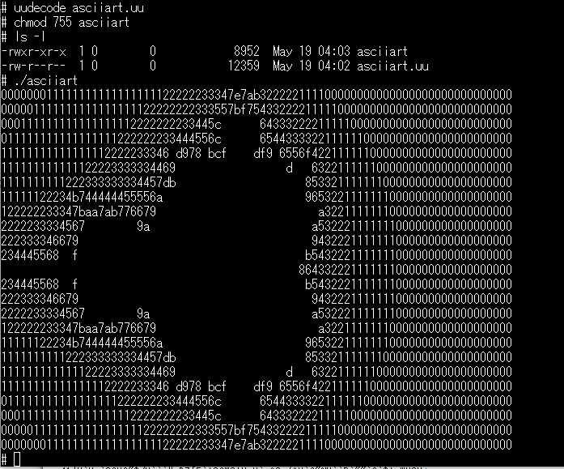

hello worldの表示だけではいまいちですので、いつものASCIIARTベンチマークを動かしてみます。asciiart.basを見ながらasciiart.cを作り、hello.cと同様のビルド環境をつくりました。helloはimage.binに組み込んでフラッシュメモリに書き込むことでプログラムを動かしましたが、毎回image.binを書き込むのも大変です。

uClinuxではRAMディスクがあり、それが/varにmountされています。/tmpもここにあります。ある程度の容量がありますので、小さいプログラムではここに書き込むのがよさそうです。

XMODEMとかZMODEMとかがあると、かっこいいのですが、ここはbusyboxに実装されているuuencode/uudecodeを活用することにしバイナリをテキストにしてシリアルコンソールからアップロードすることにしました。

### ビルド環境でのコンパイル

ビルド環境であるubuntuでの作業手順は以下のようになります。

```
ocha@ubuntu:~/asciiart$ pwd
/home/ocha/asciiart
ocha@ubuntu:~/asciiart$ ls -l
total 116
-rwxr--r-- 1 ocha ocha  8952 Jun  7 08:49 asciiart
-rw-r--r-- 1 ocha ocha   468 Jun  7 08:49 asciiart.c
-rwxrwxr-x 1 ocha ocha 80105 Jun  7 08:49 asciiart.gdb
-rw-rw-r-- 1 ocha ocha  9212 Jun  7 08:49 asciiart.o
-rw-r--r-- 1 ocha ocha   442 Jun  7 08:16 Makefile
ocha@ubuntu:~/asciiart$ uuencode asciiart asciiart > asciiart.uu
ocha@ubuntu:~/asciiart$ cat asciiart.uu
begin 744 asciiart
M8D9,5`````0```!(```A0```(O```"?````0````(O`````"`````F"]7PX`
M``````````````````````````````!.<4YQ*D5!^0``!M).NX@`(A]P`4Y`
M3G5(YS\Z(&T`.$Z0?O1ZV21M`%`O!4Z26(\H;0!X+SS\4$@7+SP_IW,8+P$O
M`$Z43^\`$"\!+P`F;0!\3I-0CRQ`+P=.DEB/+SQHQI+W+SP_M54=+P$O`$Z4
M3^\`$"\!+P!.DU"/+``H3B8&>``F;0"$+PPO#$Z34(\D`"\#+P-.DU"/(&T`
M3"\`+P).D%"/)&T`E"\.+P!.DE"/)``O#"\,3I)83RZ#+P!.DUA/+H8O`$Z2
:
:
M;W0@:6UP;&5M96YT960`````````````````````````````````````````
M``````````````````````````````````````````````````````````
M`````0```"````````````````````````````````````````````````(`
M```B`````````````````````````````"*L```B@```````````````````
J````````````````````````````````````````````````(G@``")\
`
end
ocha@ubuntu:~/asciiart$
```

uuencodeでバイナリファイルをテキストファイルに変換します。念のためcatでファイルの内容を確認しました。

### uClinuxにアップロード

asciiart.uuをuClinuxのコンソールからアップロードします。アップロードの前に以下のように受信準備をします。

```
# cd /tmp
# cat > asciiart.uu
（ここでアップロードします）
（アップロードが終わったら CTRL+Dを押します）
# ls -l
-rw-r--r-- 1 0        0           12359  May 19 04:02 asciiart.uu
# uudecode asciiart.uu
# chmod 755 asciiart
# ls -l
-rwxr-xr-x  1 0        0            8952  May 19 04:03 asciiart
-rw-r--r-- 1 0        0           12359  May 19 04:02 asciiart.uu
#

```

アップロードが終わったらuudecodeでテキストからバイナリに変換します。

あとはchmodで実行権限をつけることで、asciiartの実行プログラムの準備ができました。

### ASCIIARTベンチマークを実行

uClinux上でasciiartを実行してみます。



いつもの画面が無事表示されました。C言語で書いたのでそこそこ速いです。23秒92でした。

これである程度のプログラムはフラッシュメモリを書き換えなくても動かせることが確認できました。デバックが終わったものはromfsのディレクトリに入れておけば、カーネルの更新タイミングでromfsにも組み込まれます。
