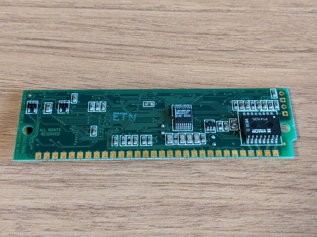
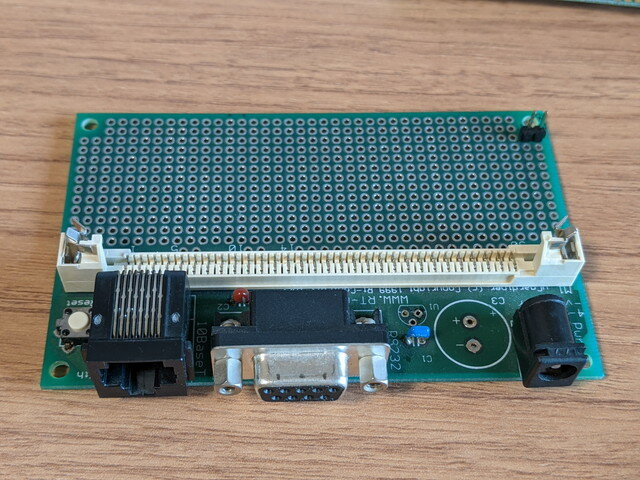
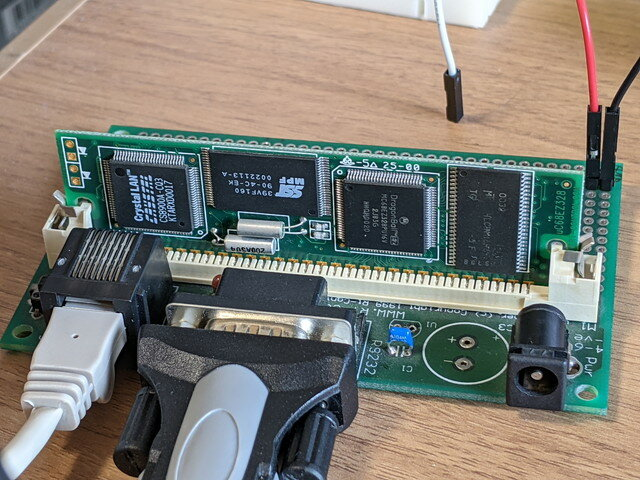
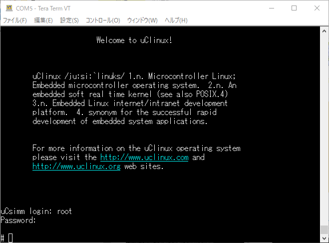

以前ヤフオクで購入したあと行方不明になっていたuCsimmカードとuCgardenerベースカードが見つかりましたので動かしてみました。

### uCsimmカード

uCsimmカードは2000年頃にRt-Control, Inc.とLineo, Inc.が開発したMC68EZ328でuClinuxが動作する30-pin SIMMサイズのマイコンボードです。これに刺激をうけて、uCdimm、ez328simm、DragonOneが登場したと思われます。現在開発中のMC68EZ328 SBCでも参考にしています。

 

uCsimmカードのスペックは以下の通りです。

- MC68EZ328 CPU
- 8 MB RAM
- 2 MB Flash
- 10 Mbit Ethernet controller (CS8900)
- 30-pin SIMM module.

これらのチップに加えてRS232Cのレベル変換ICやLAN用パルストランスまでがSIMMモジュールに実装されています。これは組み込み前提で交換保守がしやすいようになっているのではと思われます。

<!--more-->

### ベースボードの修理

このuCsimmカードを使うためにはSIMMスロットがあるベースボードが必要になります。

電源はベースボードから供給するのですが、電源コネクタがセンターマイナスであることに気づかずにセンタープラスの電源を差してしまい、3.3Vのレギュレーターが故障したようです。VIN, GNDピン周辺のパッケージが膨らんでいて過大な電流が流れたように見えます。おかげでuCsimmカードは無事だったと思われます。

このため、レギュレーターとケミコンを取り外して、ユニバーサル基板の電源ラインから3.3Vの電源を直接供給するように改造しました。

### 電源投入

ベースボードのシリアルコネクタにRS232C-USB変換ケーブルを取り付け、LANケーブルを接続した状態で電源を投入します。

シリアルコンソールとなっているTeratermにメッセージが表示されました。uCsimmカードのCPUとシリアルポートは問題なく動作しているようです。

ブートローダーでgoと入力するとuClinuxが起動すると聞いていますので、その通りに操作しました。

ファームに書き込まれているuClinuxのバージョンは2.0.38.1pre5のようです。最初から書き込まれていたものかどうかはわかりません。

### uClinuxにログインしてみる

uClinuxの起動メッセージが続き、無事loginプロンプトが表示されました。初期アカウントはroot、初期パスワードはuClinuxと聞いていますので、そのように入力しました。

無事ログインできました。早速uCsimmのuClinuxを探検してみます。（[続く](https://kanpapa.com/2021/06/mc68ez328-ucsimm-2.html "MC68EZ328 uCsimmを動かしてみました(2) ～uClinuxを探検する～")）
