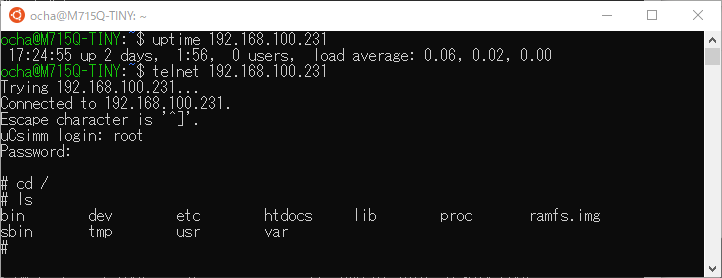

[uClinuxの起動が確認](https://kanpapa.com/2021/06/mc68ez328-ucsimm-1.html "MC68EZ328 uCsimmを動かしてみました(1)")できたところで、早速探検してみます。

### ファイルシステムを眺める

ログインしてlsしたところ、なぜかデバイスファイルが表示されました。

```
uCsimm login: root
Password:
# ls
console  console  cua0     cua0     cua1     cua1     cua2     cua2
cua3     cua3     cua4     cua4     cua5     cua5     cua6     cua6
cua7     cua7     cua8     cua8     cua9     cua9     dev      dev
fb0      fb0      fb1      fb1      kmem     kmem     mem      mem
null     null     ptyp0    ptyp0    ptyp1    ptyp1    ptyp2    ptyp2
ptyp3    ptyp3    ptyp4    ptyp4    ptyp5    ptyp5    ptyp6    ptyp6
ptyp7    ptyp7    ptyp8    ptyp8    ptyp9    ptyp9    ptypa    ptypa
ptypb    ptypb    ptypc    ptypc    ptypd    ptypd    ptype    ptype
ptypf    ptypf    ram0     ram0     ram1     ram1     ram2     ram2
ram3     ram3     rom0     rom0     rom1     rom1     rom2     rom2
rom3     rom3     tty      tty      tty0     tty0     tty1     tty1
tty2     tty2     tty3     tty3     tty4     tty4     tty5     tty5
tty6     tty6     tty7     tty7     tty8     tty8     tty9     tty9
ttyS0    ttyS0    ttyS1    ttyS1    ttyS2    ttyS2    ttyS3    ttyS3
ttyS4    ttyS4    ttyS5    ttyS5    ttyS6    ttyS6    ttyS7    ttyS7
ttyS8    ttyS8    ttyS9    ttyS9    ttyp0    ttyp0    ttyp1    ttyp1
ttyp2    ttyp2    ttyp3    ttyp3    ttyp4    ttyp4    ttyp5    ttyp5
ttyp6    ttyp6    ttyp7    ttyp7    ttyp8    ttyp8    ttyp9    ttyp9
ttypa    ttypa    ttypb    ttypb    ttypc    ttypc    ttypd    ttypd
ttype    ttype    ttypf    ttypf    zero     zero
#

```

<!--more-->

初期ディレクトリが/devになっているのでしょうか。カレントディレクトリを確認してみます。

```
# pwd
./../../../../../../../../../../../../../../../../../../../../../../../../../../../../../../../../../../../../../../../../../../../../../../../../../../../../../../../../../../../../../../../../../../../../../../../../../../../../../../../../../../../..
#

```

これはちと意味不明なので、カレントディレクトリを/にして探検を続けます。

```
# cd /
# pwd
/
# ls
bin        dev        etc        htdocs     lib        proc       ramfs.img
sbin       tmp        usr        var
# ls -l /etc
-rw-r--r-- 1 root     0             178  Jan 01 1970  inetd.conf
-rw-r--r-- 1 root     0             106  Jan 01 1970  inittab
-rw-r--r-- 1 root     0             574  Jan 01 1970  issue
-rw-r--r-- 1 root     0              79  Jan 01 1970  passwd
-rw-r--r-- 1 root     0             505  Jan 01 1970  rc
-rw-r--r-- 1 root     0              72  Jan 01 1970  resolv.conf
-rw-r--r-- 1 root     0              82  Jan 01 1970  services
#

```

### 環境設定ファイルを確認

/etc/rcで環境設定をしているのではと表示してみました。

```
# cat /etc/rc
#!/bin/sh
#
# system startup.
# set up the hostname
/bin/hostname uCsimm
# attach the interfaces
/sbin/ifattach
/sbin/ifattach \
--addr 192.168.1.200 \
--mask 255.255.255.0 \
--net 192.168.1.0 \
--gw 192.168.1.100 eth0
# expand the ramdisk
/sbin/expand /ramfs.img /dev/ram0
# mount ramdisk, proc and nfs
/bin/mount -t ext2 /dev/ram0 /var
/bin/mount -t proc proc /proc
/bin/mount -t nfs 192.168.1.11:/home/jeff/kit /usr
# start up the internet superserver
/sbin/inetd &
# that's it... sucess
exit 0

```

ここでネットワークの設定とRAMディスクの初期化、ファイルシステムのmount、inetdの起動を行っています。これを参考にすればネットワークも設定できそうです。

### ネットワークに接続する

試しにpingを投げてみます。

```
# ping 192.168.100.1
PING 192.168.100.1 (192.168.100.1): 56 data bytes
--- 192.168.100.1 ping statistics ---
3 packets transmitted, 0 packets received, 100% packet loss
#

```

正しいIPアドレスが設定されていないので、当然無反応です。 ここで/etc/rcを参考にしてIPアドレスを設定してみます。

```
# /sbin/ifattach --addr 192.168.100.231 --mask 255.255.255.0 --net 192.168.100.0 --gw 192.168.100.1 eth0
# ping 192.168.100.1
PING 192.168.100.1 (192.168.100.1): 56 data bytes
64 bytes from 192.168.100.1: icmp_seq=0 ttl=64 time=10.0 ms
64 bytes from 192.168.100.1: icmp_seq=1 ttl=64 time=0.0 ms
64 bytes from 192.168.100.1: icmp_seq=2 ttl=64 time=0.0 ms
64 bytes from 192.168.100.1: icmp_seq=3 ttl=64 time=0.0 ms
--- 192.168.100.1 ping statistics ---
4 packets transmitted, 4 packets received, 0% packet loss
round-trip min/avg/max = 0.0/2.5/10.0 ms
#

```

pingが返るようになりました。これでネットワークに接続できたことになります。

### Webサーバの稼働確認

さらにファイルを見てみます。

```
# cd /
# ls
bin        dev        etc        htdocs     lib        proc       ramfs.img
sbin       tmp        usr        var
# ls -l
drwxr-xr-x  1 root     0              32  Jan 01 1970  bin
drwxr-xr-x  1 root     0              32  Jan 01 1970  dev
drwxr-xr-x  1 root     0              32  Jan 01 1970  etc
drwxr-xr-x  1 root     0              32  Jan 01 1970  htdocs
drwxr-xr-x  1 root     0              32  Jan 01 1970  lib
dr-xr-xr-x  5 root     0               0  Jan 23 02:07 proc
-rw-r--r-- 1 root     0            3340  Jan 01 1970  ramfs.img
drwxr-xr-x  1 root     0              32  Jan 01 1970  sbin
lrwxrwxrwx  1 root     0               8  Jan 01 1970  tmp -> var/tmp/
drwxr-xr-x  1 root     0              32  Jan 01 1970  usr
drwxr-xr-x  3 root     0            1024  Oct 08 1998  var
# cd /htdocs
# ls
index.html                         logo.gif
rt-control-i-net-ready-logo-m.gif  uc68ez328-anim.gif
#

```

htdocsというディレクトリの中にコンテンツがあるようです。試しにブラウザでアクセスしてみました。


このようなページが表示されました。uCsimmの中でWebサーバが動いていることが確認できました。

### 他のネットワークアプリケーション

他にもネットワーク系のアプリケーションが動いているのでしょうか。/etc/inetd.confをみてみます。

```
# cat /etc/inetd.conf
telnet  stream  tcp     nowait  root   /sbin/telnetd
http    stream  tcp     nowait  root   /sbin/httpd -i
uptime  stream  tcp     nowait  root   /bin/cat /proc/uptime /etc/issue
#

```

telnetdとhttpd、uptimeが動いているようです。他のマシンから確認してみます。



uptimeが表示され、telnetでログインできることも確認できました。立派なサーバです。

### 動作に問題はなさそうです

逆電圧がかかった恐れもあり、正常に動作しているか心配でしたが、ひとまずおよその動きは理解できました。他にもコマンドがあるようですが、環境を壊してしまわないように少しづつ試してみたいと思います。
