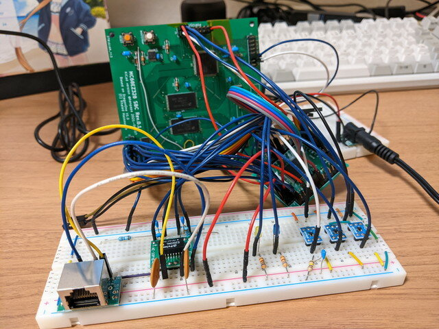
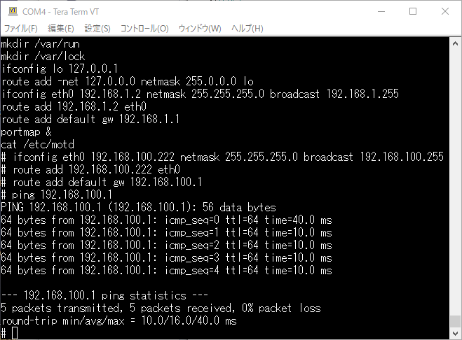
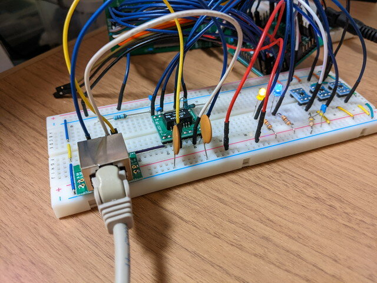

MC68EZ328 SBCにLANコントローラを接続してネットワークに接続できないか試行錯誤しています。

 [前回の記事](https://kanpapa.com/2021/07/mc68ez328-dragonone-sbc-uclinux-network1.html "MC68EZ328 DragonOne SBCでLAN接続に挑戦中")ではモニタ上でプログラムを動かし、LANコントローラCS8900Aの情報が取得できることを確認しました。次にこれをuClinuxで動かすことでネットワークアプリケーションを使えるようにします。

<!--more-->

### CS8900Aに関係するuClinuxのソースを修正

VSCodeでUCSIMやCS8900、ベースアドレスである0x10000300というキーワードでソースを検索したところ以下のものがみつかりました。

- /uClinux-dist/linux-2.4.x/drivers/net/cs89x0.c

uClinuxをbootしたときに表示される以下の文字列もこのソースに含まれています。

```
cs89x0:cs89x0_probe(0x0)
cs89x0: Setting up uCsimm CS8900 Chip Select & IRQ ioaddr = 0x2000300
```

ioaddrは0x10000300から0x02000300に変更しましたが、他にも修正箇所がありそうです。もう一度ソースを追ってみたところ、以下の点の修正が漏れていました。

- CSBのアドレス設定
- ハードウェアアドレス(MACアドレス）の設定

CS8900Aに関連するCPU内部レジスタ設定はてっきりboot時に動くアセンブラの中にあると思っていて、そちらだけを直していたのですが、このドライバでも設定していたので、上書きされて元の設定に戻ってしまっていたのです。uCsimmの場合CSBが0x8000となっていて、0x10000000のアドレスが割り当てられますが、Flashメモリと競合しないようにCSBを0x1000とし、アドレスが0x02000000になるように修正しました。

MACアドレスはuCsimmの場合、ブートローダーに書き込まれているものを使いますが、本SBCではそれはないため、ドライバのソース内で固定値で設定しました。

これらの修正を行ったあとにuClinuxのビルドを行い、フラッシュメモリに書き込みます。

### CS8900A LANドライバが認識された！

uClinuxをフラッシュメモリに書き込んだあとリセットをおこなうと、今回はうまくLANドライバが動いてくれたようで、すんなりとloginプロンプトまで表示できました。

```
cs89x0:cs89x0_probe(0x0)
cs89x0: Setting up uCsimm CS8900 Chip Select & IRQ ioaddr = 0x2000300
cs89x0.c: v2.4.3-pre1 Russell Nelson , Andrew Morton 
eth0: cs8900 rev K found at 0x2000300
cs89x0 media RJ-45, IRQ 20, programmed I/O, MAC 00:10:8b:f1:da:01
cs89x0_probe1() successful
Blkmem copyright 1998,1999 D. Jeff Dionne
Blkmem copyright 1998 Kenneth Albanowski
Blkmem 1 disk images:
0: 100B4FB8-101703B7 [VIRTUAL 100B4FB8-101703B7] (RO)
NET4: Linux TCP/IP 1.0 for NET4.0
IP Protocols: ICMP, UDP, TCP
IP: routing cache hash table of 512 buckets, 4Kbytes
TCP: Hash tables configured (established 512 bind 512)
NET4: Unix domain sockets 1.0/SMP for Linux NET4.0.
VFS: Mounted root (romfs filesystem) readonly.
eth0: 10Base-T (RJ-45) has no cable
eth0: using half-duplex 10Base-T (RJ-45)
Welcome to
          ____ _  _
         /  __| ||_|
    _   _| |  | | _ ____  _   _  _  _
   | | | | |  | || |  _ \| | | |\ \/ /
   | |_| | |__| || | | | | |_| |/    \
   |  ___\____|_||_|_| |_|\____|\_/\_/
   | |
   |_|

For further information check:
http://www.uclinux.org/

uCsimm login:
```

早速ログインしてみます。/etc/rcに書かれているネットワークの設定を確認します。

```
uCsimm login: root
Password:
# cat /etc/rc
hostname uCsimm
/bin/expand /etc/ramfs.img /dev/ram0
mount -t proc proc /proc
mount -t ext2 /dev/ram0 /var
mkdir /var/tmp
mkdir /var/log
mkdir /var/run
mkdir /var/lock
ifconfig lo 127.0.0.1
route add -net 127.0.0.0 netmask 255.0.0.0 lo
ifconfig eth0 192.168.1.2 netmask 255.255.255.0 broadcast 192.168.1.255
route add 192.168.1.2 eth0
route add default gw 192.168.1.1
portmap &
cat /etc/motd
#
```

ifconfig以降がネットワークの設定になります。我が家のネットワークは 192.168.100.0/24なので以下のようにコマンドを入力すれば良さそうです。

```
ifconfig eth0 192.168.100.222 netmask 255.255.255.0 broadcast 192.168.100.255
route add 192.168.100.222 eth0
route add default gw 192.168.100.1
```

### pingが返ってきた！

早速ネットワークを設定し、試しにpingを打ってみました。



なんとpingが返ってくるではありませんか。

次に他のPCからtelnetで接続してみます。


こちらもあっさりとログインできてしまいました。

これで今回製作したプロトタイプのネットワークボードは正しく動作することが確認できました。

（2021/07/29追記）：当初LANケーブルとLANコネクタの接触の問題はケーブルを変えたら問題はなくなりました。安定して動いています。



### 次はLANボードの基板設計

何はともあれ、MC68EZ328 SBCが無事ネットワークに接続でき拡張性が大きくひろがりました。次は当然LANボードの基板設計になりますが、なるべくコンパクトになるといいなと思いつつCPU+LANで10cmX10cmに収まるのかはちと微妙な気もして、別基板が安全かもしれません。しばらくKiCadでいろいろな実装パターンを試してみます。
