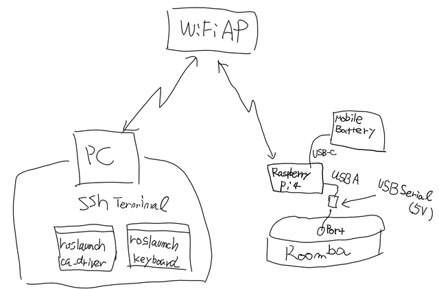
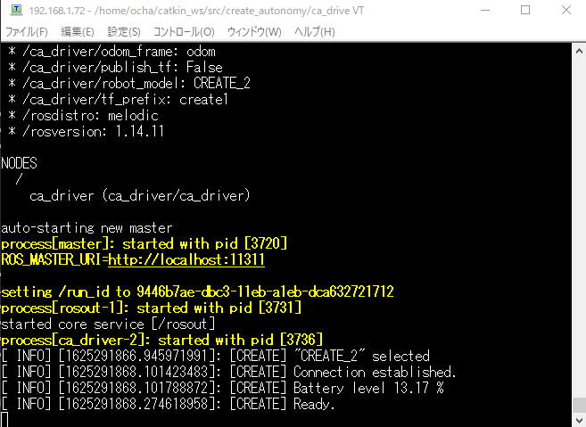

[おおたfab](https://ot-fb.com/ "おおたfab")さんでは、「[素人でもロボットをつくりたい](https://ot-fb.com/event/%e7%ac%ac44%e5%9b%9e%e3%80%80%e7%b4%a0%e4%ba%ba%e3%81%a7%e3%82%82%e3%83%ad%e3%83%9c%e3%83%83%e3%83%88%e4%bd%9c%e3%82%8a%e3%81%9f%e3%81%84%ef%bc%81%e3%83%ab%e3%83%b3%e3%83%90%e6%94%b9%e9%80%a0%e4%b8%ad/ "素人でもロボットをつくりたい")」という勉強会を定期的に行っています。前回は[ルンバのセンサーデータをArduinoで読み取る](https://kanpapa.com/2021/05/Roomba-robot-otafab42.html "ルンバのエンコーダの値をArduinoで読み取ってみました。（おおたfab 第42回 素人でもロボットをつくりたい）")ことを試しました。少し時間が空きましたが、マイコンをArduinoからRaspberry Pi 4に変更して、少し高度なことができるように[ROS(Robot Operating System)](http://wiki.ros.org/ja "ros.org/ja")で[ルンバ](http://wiki.ros.org/Robots/Roomba "Roomba")を動かしてみます。

ROSをつかってルンバを動かすという記事はインターネットを検索すればいろいろでてきます。今回は[demura.net](https://demura.net/ "demura.net")さんの記事を参考にして進めてみます。

<!--more-->

### Raspberry Pi 4にUbuntu 18.04 LTSをインストールする

今回はRaspberry Pi 4(4GB)を使用します。ROS Melodicの動作OSとしてはUbuntu 18.04 LTSが必要になります。しかし、Raspberry Pi 4ではUbuntu 18.04 LTSはサーバー版しかサポートされておらず、後からデスクトップ環境を追加する必要があります。この作業はdemura.netさんの記事を参考にしました。

- [Raspberry Pi4 (メモリ4GB): Ubuntu18.04 + Xubuntu Desktopのインストールと設定](https://demura.net/education/17957.html "Raspberry Pi4 (メモリ4GB): Ubuntu18.04 + Xubuntu Desktopのインストールと設定") (demura.net)

### ROS Melodicをインストールする

Ubuntu18.04のデスクトップ環境にROS Melodicをインストールします。こちらもdemura.netさんの記事を参考にしました。

- [Raspberry Pi4 (8GB RAM)：ROS Melodicのインストール](https://demura.net/education/18578.html "Raspberry Pi4 (8GB RAM)：ROS Melodicのインストール") (demura.net)

ただしメモリが4GBしかありませんので、少し方法を変えています。また、おおたfabの勉強会に参加されているかたのRaspberry Pi 4にも同じようにインストールする必要があるので、Jetson Japan User Groupさんの書籍「[Jetson Nano超入門](http://www.sotechsha.co.jp/pc/html/1283.htm "Jetson Nano超入門")」で使用されているインストールのためのスクリプトを参考にしてほぼ自動でインストールされるようにしました。このスクリプトはGitHub.comに置きました。

- [docofab/RoombaControlls/ROS/install-ros-melodic-rasppi.sh](https://github.com/docofab/RoombaControlls/blob/main/ROS/install-ros-melodic-rasppi.sh "RoombaControlls/install-ros-melodic-rasppi.sh")

この状態でROSが動作するようになり、サンプルプログラムであるturtlesimが動くことを確認しました。

### Gazeboシミュレータをインストールする

GazeboシミュレータをインストールしてRaspberry Pi 4の中でルンバを動かしてみます。こちらもdemura.netさんも記事を参考にしました。

- [HARD2021: Gazeboシミュレータでルンバを動かそう！](https://demura.net/robot/hard/20405.html "HARD2021: Gazeboシミュレータでルンバを動かそう！") (demura.net)

こちらも自動でインストールするスクリプトを作成しました。

- [docofab/RoombaControlls/ROS/install-gazebo-roomba-rasppi.sh](https://github.com/docofab/RoombaControlls/blob/main/ROS/install-gazebo-roomba-rasppi.sh "/docofab/RoombaControlls/ROS/install-gazebo-roomba-rasppi.sh")

実際に動かしてみると、やはりRaspberry Pi 4では重いですが、なんとか動きます。

ルンバをRaspberry Pi 4に接続すればこのシミュレータと同じように動くはずです。

### ルンバの実機を動かしてみる

いよいよRaspberry Pi 4にルンバを接続して動かしてみます。こちらもdemura.netさんも記事を参考にしましたが、前提がノートPCとなっていますので、Raspberry Pi 4用に少し手順を変えています。

- [HARD2021: リアルRoombaをノートPCで動かそう！(第２回補講）](https://demura.net/robot/hard/20456.html "HARD2021: リアルRoombaをノートPCで動かそう！(第２回補講）") (demura.net)

今回の構成図は以下のようになります。

Raspberry Pi 4のUSBコネクタに[USBシリアル変換アダプター](https://www.switch-science.com/catalog/1032/ "FTDI USBシリアル変換アダプター（5V/3.3V切り替え機能付き）")を接続し、ルンバの外部ポートに接続しました。

電源はモバイルバッテリーを使用してRaspberry Pi 4に供給します。

この状態でPCのsshターミナルからRaspberry Pi 4にログインし、roslaunch ca\_driverを実行したところopenエラーになってしまいました。どうやらca\_driverでは/dev/roombaというデバイス名を使っているようです。/dev/USBtty0は認識しているので、シンボリックリンクを張って再実行したところ、ルンバからピポッという音がして、正常に接続できました。

Ready状態になっていますし、バッテリーの残量も表示されています。正常にROSとルンバが接続されました。

この状態で、turtlesimやGazeboシミュレータで行ったようにキー入力でロボットを制御するプログラムを動かしたところ、実機のルンバを動かすことができました。

ここまでの手順をGitHub.comにまとめておきました。

- [Roombaのシミュレータ環境のセットアップ(Raspberry Pi 4)](https://github.com/docofab/RoombaControlls/blob/main/ROS/instructions/setup-gazebo-rasppi.md "Roombaのシミュレーション環境のセットアップ(Raspberry Pi 4)")
- [Roomba実機を動かす環境のセットアップ(Raspberry Pi 4)](https://github.com/docofab/RoombaControlls/blob/main/ROS/instructions/setup-real-roomba-rasppi.md "Roomba実機を動かす環境のセットアップ(Raspberry Pi 4)")

### 次のステップへ

これでルンバがROS制御のロボットになりました。今後はROSプログラミングを試していくことになります。事例をみながらROSとロボット制御についての理解を深めたいです。
