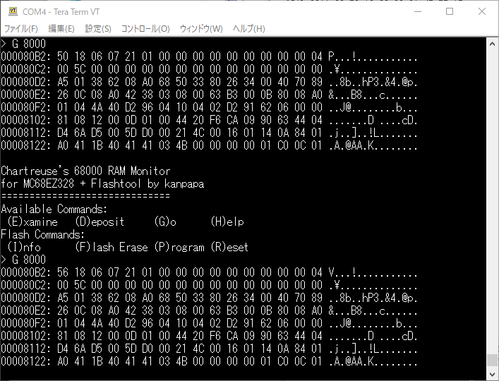

[MC68EZ328 SBC](https://www5.kanpapa.com/tag/mc68ez328/)には[DS1306 RTC（Real time clock）](https://www.maximintegrated.com/jp/products/analog/real-time-clocks/DS1306.html "DS1306 RTC")が実装されていますが、まだ一度も動かしたことがありません。

今回はMC68EZ328 CPUに実装されているSPI（Serial Peripheral Interface）を使って、DS1306 RTCを制御してみます。

  

<!--more-->

### SPIを使うには

[MC68EZ328のユーザマニュアル](https://www.nxp.com/docs/en/reference-manual/MC68EZ328UM.pdf "MC68EZ328UM")にはSPIで使用する内部レジスタの仕様とサンプルプログラムが載っています。まずはこのサンプルプログラムを参考にDS1306とSPI通信を試みましたが、全く動く気配がありません。実際の信号を見ながら確認していきます。

### CE信号の確認

DS1306のCE信号はMC68EZ328のPORTB bit1(PB1)に接続されています。Enable=High, Disable=Lowです。PORTBはメモリの機能でほぼ使っているのですが、このPB1だけGPIOとして使います。

まずCE信号が正常にコントロールできるか、テストプログラムを作りました。

- [https://github.com/kanpapa/MC68EZ328/blob/main/src/ds1306\_cstest.X68](https://github.com/kanpapa/MC68EZ328/blob/main/src/ds1306_cstest.X68 "ds1306_cstest.X68")

DS1306のCE信号にミニオシロスコープを接続して、High-Lowが繰り返されていることが確認できました。

この結果、DS1306のCE信号の制御は問題なく行えていることが確認できました。

### SPI信号の確認

次はSPI信号の確認になりますが、複数の信号をみる必要があるので、格安ロジアナを接続します。

私は[Pulseview](https://sigrok.org/wiki/PulseView "Pulseview")というアプリを使っていますが、[プロトコルの解析機能](https://sigrok.org/wiki/Protocol_decoders "Protocol_decoders")が便利でSPIも解析できます。

どうもSCLKの最初が欠けているようにみえます。SPIの初期化のタイミングが良くないのかもしれません。CEをEnableにした後に少しWAITを入れたり、厳密にSPIMレジスタを確認するように修正を行ったところ、SCLKが欠けることなく、8bit分出力されるようになりました。

CS信号のタイミングはタイミングチャート的にも問題なさそうです。

1つめの送信データ(MOSI)はRTCのRAMへの書き込みを行う指示(0xA0)です。この時の受信データ(MISO)はHigh Zになっているようです。

2つ目の送信データはRTCのRAMに書き込みたいデータ(0xA5)です。このとき受信データはHigh Zとなるべきですが、なぜか0x04というデータが見えます。つまり、最初のRAMへの書き込みを行う指示(0xA0)が読み込めておらず別の動きをしているようです。

この状態からみると、DS1306とは正常にSPI通信ができていないと考えられます。

### Write/Readができた

MC68EZ328のSPI初期化時にPHA=1, POL=0と指定したところ、受信データが正しくなりました。  
  
この例ではDS1306 RTCのRAM書き込み(0xA0)を行ったあとに、RAM読み出し(0x20)を行いました。書き込んだデータは0xA5で、読み出したデータも0xA5になっています。ようやくRTCのWrite/Readが確認できました。  
このテストプログラムはGitHubにコミットしておきました。

- [https://github.com/kanpapa/MC68EZ328/blob/main/src/ds1306\_test.X68](https://github.com/kanpapa/MC68EZ328/blob/main/src/ds1306_test.X68 "ds1306_test.X68")

### RTCのレジスタとメモリをダンプしてみる

応用としてRTC DS1306の全レジスタとメモリ(0x00-0x7F)の内容をダンプしてみました。

一番最初の１バイトが秒になります。２回プログラムを実行するとこの値が変わっていて時間が進んでいることがわかります。

このテストプログラムはGitHubにコミットしておきました。

- [https://github.com/kanpapa/MC68EZ328/blob/main/src/ds1306\_readrtc.X68](https://github.com/kanpapa/MC68EZ328/blob/main/src/ds1306_readrtc.X68 "ds1306_readrtc.X68")

### 次はuClinuxのコマンド開発

今回はアセンブラで動作確認を行いましたが、これをuClinuxの開発環境で時刻設定と時刻読み出しのコマンドを実装し、boot時の/etc/rcでRTCから時刻を読み出して、uClinuxに設定すれば、常に正しい時刻が保持できるはずです。これは次回に試してみます。
