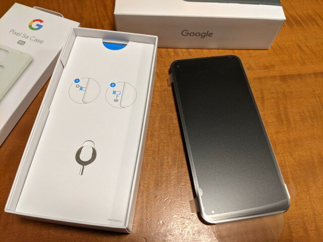
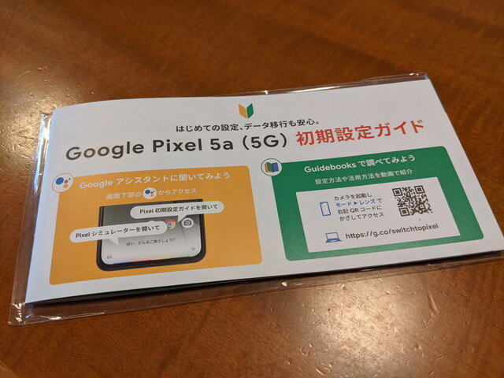
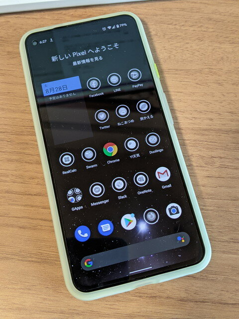

これまでPixel 3aを使用してきましたが、先日発売されたPixel 5a (5G)に機種変更しました。

Google Storeから到着したPixel 5a (5G)です。純正ケースも同時に購入しました。

 <!--more-->

早速開封です。Pixel 3aと比べて少し大きくなりましたが、気になるほどではありません。

Pixel 5a (5G)には初期設定ガイドという40ページ近い冊子がついていて、データ移行やiPhoneからの乗り換えなど詳しく書かれていました。

まずは保護フィルムを貼りました。いつも使っているPDA工房さんのCrystal Shieldです。

初期設定ガイドに従いデータ移行はUSB-Cケーブル一本でスムーズに行えました。心配していた「ねこあつめ」や「旅がえる」のデータも問題なく移行できました。移行前にPixel 3aでLINEのトーク履歴のバックアップやおサイフケータイ系のデータ保管は必要ですが、Google認証アプリもQRコードで簡単に移行できましたし、アカウント情報もパスワード管理アプリのおかげで確実に移行できています。

Pixel 3aに比べて体感速度はかなり速くなったように感じます。自宅周辺は5G圏外なので通信速度的には変化はありませんが、カメラは機能向上しているはずなのでこれから使いこんでみます。

