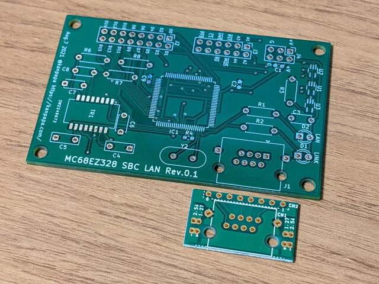
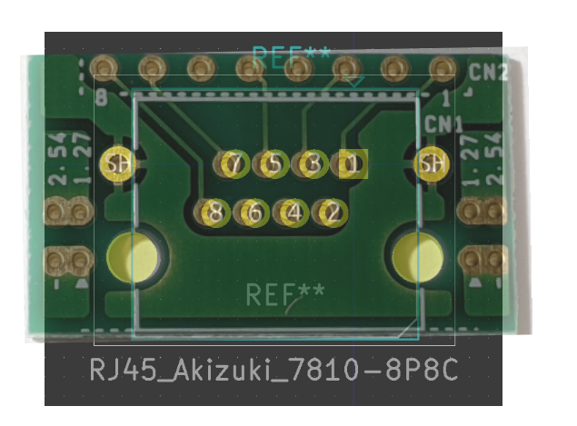
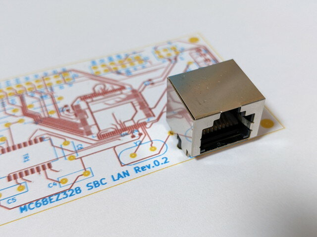
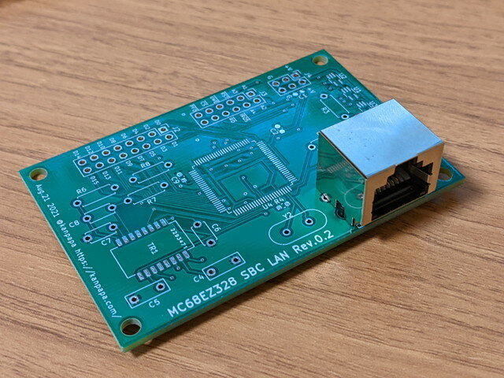
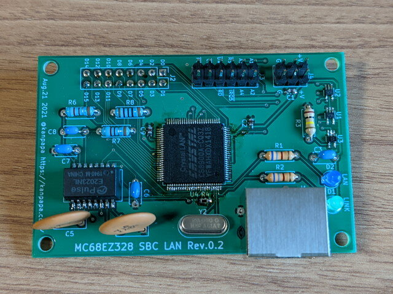
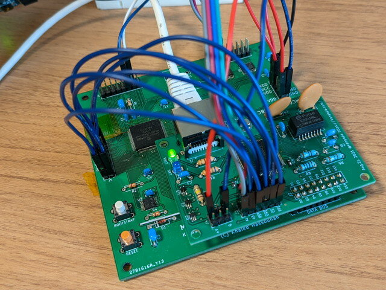

[MC68EZ328 SBC LANをユニバーサル基板に実装](https://kanpapa.com/2021/08/mc68ez328-dragonone-sbc-uclinux-network4.html "MC68EZ328 SBC LANをユニバーサル基板に実装")したときに設計したMC68EZ328 SBC LAN Rev0.1の基板を[ALLPCB](https://www.allpcb.com/ "ALLPCB")さんに発注しました。

<!--more-->

### RJ-45コネクタの穴位置が合わない

届いたRev0.1基板で製作しようとしたところ、RJ-45コネクタが微妙に取り付けにくい状態でした。図面とおりにしたはずなのですが、秋月電子さんのブレッドボード用基板と比較すると微妙に穴の位置が違うようです。

参考図面に従って作成したフットプリントと秋月電子のRJ-45専用基板の写真を比較すると微妙にずれているようにみえます。あくまでも参考図面なのでパーツの実寸は確認すべきという良い経験ができました。

### パーツの実寸を確認

RJ-45コネクタの現品をノギスで計測して、フットプリントを微調整しました。

KiCadでフットプリントを更新して、プリンタで出力した基板の穴位置と現品の穴位置が一致していることを確認して、再びMC68EZ328 SBC LAN Rev0.2を発注しました。

### 修正した基板が到着

MC68EZ328 SBC LAN Rev0.2が到着しました。無事RJ-45コネクタが取り付けできることを確認しました。

早速実装です。完成したLAN Rev0.2基板です。

### MC68EZ328 CPUボードとの接続

これまではCPUボードとユニバーサル基板で実装したLANボードの接続には大量の配線が必要でした。

今回製作したLAN基板はかなりコンパクトになります。このLAN基板をCPU基板に重ねてデータバスをコネクタ接続にすることで配線数の削減も狙いました。

### LANボードの動作確認

残念ながらLANボードは一発では動きませんでした。テスターで確認したところLANコントローラのチップが古いため、はんだのノリが良くないピンがあったようです。マイクロスコープで目視確認しながら怪しいところをはんだ付けをし直して、無事、uClinuxで認識されました。

pingも正常に動きました。

### 今後の課題

これでMC68EZ328 CPUボードをネットワークに接続することができましたが、このLAN基板とCPUボードは8P×2のコネクタで固定されているだけなので、LANコネクタの抜き差しであまり力を入れることができません。今後CPUボードを修正する機会があれば、このLAN基板との接続をすべてコネクタにして、LAN基板を固定するための取り付け穴を実装したいと考えています。
