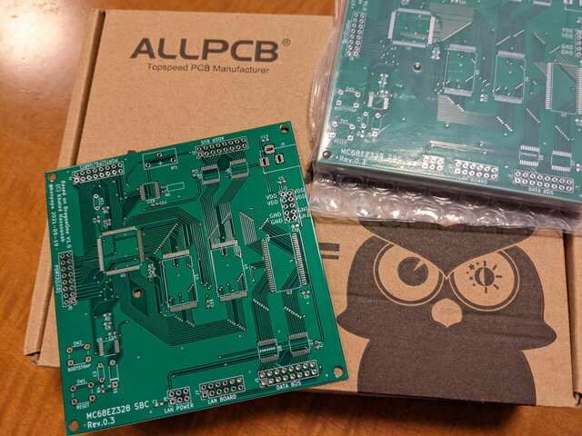
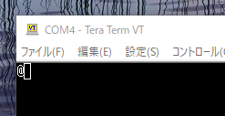
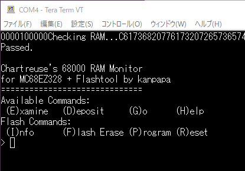
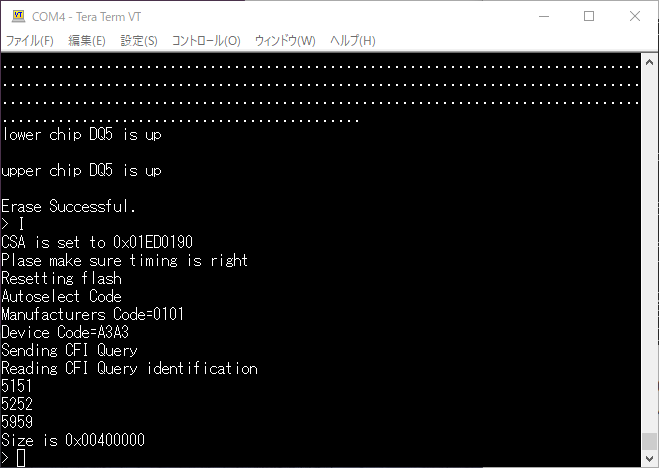
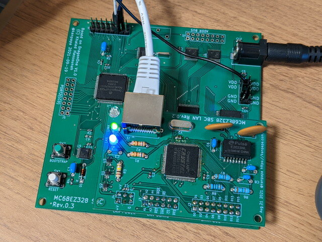
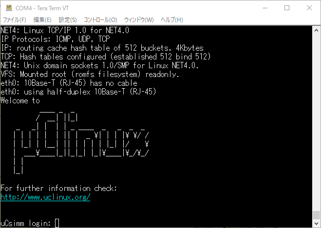
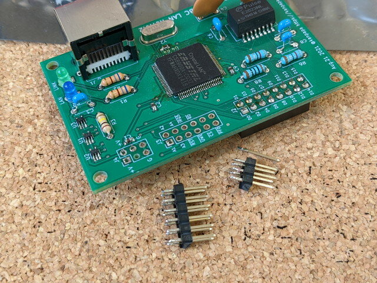
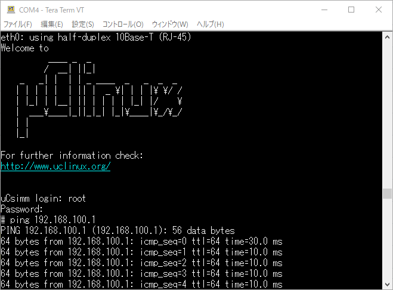
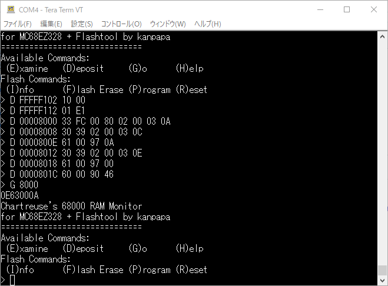

### SBC基板が到着

ALLPCBさんに基板を発注してからなんとその週のうちに到着しました。これまでの最短記録ではないでしょうか。

早速製作し完成した基板です。まずは動作に必要な最低限のパーツだけ実装します。

 <!--more-->

### SBC基板の動作確認

この状態でSBC単体での動作確認を行います。電源を投入してUSBシリアルを接続し、Entrerキーを押して、ブートストラップモードに入ることを確認しました。

この状態で[モニタプログラム](https://github.com/kanpapa/MC68EZ328/blob/main/b/Monitor_flashtool_dram.b "Monitor_flashtool_dram.b")をロードして実行してみます。

無事起動できました。これでCPUとDRAM周りはまず問題ないはずです。次にフラッシュメモリの読み書きを試してみます。

フラッシュメモリのEraseとCFI情報も正常に見えます。

### LAN拡張ボードの取り付け

残りのパーツを実装してLAN拡張ボードを取り付けます。LANケーブルを接続して、電源を投入し、LAN LEDがチカチカ点滅することまで確認しました。

### uClinuxが動かない

次にブートストラップモードで、[uClinux](https://github.com/kanpapa/MC68EZ328/blob/main/b/uclinux_3_22_Aug_2021_040522.b "uclinux_3_22_Aug_2021_040522.b")をロードしてFlashメモリに書き込んで起動しました。uClinuxは起動できるのですが途中で止まってしまいます。この現象はネットワークが動作していないのが原因ではと思われます。

### CS8900Aの接続確認

一旦モニタを起動して、CS8900AのProduct Identification Codeを表示する[テストプログラム](https://github.com/kanpapa/MC68EZ328/blob/main/d/cs8900a_check_id.d "cs8900a_check_id.d")を実行したところ、異なるIDが返ってきます。ここでは0E600008となっていますが、正常であれば0E63000Aとなります。

何か問題が発生しているようです。LANボードはこれまで問題なく動いていたので、CPUボードの問題だろうと、テスタで確認していったのですが、問題が見つかりません。念のため怪しいところにこてをあてたらログインプロンプトまで動くようになりましたが、eth0: 10Base-T (RJ-45) has no cableと表示されています。

LANボードは接続前にピンヘッダを取り外し、ピンソケットに交換を行ったので、その時に問題が生じている可能性もあります。

### ネットワークの動作確認

LANボードとの信号も念入りに確認したところ、なぜかIRQ5(負論理）がずっとLOWのままになっているのを見つけました。これはLANボードに問題がありそうだと、CS8900Aのはんだ付けを再確認して無事動くようになりました。これまではかろうじて動いていたところが、コネクタを外す作業で接触不良になってしまったのかもしれません。

CS8900Aテストプログラムでも正しい値が返ってくることも確認しました。

### ハードウェアはこれで完成

これでMC68EZ328 SBC + LAN拡張カードのハードウェアは完成です。KiCadデータはGithub.comのmainブランチにマージしておきました。

- [https://github.com/kanpapa/MC68EZ328](https://github.com/kanpapa/MC68EZ328 "github.com kanpapa/MC68EZ328")

今思えば2.2uFのコンデンサもSMDにすればよかったかなと。あと電源コネクタに電圧のシルクも欲しかった。このあたりはもう一度製作する機会があれば修正しようと思います。
