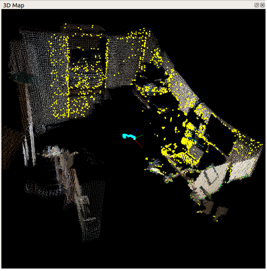

[おおたfab](https://ot-fb.com/ "おおたfab")さんでは、「[素人でもロボットをつくりたい](https://ot-fb.com/iot/6353/ "素人でもロボットをつくりたい")」という勉強会を定期的に行っています。[前回](https://kanpapa.com/2021/11/Roomba-robot-ros-part7-otafab50.html "ルンバで地図をつくってみました その２（おおたfab 第50回 素人でもロボットをつくりたい）")は[LiDAR](https://ja.wikipedia.org/wiki/LIDAR "LiDAR")を使って地図の作成を行いましたが、今回はKinectを使って地図作成にチャレンジします。

<!--more-->

### RGB-D SLAMとは

SLAMの説明はマクニカさんのサイトがよくまとまっています。

- [SLAM（スラム）とは？？～SLAMの基本技術と活用について～](https://www.macnica.co.jp/business/maas/columns/134751/)

これまではLiDAR SLAMの実験でしたが、今回はDepth SLAMとなります。Microsoft Kinectセンサーで深度の情報が取得できるのでいろいろな記事が掲載されています。今回は以下のサイトを参考にさせていただきました。

- [RGB-D SLAM With Kinect on Raspberry Pi 4 ROS Melodic](https://www.hackster.io/dmitrywat/rgb-d-slam-with-kinect-on-raspberry-pi-4-ros-melodic-ace795)
- [ROS上でのKinect v1の導入方法](https://coffeegkgk.hatenablog.com/entry/2015/08/21/205908)
- [Getting Started - OpenKinect](http://openkinect.org/wiki/Getting_Started#Manual_Build_on_Linux)
- [RTABMAPの使い方](https://qiita.com/k65c1/items/7a4df58b50a587fad3e2)
- [ROSによる画像処理(Kinect版)](https://robot.isc.chubu.ac.jp/?p=1336)

### HARDWARE

- Raspberry Pi 4 4GB
- [Kinect for Windows](https://ja.wikipedia.org/wiki/Kinect "Kinect for Windows")

### SOFTWARE

- Ubuntu 18.04
- ROS Melodic
- [libfreenect](https://github.com/OpenKinect/libfreenect "libfreenect")  
    libfreenect is a userspace driver for the Microsoft Kinect. It runs on Linux, OSX, and Windows and supports. （RGB and Depth Images、Motors、Accelerometer、LED、Audio）
- [rgbd\_launch](http://wiki.ros.org/action/fullsearch/rgbd_launch "rgbd_launch")  
    This package contains launch files for using RGB-D devices such as the Microsoft Kinect in ROS.
- [freenect\_stack](http://wiki.ros.org/action/fullsearch/freenect_stack)  
    This stack provides a ROS interface to the Microsoft Kinect using the libfreenect library.
- [rtabmap](https://github.com/introlab/rtabmap "rtabmap")  
    RTAB-Map library and standalone application.
- [rtabmap\_ros](http://wiki.ros.org/action/fullsearch/rtabmap_ros "rtabmap_ros")  
    RTAB-Map's ros-pkg. RTAB-Map is a RGB-D SLAM approach with real-time constraints.

### Raspberry Pi 4のセットアップ

1\. catkin\_wsを作成

mkdir -p ~/catkin\_ws/src  
cd catkin\_ws  
catkin\_make  
source devel/setup.bash

2\. libfreenectのインストール

cd ~/git/  
git clone https://github.com/OpenKinect/libfreenect.git  
cd libfreenect/  
mkdir build  
cd build  
cmake ..  
sudo make install  
cd ../..  
sudo cp libfreenect/platform/linux/udev/51-kinect.rules /etc/udev/rules.d  
sudo udevadm trigger

3\. rgbd\_launchとfreenect\_stackパッケージのインストール

cd ~/catkin\_ws/src  
git clone https://github.com/ros-drivers/rgbd\_launch.git  
git clone https://github.com/ros-drivers/freenect\_stack.git  
cd ~/catkin\_ws  
catkin\_make  
source ~/.bashrc

4\. RTAB-Mapのスタンドアロンライブラリのインストール

cd ~/git  
git clone https://github.com/introlab/rtabmap.git  
cd rtabmap/build  
cmake ..  
make  
sudo make install

5\. RTAB-Map rosパッケージのインストール

cd catkin\_ws/src  
git clone https://github.com/introlab/rtabmap\_ros.git  
cd ..  
catkin\_make -j4

### RGB-Depth SLAMを動かしてみる

1\. KinnectをRaspberry Pi 4に接続する

2\. 1番めのターミナルでkinectデータ取得ノードを起動する

roslaunch freenect\_launch freenect.launch depth\_registration:=true

3\. 2番めのターミナルでimage\_viewを立ち上げて画像トピックが流れているか確認する。

rosrun rqt\_image\_view rqt\_image\_view

GUIで表示したい画像トピックを選択すると画像が移ります。カラー画像は/camera/rgb/image\_color，距離画像は/camera/depth\_registered/imageです。

4\. 3番目のターミナルでRTAB-Mapのノードを起動する

roslaunch rtabmap\_ros rgbd\_mapping.launch

5\. Kinectを持ってゆっくり動いてみる。

6\. rtabmapのノードを停止する。

7\. 以下のコマンドで作成したマップが表示される。

/usr/local/bin/rtabmap-databaseViewer ~/.ros/rtabmap.db

### 実験結果

残念ながらおおたFabの勉強会では時間切れで良い結果が得られませんでした。

おおたFabさんからKinectをお借りして自宅で再度動かしたところ、RTAB-Mapで次のような結果が得られました。

部屋の角が見えています。

部屋の全景はこのような表示になりました。マウスで拡大・縮小・回転など自在に動かせます。

rtabmap-databaseViewerの結果はもっと良い画質に仕上がっているのですが、部屋が丸見えになってしまうので掲載は遠慮しておきます。

### 次回

次回はおおたFabさんでもう一度実験をして、Rvizでも結果を表示したいと考えています。
