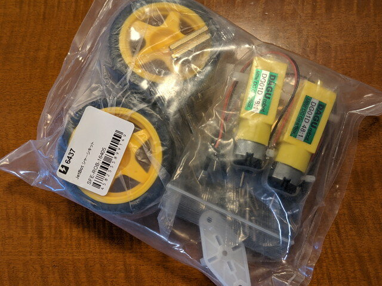
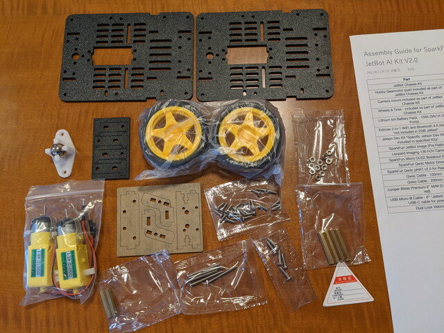
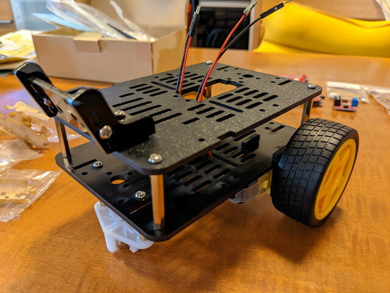
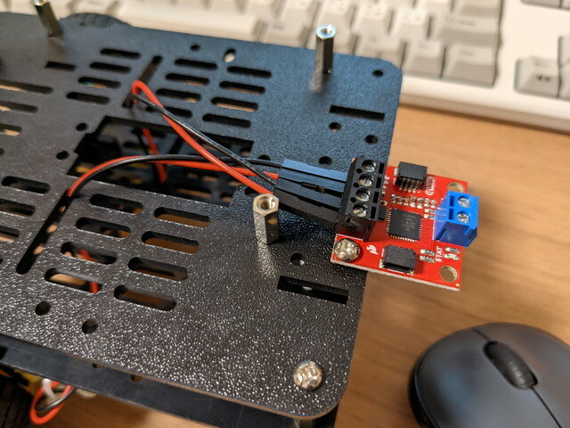
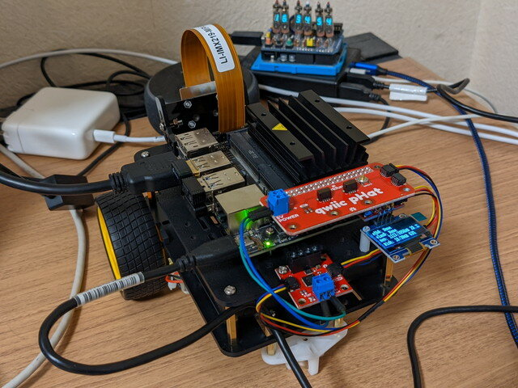

かなり前に買ったままとなっていたSpeakFunの[JetBot シャーシキット](https://www.switch-science.com/catalog/6437/ "JetBot シャーシキット")を使ってJetBotを組み立ててみました。

[JetBot](https://www.nvidia.com/ja-jp/autonomous-machines/embedded-systems/jetbot-ai-robot-kit/ "JetBot AI ロボット プラットフォーム")にはNVIDIA Jetson Nanoコンピューターが搭載されており、カメラで物体認識を行うことで衝突回避などを行うことができます。

フレーム、モーター、ホイール、キャスターなどが含まれています。モータードライバなどの電子パーツは含まれていません。これから購入されるかたは[JetBot Chassis Kit V2](https://www.switch-science.com/catalog/6944/ "JetBot Chassis Kit V2")をお勧めします。

シャーシキット以外に集めたパーツです。SparkfunのJetbotキットはQwiicでの接続なのでシンプルです。これ以外にも[JetsonNano](https://www.switch-science.com/catalog/6239/ "Jetson Nano 開発者キット B01")も必要です。[OLEDはQwiic接続ができるように自作](https://kanpapa.com/2021/07/making-qwiic-oled.html "OLEDはQwiic接続ができるように自作")したものです。

まずはモータをシャーシに固定して、キャスターボールも固定します。

ホイールとカメラ取付用のフレームをとりつけて仮組です。

ここで気が付いたのですが、このシャーシキットにはJetsonNanoなどを取り付けるためのネジやスペーサーは含まれていませんでした。シャーシキットなのでその通りかもしれません。

さらにJetson基板の固定穴にM3ネジが通らないことが判明し、手持ちのM3ネジ・スペーサーが使えません。やむなく[秋月電子](https://akizukidenshi.com/ "秋月電子")に出かけて[M2.6ネジ](https://akizukidenshi.com/catalog/g/gP-07324/ "なべ小ねじ（＋）　Ｍ２．６×５　（１００個入）")と[M2.6スペーサー](https://akizukidenshi.com/catalog/g/gP-15796/ "六角両メネジ　ＦＢ２６－１１")、[M2プラスチックネジとナット](https://akizukidenshi.com/catalog/g/gP-13238/ "Ｍ２プラスチックなべ小ねじ＋六角ナットセット　Ｍ２×５ｍｍ　（２０組入）")を買ってきました。ついでにモバイルバッテリーとJetsonNanoを接続するための[15cmのmicroUSBケーブル](https://akizukidenshi.com/catalog/g/gC-09312/ "ＵＳＢケーブル　ＵＳＢ２．０　Ａオス－マイクロＢオス　０．１５ｍ　Ａ－ｍｉｃｒｏＢ")も買いました。

説明書通りにスペーサーを取り付けましたが、JetsonNanoがこの方向だとカメラとの接続ケーブルにストレスを与えてしまいます。

そこで、現在販売されているもののようにJetsonNanoの向きを90度変更して取り付けられるようにシャーシに穴をあけました。これで現行バージョンとほぼ同じ配置にできました。

もう一度仮組をしてモータドライバを取り付け、モーターのケーブルを接続します。5mmのスペーサーがあればよかったのですが手持ちがなく軽くネジ止めです。

あとはJetsonNanoをとりつけ、Qwiicケーブルで配線をしてハードウェアの組み立ては完了です。

イメージファイルを書き込んだmicroSDカードをセットして電源を投入したところ、OLEDに各種情報が表示されました。

ここまではうまく動いているようにみえます。

完成したSparkfun版Jetbotです。かっこいいですね。

Sparkfun版Jetbotはフレームもシンプルな構造で、配線もQwiicなのではんだごても必要なくドライバーだけで組み立てができます。シンプルな構造には好感がもてました。

次はソフトウェアのセットアップです。（続く）
