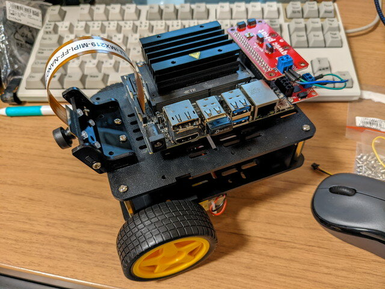
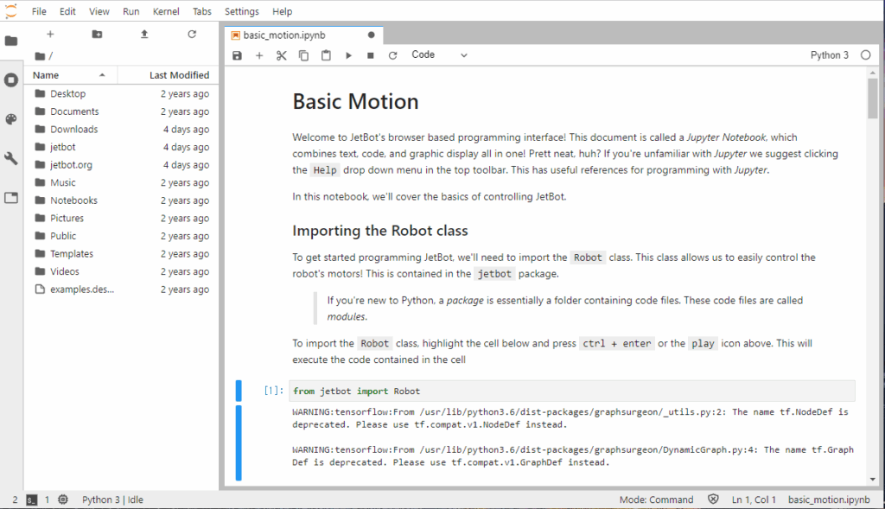
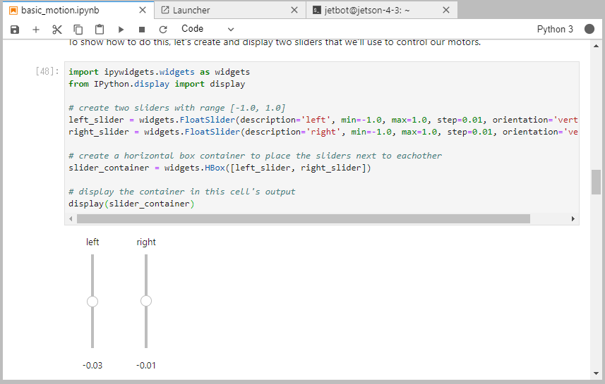
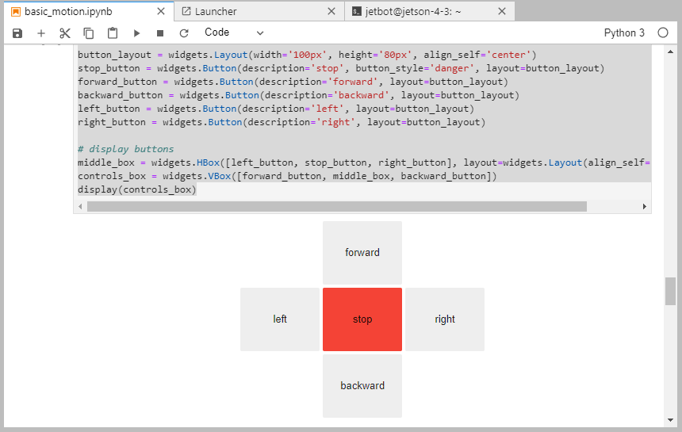

Sparkfun版JetBotを実際に動かすためにはmicroSDカードにソフトウェアを書き込む必要があります。前回の[ハードウェア編](https://kanpapa.com/2021/11/sparkfun-jetbot-hardware-assembly1.html "Sparkfun版JetBotを組み立てました（ハードウェア編）")では、イメージを書き込んだmicroSDを使用しました。このmicroSDの書き込みかたをまとめておきます。



### microSDの準備から起動まで

詳細な手順はJetBotのGithubに掲載されています。この手順のStep 4までを行います。

- [https://github.com/NVIDIA-AI-IOT/jetbot/wiki/software-setup](https://github.com/NVIDIA-AI-IOT/jetbot/wiki/software-setup "Software Setup")

大まかな流れは以下の通りです。

1. PCを使ってmicroSDにイメージファイルを書き込みます。今回は32GBのmicroSDカードを使用しました。
2. JetBotにmicroSDをセットし、HDMIモニタとキーボード、マウスを取り付けて電源を投入します。
3. WiFiの接続設定をし、OLEDにIPアドレスが表示されていることを確認します。
4. JetsonNanoをシャットダウンして、HDMIモニタ、キーボード、マウスを取り外します。
5. JetsonNanoにモバイルバッテリーを接続して、電源を投入します。
6. OLEDにIPアドレスが表示されていることを確認します。
7. 他のPCのブラウザから http://jetbotのIPアドレス:8888 にアクセスします。

次のような画面が表示されれば正常に動いています。


この画面は、JetBotのブラウザベースのプログラミングインターフェイス Jupyter Notebookと呼ばれるもので、テキスト、pythonコード、グラフィック表示が統合されたものです。これをつかってPythonのコードを動かします。

### Sparkfun版JetBotファイルの組み込み

NVIDIAから公開されているイメージファイルをそのまま使うとJetsonNanoやOLEDの制御はできますが、Sparkfunのモータードライバの制御はできないので、修正版のファイルを組み込む必要があります。

jetbotのgithubに掲載されている手順のStep 5の代わりにこちらの作業を行います。

1. [SparkfunのAssembly Guide for SparkFun JetBot AI Kit V2.0](https://learn.sparkfun.com/tutorials/assembly-guide-for-sparkfun-jetbot-ai-kit-v20/4-software-setup-guide-from-nvidia "Assembly Guide for SparkFun JetBot AI Kit V2.0 ")の[4\. Software Setup Guide from NVIDIA](https://learn.sparkfun.com/tutorials/assembly-guide-for-sparkfun-jetbot-ai-kit-v20/4-software-setup-guide-from-nvidia "4. Software Setup Guide from NVIDIA")のRe-Applying the Software Modificationsの「DOWNLOAD MODIFICATION FILES」からjetbot.zipファイルをダウンロードします。
2. ダウンロードしたjetbot.zipファイルを、Jupyter Notebookの左側のディレクトリ一覧にD&DしてJetson Nanoにアップロードします。私はホームディレクトリにアップロードしました。
3. Jupyter Notebookの左上の＋を押すと、ランチャー画面になりますので、ターミナルを選択します。
4. ターミナル画面で以下のように操作すればSparkfun JetBot用のファイルが設定されます。

```
cd
mkdir jetbot
mv ~/jetbot.zip jetbot/.
cd jetbot
unzip jetbot.zip
sudo python3 setup.py install
```

### 基本動作のテスト

Jupyter NotebookでPythonコードを動かすにはコードが書かれている部分をマウスで選択し、Playアイコンを押すだけです。コードの修正もJupyter Notebook上で直接行うことができます。

左側のNotebooksのフォルダをクリックし、フォルダの中にある[basic\_motion.ipynb](https://github.com/NVIDIA-AI-IOT/jetbot/blob/master/notebooks/basic_motion/basic_motion.ipynb "basic_motion.ipynb")をクリックすると次のような画面になります。



これが基本動作のNotebookになります。この内容を読みながら、順番通りにPythonコードを実行して動作確認を行います。

例えば以下のコードを実行すると、反時計回りにロボットが0.5秒間動いて止まります。

```
from jetbot import Robot

robot = Robot()

import time

robot.left(0.3)
time.sleep(0.5)
robot.stop()
```

これを実行した結果の動画です。（２回実行しています）

Jupyter Notebookの面白いところは、同じ画面上にスライダーやボタンを配置して、その操作がPythonに連携できるところです。簡単なGUIを同じ画面上に組み込むことができます。

スライダーの例



ボタンの例



このような形でPythonでロボットの動作を確認しながらチュートリアルを進めることでJetBotの知識を身につけることができます。

### 電源を落とす前に

JetBotの電源を切る前には必ずターミナルから

`sudo shutdown now`

を入力してシャットダウンするのをお忘れなく。
