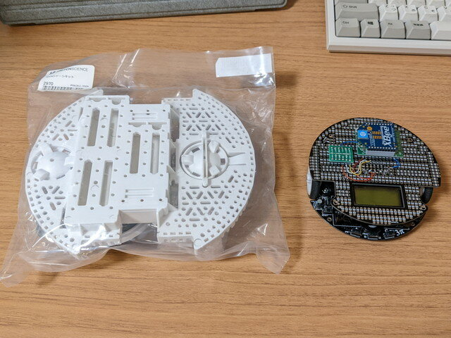
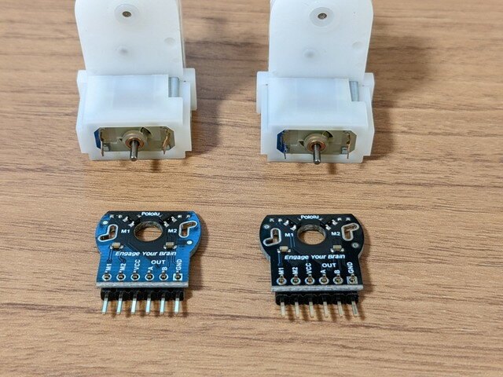
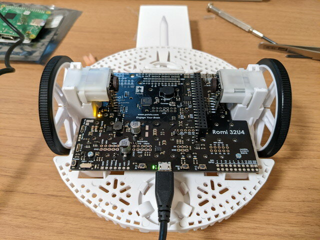
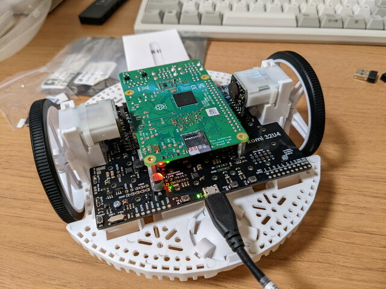

### Pololu Romiとの出会い

PololuのサイトでPololu 3piについて調べていたところ、[Romi](https://www.pololu.com/category/202/romi-chassis-and-accessories "Romi")というロボットカーのキットを見つけました。3piに比べて、ゆとりのある設計になっていて、制御ボードはATmega32U MCU、モータードライバ（DRV8838）、6軸IMU（LSM6DS33）を搭載しています。エンコーダ付きのモーターも使用でき、バッテリも単4×4から単3×6となり、Raspberry Pi 3 B+を搭載できます。メーカーはROSのサポートは行っていませんが、GitHubには[RomiPi](https://github.com/ftPeter/RomiPi "RomiPi")というROSライブラリのリポジトリもあるようです。

国内の販売店を探したところ、[スイッチサイエンス](https://www.switch-science.com/ "スイッチサイエンス")さんで取り扱っていたので、[Romiシャーシキット](https://www.switch-science.com/catalog/2970/ "Romiシャーシキット")、[Romi用32U4搭載制御基板](https://www.switch-science.com/catalog/3169/ "Romi用32U4搭載制御基板")、[Romi用エンコーダ（2個入り）](https://www.switch-science.com/catalog/2971/ "Romi用エンコーダ（2個入り）")を購入してみました。

### 各パーツの確認

到着したRomiのシャーシです。スピードを優先して軽量小型の3piとは大きさがかなり違います。

 <!--more-->

Romi32U4ボードです。Raspberry Piを接続するコネクタがあります。

エンコーダは２個入りです。モーター軸に取り付けた磁石から、モーター軸の回転数、回転方向を取得できます。

今回購入したパーツ一式はこのようになります。

### Romiの組み立て

Romiの組み立ては公式サイトに丁寧なマニュアルがあるので、それを見ながら容易に組み立てられます。また図面や回路図なども公式サイトに掲載されていて活用できます。

まずはエンコーダを組み立てます。6ピンのピンヘッダをエンコーダ基板にハンダ付けします。このピンがそのままRomi 32U4ボードのコネクタと接続されます。

モーターの端子と半田付けをして、モーターの軸に磁石を取り付けて完成です。

Romiシャーシの裏面の電池BOXです。単3NiMHが6本です。

Romiシャーシに32U4ボードを取り付け、モーター・エンコーダを接続します。

この状態で試運転です。まずはArduino IDEを使って、ATmega32Uにテストプログラムを書き込んで、無事Lチカはできました。

モーターのテストはNiMHバッテリーを取り付ける必要があります。バッテリー端子をそのまま32U4ボードにハンダ付けしますので、必要なパーツやコネクタはここで取り付けておく必要があります。モーターのテストも無事完了しました。

次にRaspberry Pi を接続したテストです。PololuではRaspberry Pi 3B+までを推奨しているようです。私も手持ちのRaspberry Pi 3B+を取り付けました。

Raspberry PiのOSはRaspberry Pi OS (Legacy) with desktop(Debian Buster)を使いました。Pololuのサイトにテストプログラムがあるのでそれを動かします。Raspberry PiがWebサーバとなり、ブラウザでRomiを制御できます。

動画をYouTubeに載せておきました。

LEDの制御、バッテリー電圧、エンコーダ情報、モーター制御など一通り問題ないことを確認できました。

Raspberry PiとRomi32U4ボードはI2Cでの接続になります。バス速度は最初は100000Hzだったですが、やや不安定な時があったので400000Hzに変更したところ安定しました。

### まとめ

実験用としては良いロボットカーではないかと思います。コンパクトですし、ArduinoからRaspberry Piまでステップアップできる点や、32U4ボードには拡張用に各種ピンが引き出されています。ここに新たなセンサーを追加することもできますし、別売の[プレート](https://www.pololu.com/product/3560 "Romi Chassis Expansion Plate")を使えば、積み重ねて機器を搭載することもできそうです。

このあとはGitHubにあったROSライブラリ RomiPi を試してみます。
