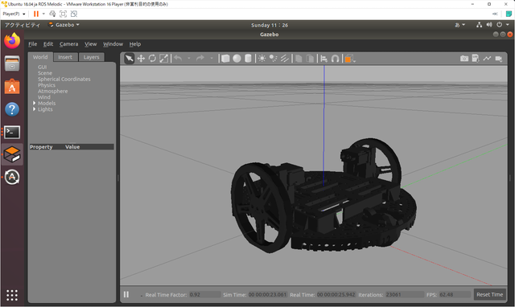

### ROSトピックを記録する

[Rvizが異常終了してしまうという問題](https://kanpapa.com/2022/01/pololu-romi-ros-romipi1.html "Pololu Romi ロボットカーをROSで動かしてみました")を解決するためにデバック情報が必要です。ROSでは流れているトピックを保存する機能があります。これを使って全トピックを記録して、問題となるトピックを調べてみます。

トピックの記録はrosbagというコマンドで行います。-aですべてのトピックが記録されます。

```
$ rosbag record -a
```

これでカレントディレクトリに2022-01-23-16-37-57.bagといったログファイルができます。

取得したログファイルの情報を表示するにはrosbug infoを使います。どのようなトピックをいつ取得したのかが表示されます。

```
$ rosbag info 2022-01-23-16-37-57.bag
path:        2022-01-23-16-37-57.bag
version:     2.0
duration:    1:40s (100s)
start:       Jan 23 2022 16:37:57.32 (1642923477.32)
end:         Jan 23 2022 16:39:37.86 (1642923577.86)
size:        1.4 MB
messages:    6053
compression: none [2/2 chunks]
types:       geometry_msgs/Twist      [9f195f881246fdfa2798d1d3eebca84a]
             nav_msgs/Odometry        [cd5e73d190d741a2f92e81eda573aca7]
             rosgraph_msgs/Log        [acffd30cd6b6de30f120938c17c593fb]
             sensor_msgs/BatteryState [476f837fa6771f6e16e3bf4ef96f8770]
             sensor_msgs/JointState   [3066dcd76a6cfaef579bd0f34173e9fd]
             tf2_msgs/TFMessage       [94810edda583a504dfda3829e70d7eec]
topics:      /battery_state   1006 msgs    : sensor_msgs/BatteryState
             /cmd_vel         2027 msgs    : geometry_msgs/Twist     
             /joint_states    1005 msgs    : sensor_msgs/JointState  
             /odom            1003 msgs    : nav_msgs/Odometry       
             /rosout             8 msgs    : rosgraph_msgs/Log        (2 connections)
             /tf              1004 msgs    : tf2_msgs/TFMessage
```

### ROSトピックを再生する

取得したROSトピックを再生することで、トピックを繰り返し再現することもできます。その場合はrosbug playをつかいます。

```
$ rosbag play 2022-01-23-16-37-57.bag
```

トピックを再生することで、稼働しているノードはそのトピックを受け取ってトピックに従った動作をします。

例えばRomi実機のノードと3DシミュレータであるGazeboを動かしておき、rosbugでトピックを再生すると流れてくるトピックの通りの動きをします。

Gazeboはこのような画面です。RomiのモデルもRomiPiに登録されています。



動画をYouTubeにアップしておきました。

Rvizも同様に可視化してくれるのですが、やはり途中で異常終了してしまいました。

### トピックの詳細を調べる

記録したトピックはCSVファイルとして出力することもできます。

```
$ rostopic echo -b 2022-01-23-16-37-57.bag -p /tf > tf.csv
```

これらの情報からRvizを終了させてしまう異常なトピックを探してみます。
