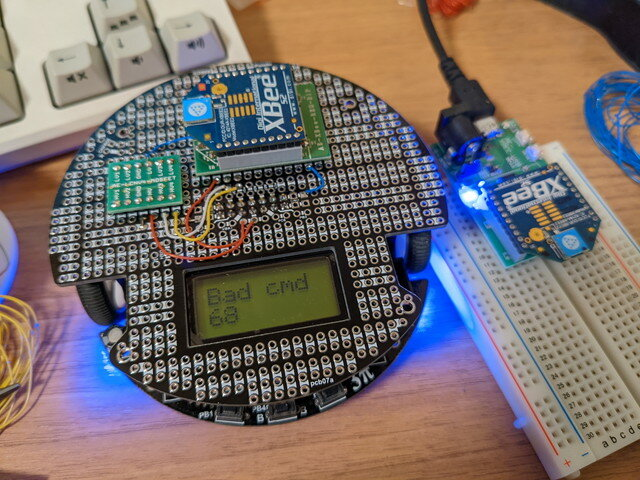
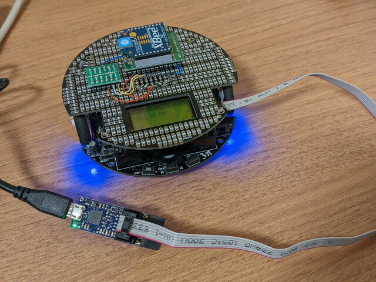
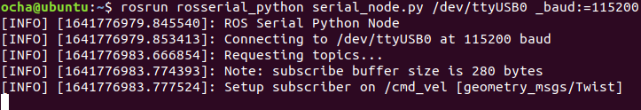

大掃除で見つかった[Pololu 3pi robot](https://www.pololu.com/product/975 "Pololu 3pi robot")ですが、これはATmega328Pが搭載されていて、Arduino IDEでもプログラミングができます。そこで[rosserial\_arduino](http://wiki.ros.org/rosserial_arduino "rosserial_arduino")を使って、ROSのノードにしてみました。


rosserialのクライアントライブラリで小さなマイコンでもROSのノードにすることができます。ただしホストとなるPCのノードが必要で、そのPCとクライアントはシリアル接続をする必要があります。

今回はシリアル接続にXBeeの透過モードを使うことでワイヤレスにします。透過モードは一度設定すればXBee同士で透過的なシリアル通信が行えます。今回使用したXBeeはシリーズ2（S2）と呼ばれているもので少し古めのものですが、115200bpsまで使えますので十分です。

<!--more-->

### 3pi robotの開発環境をArduino IDEに設定する

Arduino IDEの3pi用のライブラリやサンプルソースが準備されていますので、以下のドキュメント通りにインストールします。

- [Programming Orangutans and the 3pi Robot from the Arduino Environment](https://www.pololu.com/docs/0J17 "Programming Orangutans and the 3pi Robot from the Arduino Environment")

3piへの書き込みは以前は純正のATMEL AVRISP mkIIを使っていたのですが、見つからなかったので新たに[Pololu USB AVRプログラマ v2.1](https://www.switch-science.com/catalog/3870/ "Pololu USB AVRプログラマ v2.1")を購入しました。[スイッチサイエンス](https://www.switch-science.com/ "スイッチサイエンス")さんで取り扱っているので入手は容易ですし、小型でLEDがカッコよく光ります。

### XBeeの設定

XBeeの設定を行うためには、専用のユーティリティ[XCTU](https://www.digi.com/products/embedded-systems/digi-xbee/digi-xbee-tools/xctu "XCTU")を使います。また、手持ちのXBeeをUSBシリアルに接続できる基板（秋月電子の[XBee USBインターフェースボードキット](https://akizukidenshi.com/catalog/g/gK-06188/ "XBee USBインターフェースボードキット")相当）にXBeeを取り付けてPCのUSBに接続します。この状態でXCTUを立ち上げたところXBeeを認識できました。

2台のXBeeを以下のように設定しました。DHとDLに通信相手のMACアドレスを設定します。(MACアドレスは一例です。）

|   | **XBee親機** | **XBee子機** |
| --- | --- | --- |
| 型番 | XB24-Z7CIT-004 revG | XB24-Z7CIT-004 revJ |
| Product family | XB24-B | XB24-B |
| Function set | ZigBee Coordinator AT | ZigBee Router/End Device AT |
| Firmware version | 1020 | 1220 |
| MAC（XBeeごとに一意の値です） | 0013A200**406AAAAA** | 0013A200**408BBBBB** |
| DH Destination Address High | 13A200 | 13A200 |
| DL Destination Address Low | **408BBBBB** | **406AAAAA** |
| NI Node Identifier | COORDINATOR | ROUTER |
| BD Baud Rate | 115200 | 115200 |

このように設定した状態でエコーバックテストを行います。

XBeeをUSBシリアルに接続できる基板に親機となるXBeeを載せてPCに接続します。認識したUSBシリアルポートにターミナルを接続し、115200bpsで接続します。子機となるXBeeは、秋月電子の[XBee用2.54mmピッチ変換基板](https://akizukidenshi.com/catalog/g/gP-05060/ "XBee用2.54mmピッチ変換基板")を使いブレッドボードに取り付けて電源を供給し、RX-TXを接続して、受信したデータをそのまま送信するようにしたところ、入力した文字がエコーバックされたので問題なさそうです。これでシリアル通信設定は確認できました。


### XBeeを3piに接続する

子機のXBeeを3piのATmega328Pのシリアルポートに接続します。ちょうど[3piの拡張用基板](https://www.pololu.com/product/979 "3pi Expansion Kit with Cutouts")があったので、これに秋月電子の[XBee用2.54mmピッチ変換基板](https://akizukidenshi.com/catalog/g/gP-05060/ "XBee用2.54mmピッチ変換基板")を半田付けします。5V電源は3piのコネクタから供給され、XBee変換基板に搭載されている3.3VレギュレーターでXBeeに3.3V電源が供給されます。しかし、3piのシリアル信号は5Vのままですので、途中に[4ビット双方向ロジックレベル変換モジュール(BSS138使用)](https://akizukidenshi.com/catalog/g/gK-13837/ "4ビット双方向ロジックレベル変換モジュール(BSS138使用)")を入れることでシリアル信号の電圧レベルを合わせました。これで3piとXBeeの接続は完了です。

m3piで使っていたSlaveプログラムのままで、この基板を接続してターミナルからコマンドを送ると応答があることを確認しました。



### rosserialをインストールする

インストールはROSのチュートリアルに従って進めました。

- [http://wiki.ros.org/rosserial\_arduino/Tutorials](http://wiki.ros.org/rosserial_arduino/Tutorials "rosserial_arduino Tutorials")

今回はubuntu18.04のROS Melodicにインストールしました。このあとにインストールされたArduino用のrosライブラリをWindowsのDocuments\\Arduino\\libraries\\ros\_libにコピーしています。

### rosserialのチュートリアルを3piで動かす

チュートリアルのソースコードを参考に、3pi robotで動作確認ができるように修正しました。

チュートリアル通りに問題なく動作したので、Githubに入れておきました。

- [rosserial\_3pi\_helloworld.ino](https://github.com/kanpapa/rosserial_arduino_3pi/blob/main/Arduino/rosserial_3pi_helloworld/rosserial_3pi_helloworld.ino "rosserial_3pi_helloworld.ino")
- [rosserial\_3pi\_blink.ino](https://github.com/kanpapa/rosserial_arduino_3pi/blob/main/Arduino/rosserial_3pi_blink/rosserial_3pi_blink.ino "rosserial_3pi_blink.ino")

### 3piのモーターを動かすトピックを実装する

モーターを動かすためのsubscriberを書いてみました。/cmd\_vel のトピックに従ってモーターが動くシンプルなものです。

- [rosserial\_3pi\_robot\_01.ino](https://github.com/kanpapa/rosserial_arduino_3pi/blob/main/Arduino/rosserial_3pi_robot_01/rosserial_3pi_robot_01.ino "rosserial_3pi_robot_01.ino")

このスケッチをArduino IDEで3piに書き込みます。



次にシリアルポートの読み書き権限を設定します。

```
$ sudo chmod o+rw /dev/ttyUSB0
```

ホスト側のrosserialを動かすと同時に3pi robotのリセットをして同期します。

```
$ rosrun rosserial_python serial_node.py /dev/ttyUSB0 _baud:=115200
```

マイコン側のrosserialクライアントと同期ができると以下のように表示されます。できない場合はもう一度同時にリセットするとうまく動きます。（ここが少し面倒）



新しいターミナルを起動してトピックを確認します。ここに /cmd\_vel が表示されればOKです。


モーターを動かすための /cmd\_velのトピックを発行します。

```
$ rostopic pub -1 /cmd_vel geometry_msgs/Twist -- '[1.0, 0.0, 0.0]' '[0.0, 0.0, 0.0]'
```

モーターを止める /cmd\_vel トピックを発行します。

```
$ rostopic pub -1 /cmd_vel geometry_msgs/Twist -- '[0.0, 0.0, 0.0]' '[0.0, 0.0, 0.0]'
```

ROSのトピックでモーターの制御ができました。

### キーボードで3pi robotを動かしてみる

これまでルンバをキーボードを動かしてきましたが同じことができるはずです。

キーボードで動かすためのツールをインストールして動かします。

```
$ sudo apt install ros-melodic-teleop-twist-keyboard$ rosrun teleop_twist_keyboard teleop_twist_keyboard.py
```

次のような画面が表示されます。


次のキーボード操作で3pi robotが操作できました。

|   | I：前進 |   |
| --- | --- | --- |
| J：左旋回 | K：停⽌ | L：右旋回 |
|   | ,：後退 |   |

動作中の様子をYouTubeにアップしておきました。

https://youtu.be/f1ylQWFJX2M?si=HzvMXvOUFP3fLfTa

### 今後の計画

3piにはセンサーやプッシュスイッチがついているので、これらの状態をpublishすることもできると思いますが、それはまた次回で。
