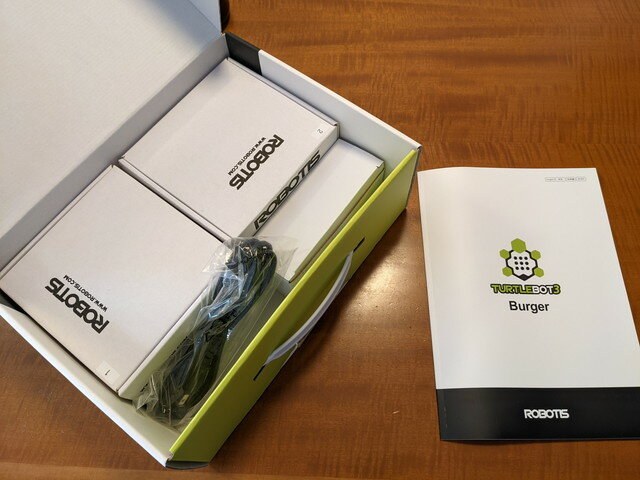
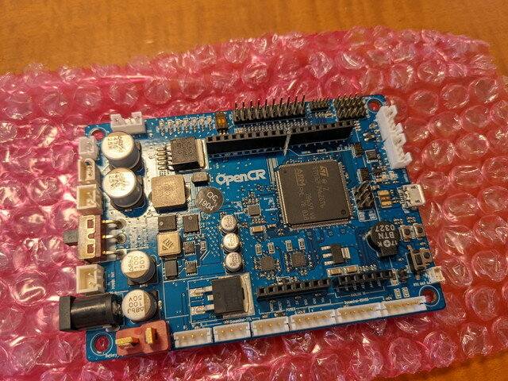
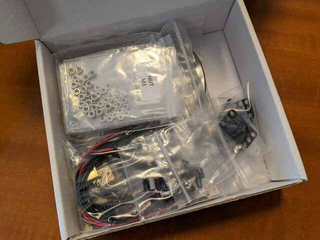

運良くTurtleBot3 Burgerの未組立品が手に入りました。

早速組み立ててみます。まずはパーツがそろっているかの確認です。

<!--more-->

箱を開けるといくつかの小さい箱に分かれていました。

組み立てマニュアルは大部分は英語ですが、レゴの組み立てマニュアルのように図解でわかりやすいです。

1つ目の箱です。Raspberry Pi 3B+、OpenCRボード、モーター等。16GB SDカードまで入っています。

こちらがTurtleBot3を制御するOpenCRボードです。豊富なI/Oと強力なCPUが特徴です。

2つめの箱です。組み立て工具、リポバッテリー、充電器、LiDARでした。

LiDARです。わくわくします。

3つめの箱はWaffle-Plateですね。

4つめの箱。ネジとかケーブル等、小物部品です。

最後の箱は電源アダプターでした。

一通りパーツは揃っているようですので組み立ててみます。

[TurtleBot3がやってきた（組み立て編）](https://kanpapa.com/2022/02/turtlebot3-burger-assembly2.html "TurtleBot3がやってきた（組み立て編）")につづく
