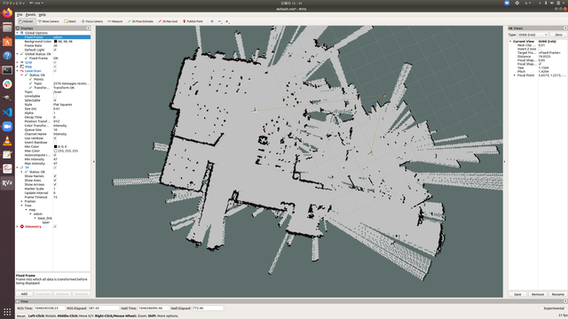
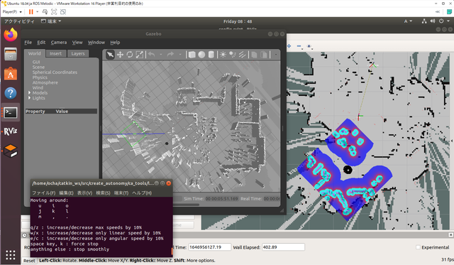

[前回](https://kanpapa.com/2022/03/Roomba-robot-ros-part8-otafab56.html "ルンバで地図をつくってみました　その３ （おおたfab 第56回 素人でもロボットをつくりたい）")ルンバで作成した地図からシミュレータ[Gazebo](http://gazebosim.org/ "Gazebo")で使うWorldを作成してみました。

今回は [shilohc/map2gazebo](https://github.com/shilohc/map2gazebo "shilohc/map2gazebo") を使っています。

元となるSLAMで作成した地図はこちらです。

 <!--more-->

### map2gazeboのインストール

map2gazeboの[README.md](https://github.com/shilohc/map2gazebo/blob/master/README.md "README.md")にしたがってインストールします。

1\. 必要なpythonパッケージをインストールする。

```
pip install --user trimesh
pip install --user numpy
```

2\. catkin\_wsにcloneする。

```
cd ~/catkin_ws/src
git clone https://github.com/shilohc/map2gazebo.git
```

3\. ビルドする。

```
catkin build map2gazebo
source ~/.bashrc
```

## Gazebo worldの作成

1\. roscoreを動かします。

```
roscore
```

2\. 先日取得した2D MAPをmap\_serverで配信します。

```
rosrun map_server map_server my_map3.yaml
```

3\. map2gazeboを実行します。

```
roslaunch map2gazebo map2gazebo.launch
```

4\. 処理が終了すると Exported STL. You can shut down this node now と表示されますので、指示通りにctrl-cで終了します。

5\. 生成したWorldをGazeboで表示します。

```
roslaunch map2gazebo gazebo_world.launch
```

以下のようにWorldが表示されれば成功です。


これで実際の地図をもとにしてGazeboである程度のシミュレーションができそうです。



もう少しmapの精度を良くしてworldを作成してみます。
