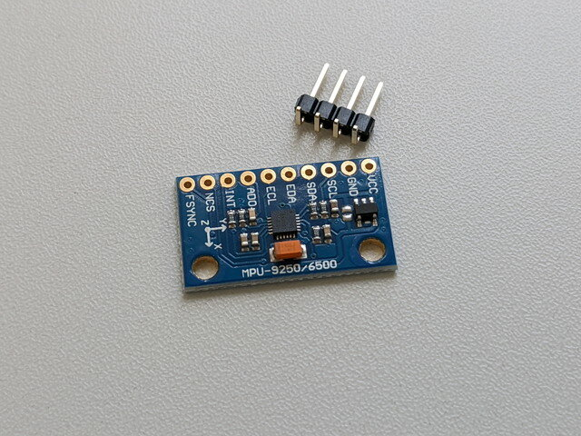
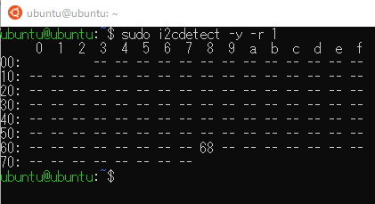
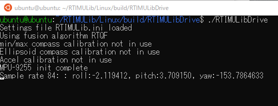
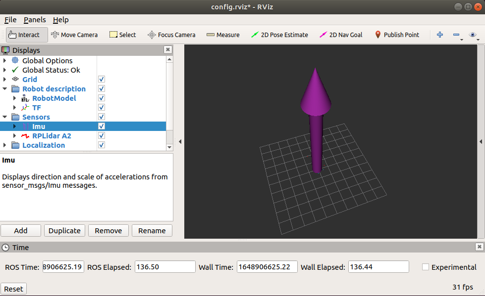

ルンバのROSパッケージは以下のものを使用していますが、IMUをサポートしているようです。

- [https://github.com/RoboticaUtnFrba/create\_autonomy](https://github.com/RoboticaUtnFrba/create_autonomy "RoboticaUtnFrba/create_autonomy")
- [https://github.com/RoboticaUtnFrba/libcreate](https://github.com/RoboticaUtnFrba/libcreate "RoboticaUtnFrba/libcreate")

IMUとしてMPU9255が使えるようですので、以下のドキュメントにしたがってRaspberry Piに接続してみることにしました。

- [https://github.com/RoboticaUtnFrba/create\_autonomy/blob/kinetic-devel/sensors/ca\_imu/README.md](https://github.com/RoboticaUtnFrba/create_autonomy/blob/kinetic-devel/sensors/ca_imu/README.md "https://github.com/RoboticaUtnFrba/create_autonomy/blob/kinetic-devel/sensors/ca_imu/README.md")

### MPU-9255を入手

今回入手したIMUのモジュールです。



基板にはMPU-9250/6500と表示がありますが、i2cでデバイスIDを読み取ってみたところMPU-9255のようでした。

<!--more-->

### i2cでIMUを接続

Raspberry PiとIMUはi2cで接続します。

まずは、Raspberry Piのピン配置です。


Raspberry Pi とIMU(MPU9255)の結線図です。


まずはIMUにピンヘッダを半田付けし、[コネクタ付コード４Ｐ](https://akizukidenshi.com/catalog/g/gC-15385/ "コネクタ付コード　４Ｐ　（赤黒黄緑）")を接続します。


これをRaspberry Piに接続し、ルンバには写真のように実装しました。中心から少し外側にしていますので、回転時の遠心力がとりやすいかもです。


### IMUの接続確認

i2cdetectを使って接続確認を行います。



問題なくつながっているようです。別のテストプログラムも試してみました。



まだキャリブレーションを行っていませんが、ある程度の値は取れているようです。ルンバの向きや角度を変えると値が大きく変化します。

### ROSドライバで動かしてみる

ca\_bringup のlaunchファイルにIMUの有効・無効のパラメタがあります。これまではfalseにしていましたが、trueに変更します。

```
export IMU=true
roslaunch ca_bringup minimal2.launch

```

ca\_bringupが問題なく起動できました。IMUも認識されているようです。

```
　：
process[create1/imu_filter_madgwick-6]: started with pid [1896]
[ INFO] [1648881058.081380857]: [CREATE] "CREATE_2" selected
[ INFO] [1648881058.239620731]: Starting ImuFilter
[ INFO] [1648881058.301960556]: Using dt computed from message headers
[ INFO] [1648881058.302226506]: The gravity vector is kept in the IMU message.
process[create1/i2c_imu_node-7]: started with pid [1907]
[ INFO] [1648881058.407603101]: Imu filter gain set to 0.100000
[ INFO] [1648881058.407881329]: Gyro drift bias set to 0.000000
[ INFO] [1648881058.408114465]: Magnetometer bias values: 0.000000 0.000000 0.000000
[ INFO] [1648881058.454616624]: RTIMU Node for ROS
Settings file /home/ubuntu/catkin_ws/src/create_autonomy/sensors/ca_imu/config/create1.ini loaded
Using fusion algorithm RTQF
Using min/max compass calibration
Using ellipsoid compass calibration
Using accel calibration
MPU-9255 init complete
[ INFO] [1648881059.126926936]: First pair of IMU and magnetometer messages received.
　：

```

### RVizで表示してみる

RVizでIMUを表示すると大きな矢印が真上に表示されます。矢印は細かく振動していてどうやらLiDARの振動が伝わっているようです。



この状態でルンバを動かしてIMUの反応をみてみます。わかりにくいのでルンバの真下から見てみてみました。ルンバが動くと矢印の動きが大きくなるように見えます。

このようにIMUの情報からルンバの姿勢の情報が取得できるようになりました。
