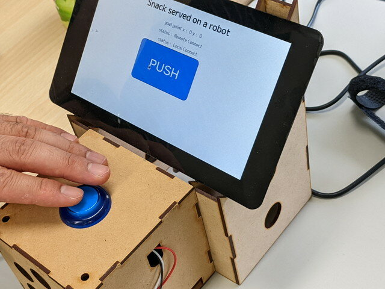

[おおたfab](https://ot-fb.com/ "おおたfab")さんでは、「[素人でもロボットをつくりたい](https://ot-fb.com/iot/6353/ "素人でもロボットをつくりたい")」という勉強会を定期的に行っています。前回は[ルンバにフレームを取り付けて自律走行のテスト](https://kanpapa.com/2022/05/Roomba-robot-ros-part13-otafab60.html "ルンバにフレームを取り付けました （おおたfab 第60回 素人でもロボットをつくりたい）")を行いましたが、今回はすべての機能を結合し試運転を行いました。

### 製作中のロボットの概要

目標としているロボットの概要ですが、あらかじめ定められた場所を順番にまわってモノを届けたり、たまに光ったり音を出したりして、その場にいる人を和ませてくれます。また受付の呼び出しボタンを押すと、お客様のお出迎えもできるような、その場にいる人のお助けができるロボットを目指しています。

### ルンバ本体

各フレームのねじ止めを行い、ルンバにも固定して取り付けました。おおたfabさんのレーザーカッターで切り出した板や3Dプリンタで出力した固定器具や100円ショップで購入した材料などを使っています。

この状態での自律走行の様子です。きちんと目的の場所まで動いてくれます。

<!--more-->

### 受付機能

次に受付の場所に設置する呼び出しボタンです。このボタンを押すとルンバロボットが近くまで移動してくれるようにします。

これはRaspberry PiにLCDモニタをつけて、WifiでROSのトピックを送信できる機能を持っています。人感センサーも搭載されていて人が近づくと反応します。

動作中の動画です。

### 可動部

このルンバロボットの一番の見せ所です。空気を送ると膨らむビニール袋と空気ポンプをフレームにセットし、運んできたものを持ち上げる仕組みを取り付けています。

これを実装するためにLiDARを少し左側に寄せています。写真では動作確認のため空気ポンプが床に置いてありますが、フレームの下段に収めることができます。これもRaspberry Piに接続し、ROSのトピックで制御します。

### 試運転の結果

まだ完全に機能が出来上がっているわけではありませんが、実際に動作するものができました。

テストの状況はYouTubeにアップしました。

可動部の動画です。こちらはややうるさい音が出ます。

### Maker Faire Tokyo 2022に向けて

なんとか形にできましたので、今年の[Maker Faire Tokyo](https://makezine.jp/event/mft2022/ "Maker Faire Tokyo 2022")に申し込むことにしました。出展までのハードルはかなり高いと思いますが、まったくロボットの経験がないメンバーでここまで動くようになったので、結果として残したいところです。
