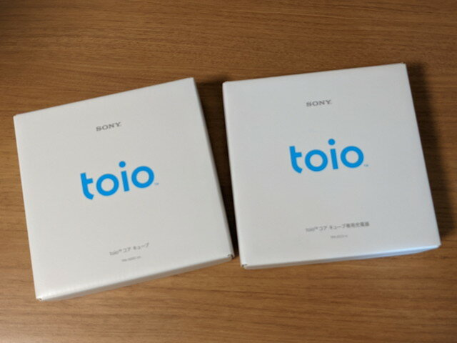
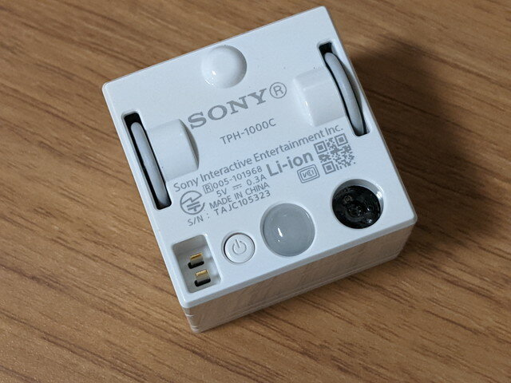
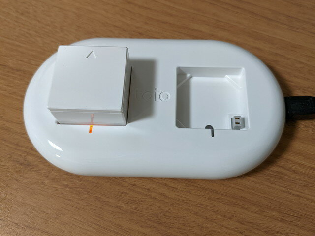

Maker Faire Tokyo 2022の申し込みをしましたが、残念ながら落選となりました。

これで出展費用が浮きましたので toio を買ってみました。

最近発売された書籍にUnityをつかってROSでtoioが動かせるという記事があり、これを使えば手軽にROSの実験ができるかなと考えたのです。

まずは試してみたいので、最低限のセットtoio本体１個と充電器を購入しました。

パッケージはSonyらしくシンプルでかっこよいです。

 <!--more-->

パッケージをひらくと、ちょこんとCubeがありました。

パッケージからとりだすと、Cube本体は小さいです。充電器にはUSB-miniのコネクタがついています。

Cube本体の裏面には車輪、LED、センサーがついています。電源を投入すると音も鳴りました。

まずは充電開始です。

すぐ試せないかなと、スマホアプリを探したところ、toioユーザが作ったと思われる[toioリモコン](https://play.google.com/store/apps/details?id=com.zurachu.toioremote&hl=ja&gl=US) Androidアプリがありました。これで簡単に動かすことができました。

このスマホアプリにはクオータニオンやオイラー角などROSで見かけた用語がでています。

これでも立派なロボットなんですね。
