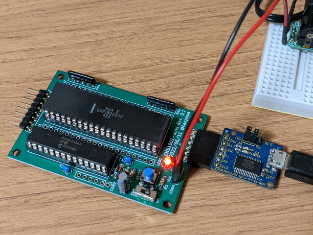
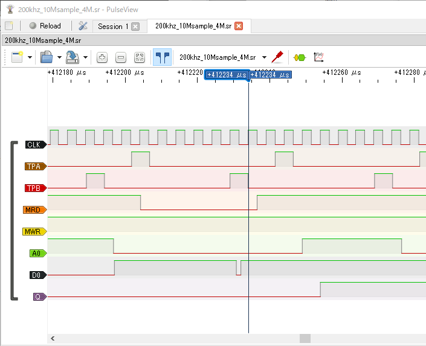

EMU1802-miniはCOSMACのCPUクロックをファームウェアで自由に変更することができます。超低速にすれば単純なSEQ/REQの繰り返しでLチカを目で確認することもできます。

<!--more-->

### クロックの高速化に挑戦

これまでの実験ではCPUクロックが200KHzを超えると動かなくなります。これはPIC内のメモリを読み出してバスに載せるのが間に合わないためと思われます。実際にロジアナで見てみます。

クロックが200KHzの場合、TPBの立下りまでにデータバスに出力できています。直前に小さいパルスが見えますがこれはPICを出力モードに切り替える瞬間に発生したもののようです。この後にデータが出力されています。

クロックを倍の400KHzにした場合、TPBの立下りまでにデータバスへの出力が間に合いません。

### ファームウェアの最適化

もっと速くバスにデータを載せられないかとファームウェアを見直してみます。残念ながらCOSMACにはZ80のようなデバイスの完了を待つようなWAIT入力はありません。WAITと書かれているピンはあるのですが、これはCLEAR信号との組み合わせでCPUの動作モードを制御するためのもので用途は全く異なります。

EMUZ80では２種類の割り込みを使っています。１つは状態変化割り込み（IOC：Interrupt-On-Change）、もう１つは外部割込み（INT）です。EMU1802でも同様の構成になっていましたが、これを見直しました。

COSMACで割り込みが必要となるのは以下のタイミングです。

- TPA 上位アドレスの取り込み
- MWR　メモリ書き込み
- TPB　メモリ読み込み

このPICにあるINT0～INT2をそれぞれの処理に割り当てました。IOCを使うと立ち上がり、立下りの両方を処理することができますが、その状態の確認のためのプログラムステップが必要になり、ほんの少しですが遅くなってしまいます。

ファームウェアを書き換えて実験したところ、300KHzまではクロックを速くすることができました。しかし、ソフトウェアシリアルのタイミングが合わなくなり、文字化けしてしまいました。いずれにしても極端な高速化はできそうにもないので、安定している200KHzのまま使うのが良さそうです。

修正したファームウェアはV1.1としてGitHubに登録しておきました。

- [https://github.com/kanpapa/emu1802](https://github.com/kanpapa/emu1802 "GitHub kanpapa  emu1802")

この割り込み処理の部分をアセンブラで記述すればもう少しは速くできるかもです。ぜひ挑戦してみてください。
