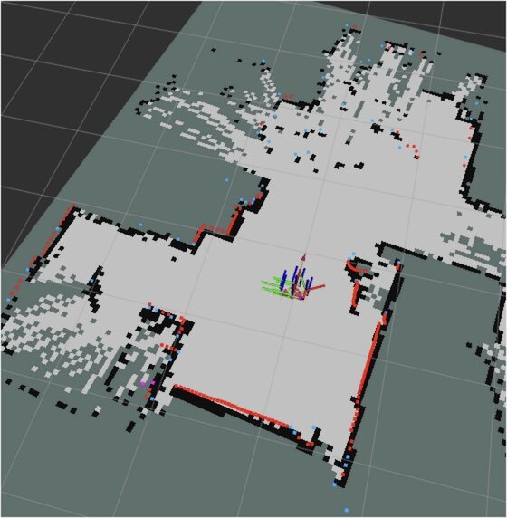

[前回の記事でルンバ単体の環境設定](https://kanpapa.com/2022/07/ros2-foxy-roomba-bringup.html "ROS2 Foxyでルンバを動かしてみました(1) ルンバ設定編")まで行うことができました。これだけでは手動操作しかできません。ここでPCを接続して、そちらで環境地図の生成（SLAM）や自律走行（Navigation）の環境を作っていきます。

 <!--more-->

### ネットワーク経由でトピックを受信する

すでにルンバからTopicが送信されることは確認しています。複数のコンピュータを接続して使用する場合はDOMAINを設定する必要があります。同じドメインのものだけが通信できます。

Raspberry PiとPCの~/.bashrcに以下の１行を追記します。今回は100を使用します。

```
export ROS_DOMAIN_ID=100
```

そのあとにsourceコマンドで~/.bashrcを読み込みます。

```
source ~/.bashrc
```

ルンバでドライバを動かしたあとに、PCでルンバからのトピックが見えるか確認します。

```
ros2 topic list
```

問題がなければこの状態でルンバから流れてくるtopicが見えます。ただし私の場合はしばらくするとtopicが急に消えたりして安定してtopicを確認することができませんでした。いろいろ調べたところどうもWiFiルーターの問題のようで、WiFiルーターを別のものに変えたら全く問題がなくなりました。この機会に新しいWiFiルーターに交換することで対応しました。

### Rvizで可視化してみる

topicが流れる状態になったら、Rvizで可視化してみます。まずはRviz2を起動します。

```
rviz2
```

Rviz2が起動したら以下のように表示項目を追加します。

1. 左側のDisplaysのメニューでAddをクリックする。
2. By display typeからLaserScanを選んでOKをクリックし、追加されたLaserScanのTopicを選び、Topicに/scanを設定する。TopicのReliabilty PolicyをBest Effortにする。Size(m)を0.03にする。
3. By display typeからTFを選んでOKをクリックする。
4. Global OptionsのFixed Frameをbase\_linkにする。

この状態でルンバの位置にTFの情報が表示され、レーザースキャナの状態も見えるはずです。


これらの情報を使ってSLAMで環境地図を作っていきます。

### SLAMを動かす

ルンバのドライバがRaspberry Piで動いていることを確認したあとに、以下のコマンドを入力します。

```
ros2 launch slam_toolbox online_async_launch.py
```

キーボードで操作をするためのコマンドを入力します。

```
export TURTLEBOT3_MODEL=burger
ros2 run turtlebot3_teleop teleop_keyboard
```

キーボードを操作してmapを作っていきます。ゆっくり動かすのがコツです。



### 環境地図を保存する

mapができたら以下のコマンドで保存します。

```
ros2 run nav2_map_server map_saver_cli -f ~/map
```

Ubuntuのファイルアプリで~/map.pgmをクリックすると作成できたmapが表示されます


次回はこの[環境地図の情報を使って自律走行](https://kanpapa.com/2022/07/ros2-foxy-roomba-nav2.html "ROS2 Foxyでルンバを動かしてみました(3) 自律走行編")を行います。
