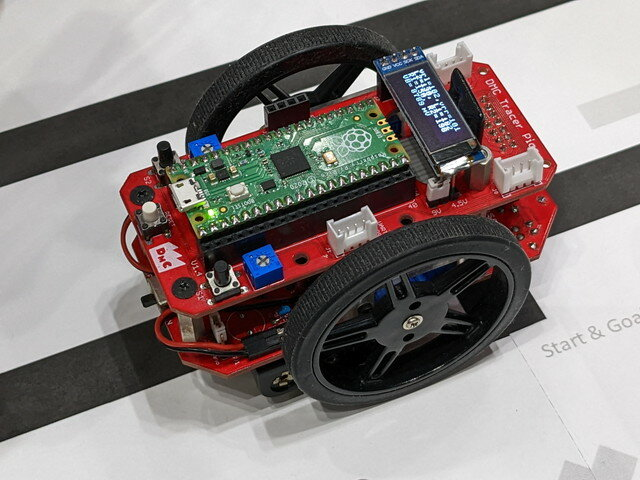
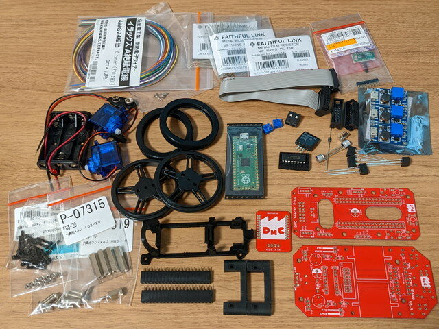
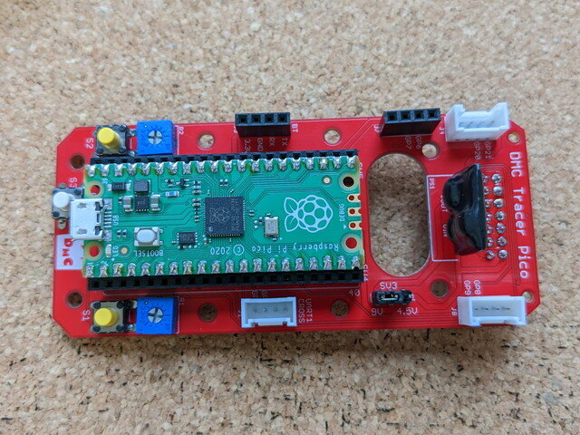
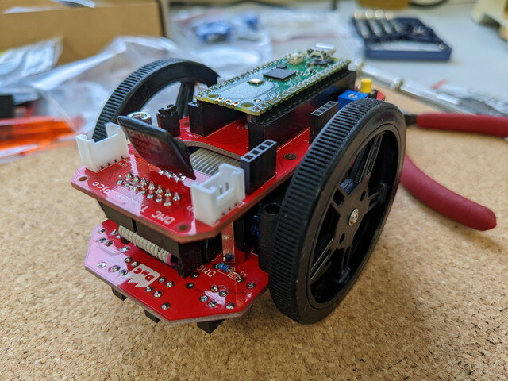
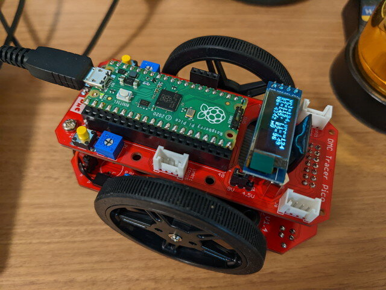

### DMCおうちロボコンとは

先日行われたMaker Faire Tokyo 2022で展示されていた[DMCおうちロボコン](https://makezine.jp/event/makers-mft2022/m0120/ "D's Maker College")に興味をもちました。

ライントレースロボットでいかに速く完走するかを競うものですが、2022年はRaspberry Pi Picoを使った標準ロボットを規定のパーツでくみ上げて、ソフトウェアだけをチューニングすることで、いかに速く走るかを競うとのこと。

<!--more-->

完成度が高そうな筐体です。私も製作してみたくなったので、会場で基板とモーターと電源系の固定に使うパーツを500円で購入しました。

### 公式トレーサーロボットの組み立て

早速パーツ集めです。個体差をなくすために使用するパーツが指定されていますが、親切なことにパーツリストをそのまま秋月電子の通販コード一括入力フォームにコピペできたり、Amazonのリンクが案内されていたりして、指定のパーツの入手がしやすくなっています。

パーツをあつめるとこんな感じです。（この時点では一部未着のものもあります）

これを組み立てていきます。参加者用のマニュアルも親切に書かれていてわかりやすいです。

製作中の基板です。一番右側は電源ユニットで単4×3を9Vに昇圧するDC-DCコンバータを組み込んでいます。

モーター系の基板です。

制御系の基板です。

これらをくみ上げるとMaker Faire Tokyo 2022で見たトレーサーロボットができあがりました。

### トレーサーロボットの試走

Raspberry Pi PicoをPCに接続し、Thonnyでサンプルプログラムを書き込むとOLEDにロボットの状態が表示されました。

早速テスト走行です。手持ちのLEGO MINDSTORMSのライントレーサー用のコースをつかってみます。

試走の様子をYouTubeにアップしておきました。

https://youtu.be/h6xSptYL6HI?si=-mWbnwvYR5Zf\_tQn

まだ何も調整していないのに問題なくラインをトレースして走行しています。

### 今後のとりくみ

ここからはDMCおうちロボコンの公式コースをコンビニのコピー機で入手して、ソフトウェアでチューニングしていくことになります。

Maker Faire Tokyo 2022でトレーサーロボットの基板を入手されたかたが、これからどんどんチャレンジしていくと思いますので楽しみです。
