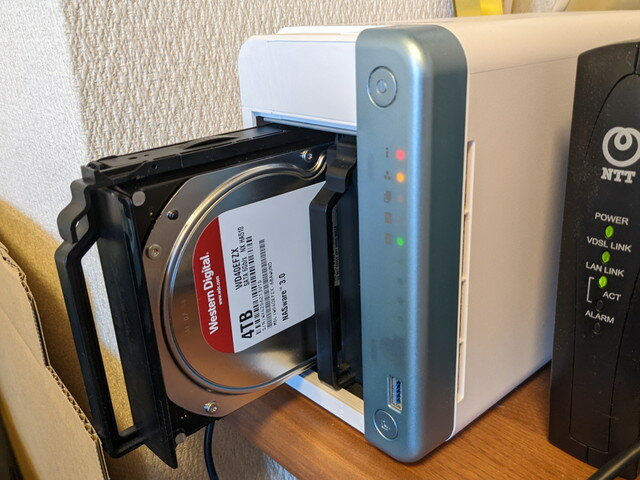
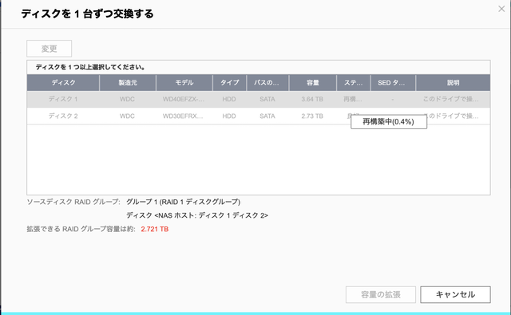
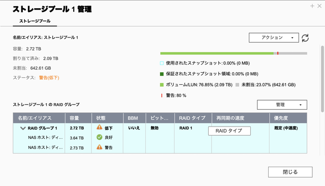

我が家のNASですが、QNAPを使っています。


これまで特に問題なく動いていたのですが・・・。

<!--more-->

ある時ハードディスクは何年使っているのか確認してみました。


1935日なので、すでに５年が経過しています。これまでの経験からそろそろ予防交換をするのが良さそうだなと、休日に作業できるように新しいハードディスクを購入しました。これまでは3TBを２台でRAID1の構成でしたが、そんなにデータ量は急に増えないと想定して4TBを２台としました。


交換手順を確認すると、ストレージプールの管理画面で「ディスクを１台ずつ交換する」というメニューがあります。これに従って作業すれば問題なく終わるはずでした。


### バックアップの取得

まずはバックアップを外付けディスクに行います。これは[HBS 3 Hybrid Backup Sync](https://www.qnap.com/ja-jp/software/hybrid-backup-sync "HBS 3 Hybrid Backup Sync")を使い問題なく終わりました。このバックアップが重要な役割を果たすことは後になるとわかります。

### RAID1の再構築がエラーで中断

一台目のディスクを交換します。



直後に新しいハードディスクを認識し、RAID1の再構築が始まりました。



順調に進んでいるように見えたのですが、突然QNAPから甲高いエラー音が聞こえました。

確認したところ、ディスク２に警告のマークがでています。



さらにログを確認すると、Disk 2でMedium errorが発生し、Skipped rebuilding RAIDとあるので再構築がスキップされたようです。


### RAIDの状況確認

こうなると厄介です。とりあえずsshでQNAPにログインし、状態を確認してみます。

```
$ sudo cat /proc/mdstat Password: Personalities : [linear] [raid0] [raid1] [raid10] [raid6] [raid5] [raid4] [multipath] md1 : active raid1 sdb3[1] sda3[2](S)      2920311616 blocks super 1.0 [2/1] [_U]      md322 : active raid1 sdb5[1] sda5[0]      7235136 blocks super 1.0 [2/2] [UU]      bitmap: 0/1 pages [0KB], 65536KB chunkmd256 : active raid1 sdb2[1] sda2[0]      530112 blocks super 1.0 [2/2] [UU]      bitmap: 0/1 pages [0KB], 65536KB chunkmd13 : active raid1 sda4[0] sdb4[1]      458880 blocks super 1.0 [64/2] [UU______________________________________________________________]      bitmap: 1/1 pages [4KB], 65536KB chunkmd9 : active raid1 sda1[0] sdb1[1]      530048 blocks super 1.0 [64/2] [UU______________________________________________________________]      bitmap: 1/1 pages [4KB], 65536KB chunkunused devices: 
```

md1が今回のRAIDになります。その部分を確認します。

```
md1 : active raid1 sdb3[1] sda3[2](S)      2920311616 blocks super 1.0 [2/1] [_U]
```

ディスク1がsda3、ディスク2がsdb3です。ディスク1は(S)となっていて、スペアディスクとなっているようです。また、\[\_U\]となっていて、ディスク2のみで稼働している状態です。本来正常であれば\[UU\]となるべきところです。

mdadmコマンドでも確認してみます。

```
$ sudo mdadm --detail /dev/md1/dev/md1:        Version : 1.0  Creation Time : Thu Jul 22 21:54:02 2021     Raid Level : raid1     Array Size : 2920311616 (2785.03 GiB 2990.40 GB)  Used Dev Size : 2920311616 (2785.03 GiB 2990.40 GB)   Raid Devices : 2  Total Devices : 2    Persistence : Superblock is persistent    Update Time : Sun Sep 25 20:46:08 2022          State : clean, degraded  Active Devices : 1Working Devices : 2 Failed Devices : 0  Spare Devices : 1           Name : 1           UUID : 981566bd:103cd8d4:05137586:e84f7ec7         Events : 92834    Number   Major   Minor   RaidDevice State       0       0        0        0      removed       1       8       19        1      active sync   /dev/sdb3       2       8        3        -      spare   /dev/sda3
```

これを確認すると、State : clean, degraded　とありますので、動作はしているけど、 片系だけで動いているようです。

/dev/sda3はスペアディスクとなっていることも確認できます。

ディスク２の故障状況が気になります。S.M.A.R.T.の状態を確認してみます。


異常セクター数が２となっていて、まだ、致命的という状況ではなさそうですが、いつディスク２が壊れるかわかりません。この時点ではエラーがでているディスク２だけでかろうじて動いている状態です。

### どう対応すべきか？

一応NASのバックアップはとってありますので、ダメ元でこの機会にいろいろ試してみることにします。

#### (1) 再度RAIDの再構築を行ってみる

ディスク２のエラーが出なければすでにスペアディスクとなっているディスク１に対して同期されるはずですが、やはりこれまでと同じエラーとなり再構築がスキップされてしまいました。

#### (2) ディスク１をもとのハードディスク(3TB)に戻してみる。

新しいハードディスク(4TB)に一度交換しているので、さらに新しいハードディスクに交換されたと認識されたようで、再び再構築が始まりましたが、やはり途中でエラーとなり再構築がスキップされてしまいました。

#### (3) ディスク１を再び新しいハードディスク(4TB)に戻してみる。

再び再構築が始まりましたが、やはり途中でエラーとなり再構築がスキップされてしまいました。

この状態でdmesgでログを確認してみましたが、ディスク２のエラーがたくさん記録されています。もうディスク２のデータは正常に読み出せているかも怪しい状態です。

```
[ 1578.660611] ata2.00: exception Emask 0x0 SAct 0x3f8 SErr 0x0 action 0x0[ 1578.667277] ata2.00: irq_stat 0x40000008[ 1578.671234] ata2.00: failed command: READ FPDMA QUEUED[ 1578.676398] ata2.00: cmd 60/00:18:88:82:e7/04:00:02:00:00/40 tag 3 ncq dma 524288 in[ 1578.676398]          res 41/40:00:60:84:e7/00:00:02:00:00/40 Emask 0x409 (media error) [ 1578.692414] ata2.00: status: { DRDY ERR }[ 1578.696459] ata2.00: error: { UNC }[ 1578.701570] ata2.00: configured for UDMA/133[ 1578.705914] sd 1:0:0:0: [sdb] tag#3 FAILED Result: hostbyte=DID_OK driverbyte=DRIVER_SENSE cmd_age=3s result=8000002 sbuf[0,1,2,3,7,12,13]=f0_0_3_2_a_11_4 blk_rq_bytes=45000 passthrough=0 cmd_flags=4000 jiffies_alloc=136d33 allowed=5 timeout=7530 jiffies=137b2c[ 1578.729074] sd 1:0:0:0: [sdb] tag#3 Sense Key : Medium Error [current] [ 1578.735707] sd 1:0:0:0: [sdb] tag#3 Add. Sense: Unrecovered read error - auto reallocate failed[ 1578.744450] sd 1:0:0:0: [sdb] tag#3 CDB: Read(16) 88 00 00 00 00 00 02 e7 82 88 00 00 04 00 00 00[ 1578.753345] blk_update_request: I/O error, dev sdb, sector 48727136 op 0x0:(READ) flags 0x4000 phys_seg 69 prio class 0[ 1578.764206] ata2: EH complete[ 1578.834853] Check proc_name[ahci].[ 1582.582715] ata2.00: exception Emask 0x0 SAct 0x7ff001cf SErr 0x0 action 0x0[ 1582.589832] ata2.00: irq_stat 0x40000008[ 1582.593780] ata2.00: failed command: READ FPDMA QUEUED[ 1582.598938] ata2.00: cmd 60/08:30:60:84:e7/00:00:02:00:00/40 tag 6 ncq dma 4096 in[ 1582.598938]          res 41/40:00:60:84:e7/00:00:02:00:00/40 Emask 0x409 (media error) [ 1582.614768] ata2.00: status: { DRDY ERR }[ 1582.618790] ata2.00: error: { UNC }[ 1582.689336] ata2.00: configured for UDMA/133[ 1582.693701] sd 1:0:0:0: [sdb] tag#6 FAILED Result: hostbyte=DID_OK driverbyte=DRIVER_SENSE cmd_age=3s result=8000002 sbuf[0,1,2,3,7,12,13]=f0_0_3_2_a_11_4 blk_rq_bytes=1000 passthrough=0 cmd_flags=800 jiffies_alloc=137c80 allowed=5 timeout=7530 jiffies=138ac0[ 1582.716840] sd 1:0:0:0: [sdb] tag#6 Sense Key : Medium Error [current] [ 1582.723511] sd 1:0:0:0: [sdb] tag#6 Add. Sense: Unrecovered read error - auto reallocate failed[ 1582.732232] sd 1:0:0:0: [sdb] tag#6 CDB: Read(16) 88 00 00 00 00 00 02 e7 84 60 00 00 00 08 00 00[ 1582.741132] blk_update_request: I/O error, dev sdb, sector 48727136 op 0x0:(READ) flags 0x800 phys_seg 1 prio class 0[ 1582.752119] ata2: EH complete[ 1582.753363] md/raid1:md1: sdb: unrecoverable I/O read error for block 46606464[ 1582.755257] Check proc_name[ahci].[ 1582.764533] md: md1: recovery interrupted.[ 1585.035862] md: Recovering skipped: md1[ 1585.039746] md/raid:md1: report qnap hal event: type = HAL_EVENT_RAID, action = REBUILDING_SKIP[ 1585.048487] md/raid:md1: report qnap hal event: raid_id=1, pd_name=/dev/(null), spare=/dev/(null), pd_repair_sector=0[ 2610.749753] perf: interrupt took too long (3919 > 3916), lowering kernel.perf_event_max_sample_rate to 51000[ 9230.593681] perf: interrupt took too long (4902 > 4898), lowering kernel.perf_event_max_sample_rate to 40000
```

### NASを初期化してバックアップからリストア

こうなるとNASを初期化して、バックアップからリストアするしかない状況です。作業前にバックアップを取っておいて本当に良かったです。

ディスク２からの復旧はあきらめて、ディスク２を新しいハードディスクに交換して、NASの初期化を行います。

NASの設定ファイルをバックアップする機能もあるので、事前にバックアップはしていたのですが、クリーンな環境にしたかったので、今回はゼロから再設定しました。

そのために共有フォルダーの状態やユーザ登録の状態など最低限の情報は画面キャプチャで保存しておきました。

ユーザ登録と共有フォルダの設定まで完了したところで、HBS 3 Hybrid Backup Syncでバックアップしたファイルをリストアして作業完了です。あとはRAID1の再構築が完了するのを待つことになります。

こんな機会はなかなか無いのでRAIDの状態をコマンドでも確認してみます。

再構築中の状態はこのような状態でした。

```
$ sudo cat /proc/mdstat Personalities : [linear] [raid0] [raid1] [raid10] [raid6] [raid5] [raid4] [multipath] md1 : active raid1 sdb3[1] sda3[0]      3897063616 blocks super 1.0 [2/2] [UU]      [=================>...]  resync = 87.0% (3391328320/3897063616) finish=101.3min speed=83150K/sec      md322 : active raid1 sdb5[2] sda5[0]      7235136 blocks super 1.0 [2/2] [UU]      bitmap: 0/1 pages [0KB], 65536KB chunkmd256 : active raid1 sdb2[2] sda2[0]      530112 blocks super 1.0 [2/2] [UU]      bitmap: 0/1 pages [0KB], 65536KB chunkmd13 : active raid1 sdb4[1] sda4[0]      458880 blocks super 1.0 [128/2] [UU______________________________________________________________________________________________________________________________]      bitmap: 1/1 pages [4KB], 65536KB chunkmd9 : active raid1 sdb1[1] sda1[0]      530048 blocks super 1.0 [128/2] [UU______________________________________________________________________________________________________________________________]      bitmap: 1/1 pages [4KB], 65536KB chunkunused devices: $ sudo mdadm --detail /dev/md1/dev/md1:        Version : 1.0  Creation Time : Mon Sep 26 10:16:48 2022     Raid Level : raid1     Array Size : 3897063616 (3716.53 GiB 3990.59 GB)  Used Dev Size : 3897063616 (3716.53 GiB 3990.59 GB)   Raid Devices : 2  Total Devices : 2    Persistence : Superblock is persistent    Update Time : Mon Sep 26 21:02:39 2022          State : clean, resyncing  Active Devices : 2Working Devices : 2 Failed Devices : 0  Spare Devices : 0  Resync Status : 87% complete           Name : 1           UUID : c77ad8a3:af5e534a:febb2791:00770ef9         Events : 14666    Number   Major   Minor   RaidDevice State       0       8        3        0      active sync   /dev/sda3       1       8       19        1      active sync   /dev/sdb3
```

無事にRAID1の再構築が完了すると以下のようになりました。これが正常な状態です。

```
$ sudo cat /proc/mdstatPersonalities : [linear] [raid0] [raid1] [raid10] [raid6] [raid5] [raid4] [multipath]md1 : active raid1 sda3[0] sdb3[1]      3897063616 blocks super 1.0 [2/2] [UU]md322 : active raid1 sdb5[1] sda5[0]      7235136 blocks super 1.0 [2/2] [UU]      bitmap: 0/1 pages [0KB], 65536KB chunkmd256 : active raid1 sdb2[1] sda2[0]      530112 blocks super 1.0 [2/2] [UU]      bitmap: 0/1 pages [0KB], 65536KB chunkmd13 : active raid1 sda4[0] sdb4[1]      458880 blocks super 1.0 [128/2] [UU______________________________________________________________________________________________________________________________]      bitmap: 1/1 pages [4KB], 65536KB chunkmd9 : active raid1 sda1[0] sdb1[1]      530048 blocks super 1.0 [128/2] [UU______________________________________________________________________________________________________________________________]      bitmap: 1/1 pages [4KB], 65536KB chunkunused devices: $ sudo mdadm --detail /dev/md1/dev/md1:        Version : 1.0  Creation Time : Mon Sep 26 10:16:48 2022     Raid Level : raid1     Array Size : 3897063616 (3716.53 GiB 3990.59 GB)  Used Dev Size : 3897063616 (3716.53 GiB 3990.59 GB)   Raid Devices : 2  Total Devices : 2    Persistence : Superblock is persistent    Update Time : Tue Sep 27 22:54:36 2022          State : clean Active Devices : 2Working Devices : 2 Failed Devices : 0  Spare Devices : 0           Name : 1           UUID : c77ad8a3:af5e534a:febb2791:00770ef9         Events : 33230    Number   Major   Minor   RaidDevice State       0       8        3        0      active sync   /dev/sda3       1       8       19        1      active sync   /dev/sdb3
```

### RAIDだからと過信しない

今回の経験からRAIDだから安心ということは決してないので、適切なタイミングで外部ディスクにバックアップを取得することをお勧めします。NASの大幅な構成変更時にもバックアップは必須です。

また、S.M.A.R.T.もあくまでも目安であって、これまで全くエラーが出ていなくても今回のように急に壊れることはあると思ったほうが良いでしょう。

こまめにバックアップをしつつ、クラウドストレージも使って重要なファイルは冗長化しておくことをお勧めします。またLinuxのコマンドが使えるかたはsshサーバを起動しておくといざというときに詳細な情報が確認できるので安心です。

何かの参考になれば幸いです。
