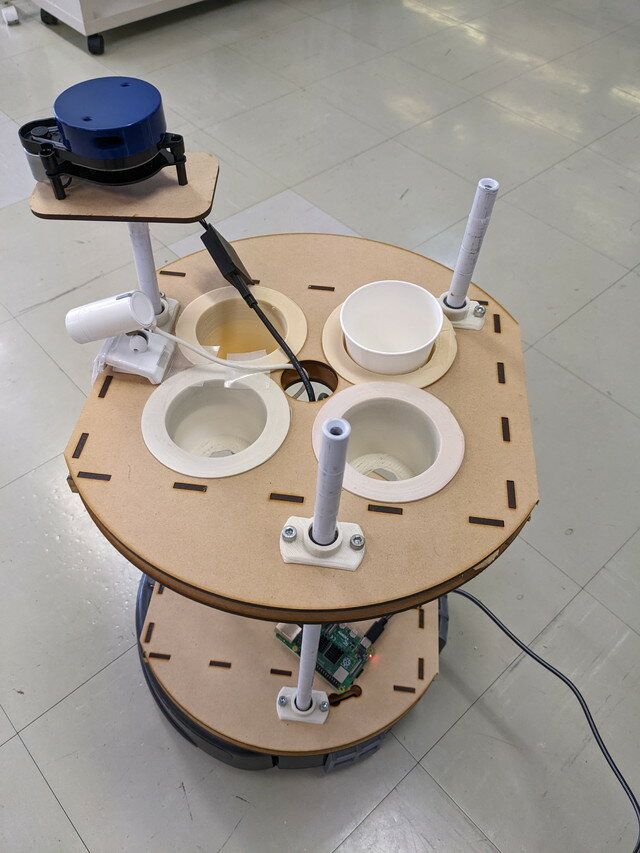
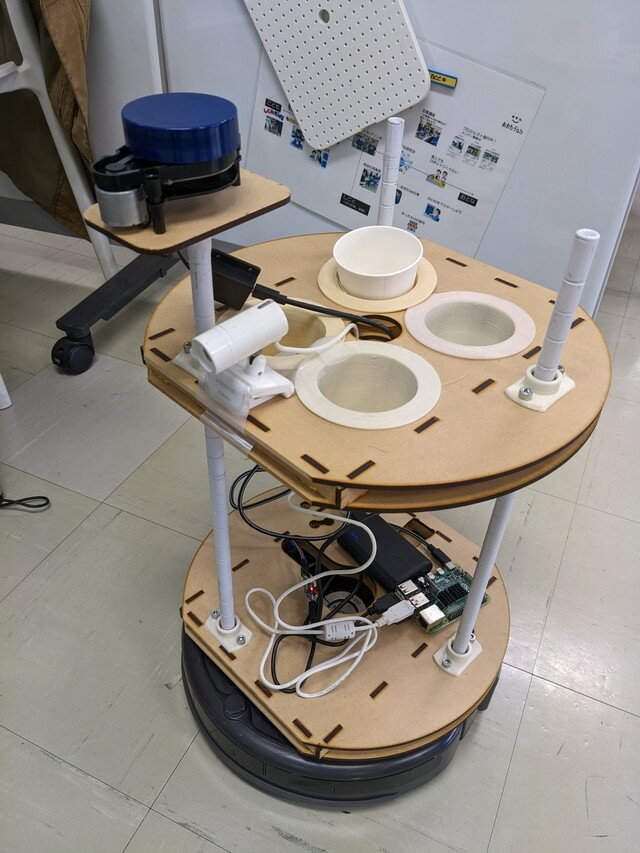

[おおたfab](https://ot-fb.com/ "おおたfab")さんでは、「[素人でもロボットをつくりたい](https://ot-fb.com/iot/6353/ "素人でもロボットをつくりたい")」という勉強会を定期的に行っていますが、その成果発表ということで、10月30日に開催された[おおたfabオープンハウス](https://ot-fb.com/event/%e3%81%8a%e3%81%8a%e3%81%9ffab%e3%82%aa%e3%83%bc%e3%83%97%e3%83%b3%e3%83%8f%e3%82%a6%e3%82%b9%e3%81%ae%e3%81%8a%e7%9f%a5%e3%82%89%e3%81%9b/ "おおたfabオープンハウスのお知らせ")でルンバロボットの走行デモを行いました。

### Raspberry Pi 4の再セットアップ

前回の勉強会ではなんとおおたfabのルンバで使っているRaspberry Pi 4のパスワードを忘れてしまい、ログインできない状態になってしまいました。やむなくRapsberry Pi 4を自宅に持ち帰り、UbuntuやROS2などの再インストールを行いました。ROS2の場合ですとそんなに手間でもありません。インストール方法は[GitHub](https://github.com/docofab/RoombaControlls/blob/main/ROS2/instructions/setup-real-roomba-foxy.md "setup-real-roomba-foxy.md")にまとめているのでその通りに進めます。

念のため、自宅のルンバでSLAMやNav2を動かして動作確認を行いました。

<!--more-->

もう一工夫したいなと、手元にあったUSBカメラも使えるようにしました。走行中ルンバからの景色を見ることができます。リモコン操縦の時にも役立ちそうです。

こちらも手順を[GitHub](https://github.com/docofab/RoombaControlls/blob/main/ROS2/instructions/setup-usb-camera.md "setup-usb-camera.md")にまとめておきました。

### 新しいフレームへの実装

おおたfabオープンハウスは午後から開始でしたので、午後からセットアップを開始しました。新しいフレームにRaspberry Pi 4とLiDARとUSBカメラを取り付けます。電源はモバイルバッテリーではなく、USB電源アダプタから供給した状態で動作確認を行いました。

新しいフレームには紙コップが置けるような場所も作ってもらいました。うまく動くようになれば飲みものも届けることができるロボットになります。

### 完成したルンバロボットを動かしてみる

すべての準備がおわったルンバロボットです。電源もモバイルバッテリーに切り替えました。

この状態でSLAM（地図作成）を行いましたが、どうも動きがスムーズではありません。前回リモコン走行の時はスムーズだったのですが。

また、SLAMである程度のマップは生成できたもののなぜか保存がエラーになってしまったので、今回は以前作成したおおたfabのフロアマップを使って、Nav2で自律走行を実演しました。

USBカメラの画像も表示したかったのですが、ノードを動かしたところRaspberry Pi 4との通信がハングアップしてしまいました。Raspberry Pi 4がハングアップしているわけではなく、ネットワークの問題のようで、持ち込んだWiFi小型ルーターの処理能力を超えているように思われます。もしかするとLiDARのスキャンデータもある程度のデータ量がありますので、ルンバの動きがスムーズでないのはこの影響ではないかと考えています。

### 今後について

今回のおおたfabオープンハウスではかろうじて自律走行のデモンストレーションはできました。ネットワーク能力に問題がありそうだということもわかりましたので、次回はWiFiルーターを変更して試してみたいと思います。

今回のオープンハウスでルンバロボットに興味を持っていただける方もいましたし、Raspberry Pi 4の話とかできました。良い機会だと思いますので、次回も楽しみにしています。

