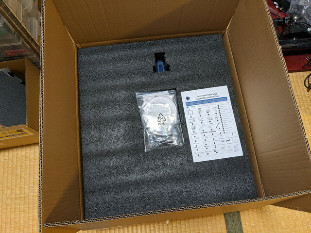
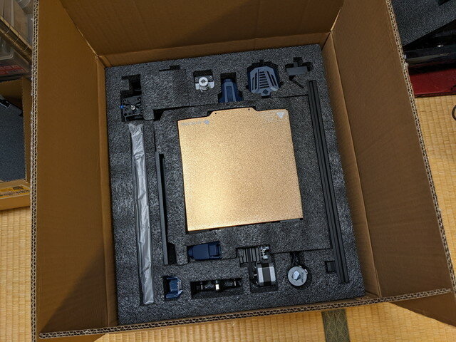
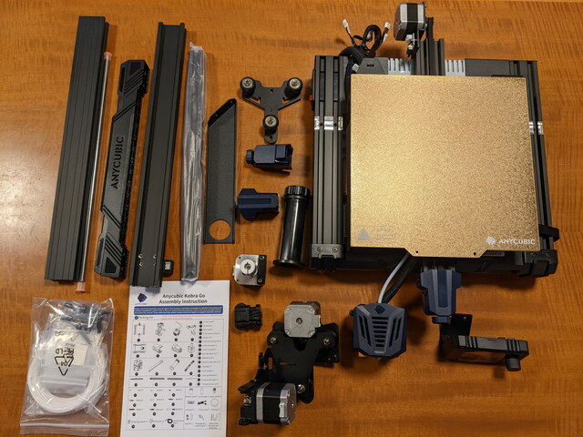
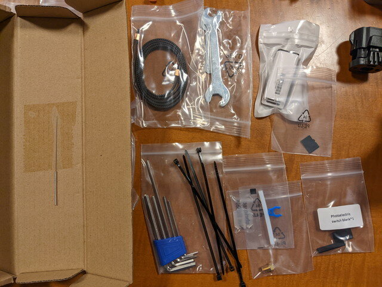
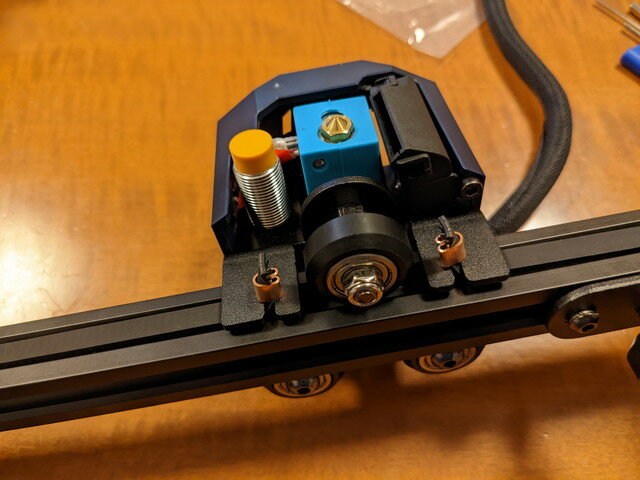
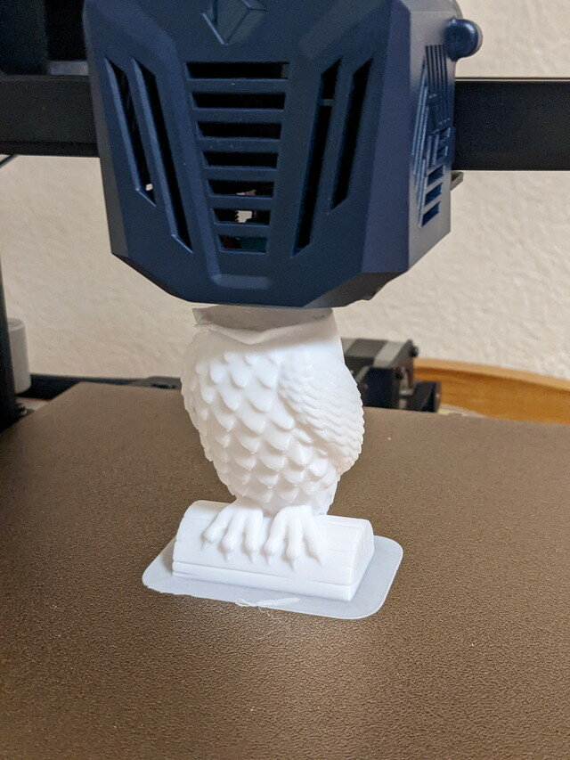
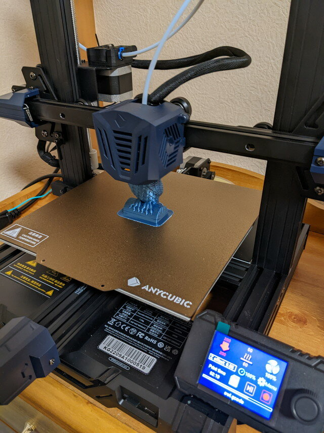

[久しぶりに3Dプリンタを使ってみて](https://kanpapa.com/2022/11/drain-3dprint.html "3Dプリンタで排水溝を作ってみました")、3Dプリンタでの造形にはコツと時間がかかるというのが再認識できたので、手元に3Dプリンタを置いておきたいと考えました。

安価なもので信頼性があるものがないかなと探したところ、ANYCUBIC Kobra Goという3Dプリンタを見つけました。お手頃な価格にするためか、DIYモデルということで自分で組み立てるものでした。3Dプリンタの構造を理解するのにも良いですので、思い切って購入しました。今ならフィラメントも同時購入でサービスとのことなのでトータルで考えてもお得です。

### 梱包箱の開梱

やや大きめの箱で到着しました。箱を開くと厳重に保護材で守られているのがわかります。最初に見てほしいのでしょうか、組み立てマニュアルが一番目の付くところに入っています。

保護材を外していくと本体やパーツが見えてきます。これらを丁寧に取り出していきます。

<!--more-->

### パーツの確認

取り出したパーツを作業机の上に並べて不足している部品がないか確認です。私が購入したときは英文マニュアルでしたが、今は日本語マニュアルがついているそうです。

ネジや小物部品です。種類ごとにナンバリングされていて間違えることもなさそうです。テスト用のフィラメントもついています。

ツールボックスも入っていて、箱を開けると工具が入っています。これらの工具だけで組み立てができます。ノズルを掃除する針金も入っていました。

パーツは多いようにみえますが、大きな部品は16個だけで、ネジを含めた部品の番号は28までに収まっています。

### 本体の組み立て

パーツの確認が終わったところで組みたてを開始します。私の場合は英文マニュアルだったのでわかりにくいところはGoogle Lensを使って読んで進めました。

まずはZ軸の取り付け。あとで調整するので軽めにネジ止めします。

Z軸のモーターを取り付けて、Z軸のスクリューシャフトを取り付けていきます。

X軸を組み立てていきます。

ノズルの周りの様子がよくわかります。これもDIYモデルならではです。

Z軸にX軸を取り付けます。だんだん形になってきました。

完成したANYCUBIC Kobra Go です。電源が届かないのでいったん床に置いての作業です。

操作はダイヤルで行いますが直感的に使えます。シンプルで使い勝手は良いと思います。

### テストプリントを行ってみる

まずは自動レベリングを行います。プラットフォームの各点とノズルの間隔を自動で校正してくれます。

この状態で早速テストプリントをしたところ、プラットフォームに定着せずうまく印刷できませんでした。やむなく途中でプリントを中断しました。

本体をもう一度確認したところ、プラットフォームがややぐらつくようで、プラットフォームの真下にあるD型ホイールが手で触って回転できる状態でした。

このため、その部分の偏心ボルトを回してD型ホイールを手で触っても空回りせず、ぐらつかずスムーズに動くよう調整しました。

他の各軸の可動部のD型ホイールの状態も確認し再度調整を行いました。他にもベルトのゆるみが無いかも確認して再び出力したところ、うまく出力できるようになりました。

今回は正常にプラットフォームに定着しています。

出力中の動画です。

サンプルデータのowlが出力されていきます。思ったよりきれいです。

ところが、サンプルのフィラメントが途中で終わってしまいました。しかたないので同時にサービスしてもらったフィラメントに交換して、再度出力です。

無事owlが出力されました。

完成したowlです。きれいにできています。フィラメントの色合いも良く、初めてにしては良すぎる出来栄えです。

### まとめ

これで好きな時間に3Dプリンタで出力できる環境が整いました。まだ出力データを作るためのスライサの設定とかサポートの付け方など慣れないところもありますが、いろいろなものを出力してみて、慣れていきたいと思います。
